# ServiceConnect Examples Implementation Plan

> **For agentic workers:** REQUIRED SUB-SKILL: Use superpowers:subagent-driven-development (recommended) or superpowers:executing-plans to implement this plan task-by-task. Steps use checkbox (`- [ ]`) syntax for tracking.

**Goal:** Build a new `examples/` area that demonstrates every currently supported ServiceConnect messaging pattern as runnable C# console applications with shared containerized dependencies and per-pattern Mermaid documentation.

**Architecture:** The implementation adds a top-level `examples/` workspace with shared Docker Compose infrastructure, a shared support library, and one folder per pattern. Each pattern lives in its own solution, contains only the projects needed for that topology, and includes local runner scripts plus a README that documents the flow with Mermaid.

**Tech Stack:** .NET 10 console apps, Docker Compose, RabbitMQ, MongoDB, `Microsoft.Extensions.DependencyInjection`, `Microsoft.Extensions.Configuration`, `ServiceConnect`, `ServiceConnect.Client.RabbitMQ`, `ServiceConnect.Persistence.MongoDb`

---

## Constraints

- Do not use TDD or write test-first scaffolding for this work.
- Do not add new unit-test or integration-test projects for the examples.
- Verification is done through `dotnet build` plus smoke-running the example solutions.
- Use local project references into `src/`.
- Keep examples minimal and instructional.

## File Structure Map

### Shared foundation

- Create: `examples/Directory.Build.props`
- Create: `examples/appsettings.json`
- Create: `examples/docker-compose.yml`
- Create: `examples/README.md`
- Create: `examples/scripts/common.sh`
- Create: `examples/scripts/common.ps1`
- Create: `examples/ExampleSupport/ServiceConnect.Examples.Support.csproj`
- Create: `examples/ExampleSupport/Configuration/ExampleSettings.cs`
- Create: `examples/ExampleSupport/Configuration/ExampleSettingsLoader.cs`
- Create: `examples/ExampleSupport/Bootstrap/ExampleBusFactory.cs`
- Create: `examples/ExampleSupport/Bootstrap/DependencyWaiter.cs`
- Create: `examples/ExampleSupport/Bootstrap/ConsoleStatus.cs`

### Pattern folders

- Create: `examples/PointToPoint/**`
- Create: `examples/PublishSubscribe/**`
- Create: `examples/RequestReply/**`
- Create: `examples/CompetingConsumers/**`
- Create: `examples/ContentBasedRouting/**`
- Create: `examples/RoutingSlip/**`
- Create: `examples/ScatterGather/**`
- Create: `examples/Aggregator/**`
- Create: `examples/ProcessManager/**`
- Create: `examples/Filters/**`
- Create: `examples/Streaming/**`

Each pattern folder contains:

- `<PatternName>.sln`
- `README.md`
- `run.sh`
- `run.ps1`
- `src/ServiceConnect.Examples.<Pattern>.Contracts/`
- one or more endpoint console projects

## Task 1: Create Shared Examples Foundation

**Files:**
- Create: `examples/Directory.Build.props`
- Create: `examples/appsettings.json`
- Create: `examples/docker-compose.yml`
- Create: `examples/scripts/common.sh`
- Create: `examples/scripts/common.ps1`
- Create: `examples/ExampleSupport/ServiceConnect.Examples.Support.csproj`
- Create: `examples/ExampleSupport/Configuration/ExampleSettings.cs`
- Create: `examples/ExampleSupport/Configuration/ExampleSettingsLoader.cs`
- Create: `examples/ExampleSupport/Bootstrap/DependencyWaiter.cs`
- Create: `examples/ExampleSupport/Bootstrap/ExampleBusFactory.cs`
- Create: `examples/ExampleSupport/Bootstrap/ConsoleStatus.cs`

- [ ] **Step 1: Create shared build conventions**

```xml
<!-- examples/Directory.Build.props -->
<Project>
  <PropertyGroup>
    <TargetFramework>net10.0</TargetFramework>
    <Nullable>enable</Nullable>
    <ImplicitUsings>enable</ImplicitUsings>
    <TreatWarningsAsErrors>true</TreatWarningsAsErrors>
  </PropertyGroup>
  <ItemGroup>
    <Content Include="$(MSBuildThisFileDirectory)appsettings.json"
             Link="appsettings.json"
             CopyToOutputDirectory="PreserveNewest" />
  </ItemGroup>
</Project>
```

- [ ] **Step 2: Create shared configuration and infrastructure files**

```json
// examples/appsettings.json
{
  "Examples": {
    "RabbitMqHost": "localhost",
    "RabbitMqPort": 5672,
    "RabbitMqUsername": "guest",
    "RabbitMqPassword": "guest",
    "MongoConnectionString": "mongodb://localhost:27017"
  }
}
```

```yaml
# examples/docker-compose.yml
services:
  rabbitmq:
    image: rabbitmq:3.13-management
    ports:
      - "5672:5672"
      - "15672:15672"
    environment:
      RABBITMQ_DEFAULT_USER: guest
      RABBITMQ_DEFAULT_PASS: guest
  mongodb:
    image: mongo:7.0
    ports:
      - "27017:27017"
```

- [ ] **Step 3: Create shared shell helpers**

```bash
#!/usr/bin/env bash
# examples/scripts/common.sh
set -euo pipefail

EXAMPLES_ROOT="$(cd "$(dirname "${BASH_SOURCE[0]}")/.." && pwd)"

start_dependencies() {
  docker compose -f "$EXAMPLES_ROOT/docker-compose.yml" up -d rabbitmq mongodb
}
```

```powershell
# examples/scripts/common.ps1
$ExamplesRoot = Split-Path -Parent $PSScriptRoot

function Start-ExampleDependencies {
    docker compose -f "$ExamplesRoot/docker-compose.yml" up -d rabbitmq mongodb
}
```

- [ ] **Step 4: Create shared support project and bootstrap helpers**

```xml
<!-- examples/ExampleSupport/ServiceConnect.Examples.Support.csproj -->
<Project Sdk="Microsoft.NET.Sdk">
  <ItemGroup>
    <PackageReference Include="Microsoft.Extensions.Configuration" Version="9.0.0" />
    <PackageReference Include="Microsoft.Extensions.Configuration.Json" Version="9.0.0" />
    <PackageReference Include="Microsoft.Extensions.Configuration.EnvironmentVariables" Version="9.0.0" />
    <PackageReference Include="Microsoft.Extensions.DependencyInjection" Version="9.0.0" />
    <PackageReference Include="Microsoft.Extensions.Logging" Version="9.0.0" />
    <PackageReference Include="RabbitMQ.Client" Version="7.2.1" />
    <PackageReference Include="MongoDB.Driver" Version="2.23.1" />
  </ItemGroup>
  <ItemGroup>
    <ProjectReference Include="../../src/ServiceConnect/ServiceConnect.csproj" />
    <ProjectReference Include="../../src/ServiceConnect.Client.RabbitMQ/ServiceConnect.Client.RabbitMQ.csproj" />
    <ProjectReference Include="../../src/ServiceConnect.Persistence.MongoDb/ServiceConnect.Persistence.MongoDb.csproj" />
  </ItemGroup>
</Project>
```

```csharp
// examples/ExampleSupport/Configuration/ExampleSettings.cs
namespace ServiceConnect.Examples.Support.Configuration;

public sealed class ExampleSettings
{
    public string RabbitMqHost { get; init; } = "localhost";
    public int RabbitMqPort { get; init; } = 5672;
    public string RabbitMqUsername { get; init; } = "guest";
    public string RabbitMqPassword { get; init; } = "guest";
    public string MongoConnectionString { get; init; } = "mongodb://localhost:27017";
}
```

```csharp
// examples/ExampleSupport/Configuration/ExampleSettingsLoader.cs
using Microsoft.Extensions.Configuration;

namespace ServiceConnect.Examples.Support.Configuration;

public static class ExampleSettingsLoader
{
    public static ExampleSettings Load()
    {
        var config = new ConfigurationBuilder()
            .SetBasePath(AppContext.BaseDirectory)
            .AddJsonFile("appsettings.json", optional: true)
            .AddEnvironmentVariables(prefix: "SC_EXAMPLES_")
            .Build();

        return config.GetSection("Examples").Get<ExampleSettings>() ?? new ExampleSettings();
    }
}
```

```csharp
// examples/ExampleSupport/Bootstrap/DependencyWaiter.cs
using MongoDB.Driver;
using RabbitMQ.Client;

namespace ServiceConnect.Examples.Support.Bootstrap;

public static class DependencyWaiter
{
    public static async Task WaitForRabbitMqAsync(string host, int port, string username, string password, CancellationToken cancellationToken)
    {
        var started = DateTimeOffset.UtcNow;
        while (DateTimeOffset.UtcNow - started < TimeSpan.FromSeconds(30))
        {
            cancellationToken.ThrowIfCancellationRequested();
            try
            {
                var factory = new ConnectionFactory { HostName = host, Port = port, UserName = username, Password = password };
                await using var connection = await factory.CreateConnectionAsync(cancellationToken);
                return;
            }
            catch
            {
                await Task.Delay(500, cancellationToken);
            }
        }

        throw new TimeoutException("Timed out waiting for RabbitMQ.");
    }

    public static async Task WaitForMongoDbAsync(string connectionString, CancellationToken cancellationToken)
    {
        var started = DateTimeOffset.UtcNow;
        while (DateTimeOffset.UtcNow - started < TimeSpan.FromSeconds(30))
        {
            cancellationToken.ThrowIfCancellationRequested();
            try
            {
                var client = new MongoClient(connectionString);
                await client.ListDatabaseNamesAsync(cancellationToken: cancellationToken);
                return;
            }
            catch
            {
                await Task.Delay(500, cancellationToken);
            }
        }

        throw new TimeoutException("Timed out waiting for MongoDB.");
    }
}
```

```csharp
// examples/ExampleSupport/Bootstrap/ConsoleStatus.cs
namespace ServiceConnect.Examples.Support.Bootstrap;

public static class ConsoleStatus
{
    public static void Ready(string endpointName) => Console.WriteLine($"READY:{endpointName}");
    public static void Success(string endpointName, string detail) => Console.WriteLine($"SUCCESS:{endpointName}:{detail}");
    public static void Error(string endpointName, Exception exception) => Console.WriteLine($"ERROR:{endpointName}:{exception.Message}");
}
```

```csharp
// examples/ExampleSupport/Bootstrap/ExampleBusFactory.cs
using Microsoft.Extensions.DependencyInjection;
using ServiceConnect.Client.RabbitMQ;
using ServiceConnect.Examples.Support.Configuration;
using ServiceConnect.Interfaces;
using ServiceConnect.Persistence.MongoDb;

namespace ServiceConnect.Examples.Support.Bootstrap;

public static class ExampleBusFactory
{
    public static IServiceCollection AddExampleBus(this IServiceCollection services, ExampleSettings settings, string queueName, bool useMongoDb = false, string? databaseName = null)
    {
        services.AddLogging();
        services.AddServiceConnect(builder =>
        {
            builder.UseRabbitMQ(t =>
            {
                t.Host = settings.RabbitMqHost;
                t.Username = settings.RabbitMqUsername;
                t.Password = settings.RabbitMqPassword;
                t.SetClientSetting("Port", settings.RabbitMqPort);
                t.SetClientSetting("RetryCount", 3);
                t.SetClientSetting("RetrySeconds", 1);
            });
            builder.ConfigureQueues(q => q.QueueName = queueName);
            builder.ConfigureBus(b => b.ScanForMessageHandlers = false);

            if (useMongoDb)
            {
                builder.UseMongoDbPersistence(opts =>
                {
                    opts.ConnectionString = settings.MongoConnectionString;
                    opts.DatabaseName = databaseName ?? queueName.Replace('-', '_');
                });
            }
        });

        return services;
    }
}
```

- [ ] **Step 5: Build the shared foundation**

Run: `dotnet build examples/ExampleSupport/ServiceConnect.Examples.Support.csproj`
Expected: `Build succeeded.`

- [ ] **Step 6: Commit the shared examples foundation**

```bash
git add examples/Directory.Build.props examples/appsettings.json examples/docker-compose.yml examples/scripts examples/ExampleSupport
git commit -m "feat: add examples foundation"
```

## Task 2: Create Top-Level Catalog And Conventions

**Files:**
- Create: `examples/README.md`

- [ ] **Step 1: Create the examples index README**

```markdown
# ServiceConnect Examples

## Patterns

- [PointToPoint](PointToPoint/README.md)
- [PublishSubscribe](PublishSubscribe/README.md)
- [RequestReply](RequestReply/README.md)
- [CompetingConsumers](CompetingConsumers/README.md)
- [ContentBasedRouting](ContentBasedRouting/README.md)
- [RoutingSlip](RoutingSlip/README.md)
- [ScatterGather](ScatterGather/README.md)
- [Aggregator](Aggregator/README.md)
- [ProcessManager](ProcessManager/README.md)
- [Filters](Filters/README.md)
- [Streaming](Streaming/README.md)

## Shared Dependencies

Start the shared stack with:

```bash
docker compose -f examples/docker-compose.yml up -d
```
```

- [ ] **Step 2: Build the support project again after linking the catalog**

Run: `dotnet build examples/ExampleSupport/ServiceConnect.Examples.Support.csproj`
Expected: `Build succeeded.`

- [ ] **Step 3: Commit the examples catalog**

```bash
git add examples/README.md
git commit -m "docs: add examples index"
```

## Task 3: Add Point-To-Point Example

**Files:**
- Create: `examples/PointToPoint/PointToPoint.sln`
- Create: `examples/PointToPoint/README.md`
- Create: `examples/PointToPoint/run.sh`
- Create: `examples/PointToPoint/run.ps1`
- Create: `examples/PointToPoint/src/ServiceConnect.Examples.PointToPoint.Contracts/ServiceConnect.Examples.PointToPoint.Contracts.csproj`
- Create: `examples/PointToPoint/src/ServiceConnect.Examples.PointToPoint.Contracts/WorkSubmitted.cs`
- Create: `examples/PointToPoint/src/ServiceConnect.Examples.PointToPoint.Consumer/ServiceConnect.Examples.PointToPoint.Consumer.csproj`
- Create: `examples/PointToPoint/src/ServiceConnect.Examples.PointToPoint.Consumer/Program.cs`
- Create: `examples/PointToPoint/src/ServiceConnect.Examples.PointToPoint.Consumer/WorkSubmittedHandler.cs`
- Create: `examples/PointToPoint/src/ServiceConnect.Examples.PointToPoint.Sender/ServiceConnect.Examples.PointToPoint.Sender.csproj`
- Create: `examples/PointToPoint/src/ServiceConnect.Examples.PointToPoint.Sender/Program.cs`

- [ ] **Step 1: Create the contracts project and message type**

```csharp
using ServiceConnect.Interfaces;

namespace ServiceConnect.Examples.PointToPoint.Contracts;

public sealed class WorkSubmitted(Guid correlationId) : Message(correlationId)
{
    public string WorkId { get; init; } = string.Empty;
}
```

- [ ] **Step 2: Create the consumer app**

```csharp
using Microsoft.Extensions.DependencyInjection;
using ServiceConnect.Examples.PointToPoint.Contracts;
using ServiceConnect.Examples.Support.Bootstrap;
using ServiceConnect.Examples.Support.Configuration;
using ServiceConnect.Interfaces;

var settings = ExampleSettingsLoader.Load();
await DependencyWaiter.WaitForRabbitMqAsync(settings.RabbitMqHost, settings.RabbitMqPort, settings.RabbitMqUsername, settings.RabbitMqPassword, CancellationToken.None);

var handlerReferences = new List<HandlerReference>
{
    new() { HandlerType = typeof(WorkSubmittedHandler), MessageType = typeof(WorkSubmitted) }
};

var services = new ServiceCollection();
services.AddSingleton<IList<HandlerReference>>(handlerReferences);
services.AddTransient<IMessageHandler<WorkSubmitted>, WorkSubmittedHandler>();
services.AddExampleBus(settings, "point-to-point-consumer");

await using var provider = services.BuildServiceProvider();
var bus = provider.GetRequiredService<IBus>();
await bus.StartConsumingAsync();
ConsoleStatus.Ready("point-to-point-consumer");
await Task.Delay(Timeout.InfiniteTimeSpan);
```

```csharp
using ServiceConnect.Examples.PointToPoint.Contracts;
using ServiceConnect.Examples.Support.Bootstrap;
using ServiceConnect.Interfaces;

namespace ServiceConnect.Examples.PointToPoint.Consumer;

public sealed class WorkSubmittedHandler : IMessageHandler<WorkSubmitted>
{
    public Task HandleAsync(WorkSubmitted message)
    {
        ConsoleStatus.Success("point-to-point-consumer", $"processed {message.WorkId}");
        return Task.CompletedTask;
    }
}
```

- [ ] **Step 3: Create the sender app, solution, runner, and README**

```csharp
using Microsoft.Extensions.DependencyInjection;
using ServiceConnect.Examples.PointToPoint.Contracts;
using ServiceConnect.Examples.Support.Bootstrap;
using ServiceConnect.Examples.Support.Configuration;
using ServiceConnect.Interfaces;
using ServiceConnect.Interfaces.Options;

var settings = ExampleSettingsLoader.Load();
await DependencyWaiter.WaitForRabbitMqAsync(settings.RabbitMqHost, settings.RabbitMqPort, settings.RabbitMqUsername, settings.RabbitMqPassword, CancellationToken.None);

var services = new ServiceCollection();
services.AddSingleton<IList<HandlerReference>>(new List<HandlerReference>());
services.AddExampleBus(settings, "point-to-point-sender");

await using var provider = services.BuildServiceProvider();
var bus = provider.GetRequiredService<IBus>();
await bus.SendAsync(new WorkSubmitted(Guid.NewGuid()) { WorkId = "work-001" }, new SendOptions { EndPoint = "point-to-point-consumer" });
ConsoleStatus.Success("point-to-point-sender", "sent work-001");
```

```markdown
# PointToPoint

## Overview

Send one command from one sender to one consumer queue.

## Participants

- `ServiceConnect.Examples.PointToPoint.Sender`
- `ServiceConnect.Examples.PointToPoint.Consumer`

## Mermaid Diagram

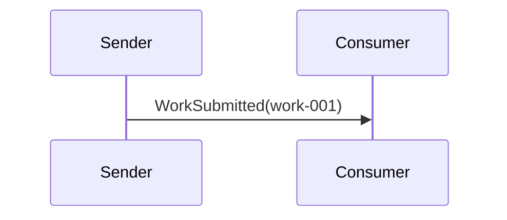

## Prerequisites

`docker compose -f ../docker-compose.yml up -d`

## Run This Example

`bash run.sh`

## Run Manually

Run the consumer first, then the sender.

## Expected Output

`READY:point-to-point-consumer`

`SUCCESS:point-to-point-sender:sent work-001`

`SUCCESS:point-to-point-consumer:processed work-001`

## What To Notice

The sender targets a single endpoint and only one consumer handles the message.
```

- [ ] **Step 4: Build the point-to-point solution**

Run: `dotnet build examples/PointToPoint/PointToPoint.sln`
Expected: `Build succeeded.`

- [ ] **Step 5: Manually run the point-to-point example**

Run: `bash examples/PointToPoint/run.sh`
Expected: output includes `READY:point-to-point-consumer`, `SUCCESS:point-to-point-sender:sent work-001`, and `SUCCESS:point-to-point-consumer:processed work-001`.

- [ ] **Step 6: Commit the point-to-point example**

```bash
git add examples/PointToPoint
git commit -m "feat: add point-to-point example"
```

## Task 4: Add Publish/Subscribe Example

**Files:**
- Create: `examples/PublishSubscribe/PublishSubscribe.sln`
- Create: `examples/PublishSubscribe/README.md`
- Create: `examples/PublishSubscribe/run.sh`
- Create: `examples/PublishSubscribe/run.ps1`
- Create: `examples/PublishSubscribe/src/ServiceConnect.Examples.PublishSubscribe.Contracts/ServiceConnect.Examples.PublishSubscribe.Contracts.csproj`
- Create: `examples/PublishSubscribe/src/ServiceConnect.Examples.PublishSubscribe.Contracts/OrderPlaced.cs`
- Create: `examples/PublishSubscribe/src/ServiceConnect.Examples.PublishSubscribe.Publisher/Program.cs`
- Create: `examples/PublishSubscribe/src/ServiceConnect.Examples.PublishSubscribe.BillingSubscriber/Program.cs`
- Create: `examples/PublishSubscribe/src/ServiceConnect.Examples.PublishSubscribe.BillingSubscriber/OrderPlacedHandler.cs`
- Create: `examples/PublishSubscribe/src/ServiceConnect.Examples.PublishSubscribe.AnalyticsSubscriber/Program.cs`
- Create: `examples/PublishSubscribe/src/ServiceConnect.Examples.PublishSubscribe.AnalyticsSubscriber/OrderPlacedHandler.cs`

- [ ] **Step 1: Create the shared message and subscriber handlers**

Use one event type:

```csharp
public sealed class OrderPlaced(Guid correlationId) : Message(correlationId)
{
    public string OrderId { get; init; } = string.Empty;
}
```

Create two handlers with different endpoint labels:

```csharp
ConsoleStatus.Success("billing-subscriber", $"received {message.OrderId}");
```

```csharp
ConsoleStatus.Success("analytics-subscriber", $"received {message.OrderId}");
```

- [ ] **Step 2: Create the publisher app and both subscriber apps**

Use the same bus bootstrapping pattern as Task 3, but:

- publisher queue name: `publish-subscribe-publisher`
- billing subscriber queue name: `publish-subscribe-billing`
- analytics subscriber queue name: `publish-subscribe-analytics`
- publisher sends `await bus.PublishAsync(new OrderPlaced(Guid.NewGuid()) { OrderId = "order-100" });`

- [ ] **Step 3: Create the solution, runners, and README**

README Mermaid block:

```markdown
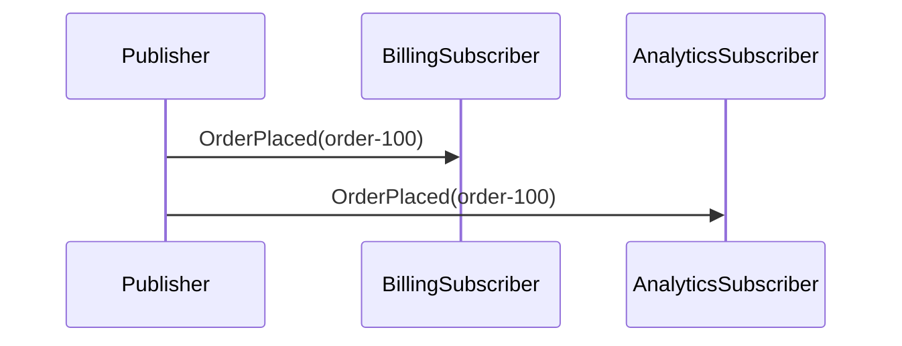
```

- [ ] **Step 4: Build the publish/subscribe solution**

Run: `dotnet build examples/PublishSubscribe/PublishSubscribe.sln`
Expected: `Build succeeded.`

- [ ] **Step 5: Manually run the publish/subscribe example**

Run: `bash examples/PublishSubscribe/run.sh`
Expected: output includes one publisher success line plus success lines from both subscribers for `order-100`.

- [ ] **Step 6: Commit the publish/subscribe example**

```bash
git add examples/PublishSubscribe
git commit -m "feat: add publish-subscribe example"
```

## Task 5: Add Request/Reply Example

**Files:**
- Create: `examples/RequestReply/RequestReply.sln`
- Create: `examples/RequestReply/README.md`
- Create: `examples/RequestReply/run.sh`
- Create: `examples/RequestReply/run.ps1`
- Create: `examples/RequestReply/src/ServiceConnect.Examples.RequestReply.Contracts/QuoteRequest.cs`
- Create: `examples/RequestReply/src/ServiceConnect.Examples.RequestReply.Contracts/QuoteResponse.cs`
- Create: `examples/RequestReply/src/ServiceConnect.Examples.RequestReply.Requester/Program.cs`
- Create: `examples/RequestReply/src/ServiceConnect.Examples.RequestReply.Responder/Program.cs`
- Create: `examples/RequestReply/src/ServiceConnect.Examples.RequestReply.Responder/QuoteRequestHandler.cs`

- [ ] **Step 1: Create the request and response message types**

Use:

```csharp
public sealed class QuoteRequest(Guid correlationId) : Message(correlationId)
{
    public string ProductCode { get; init; } = string.Empty;
}

public sealed class QuoteResponse(Guid correlationId) : Message(correlationId)
{
    public decimal Price { get; init; }
}
```

- [ ] **Step 2: Create the responder and requester apps**

Responder handler:

```csharp
public sealed class QuoteRequestHandler : IMessageHandler<QuoteRequest>
{
    public IConsumeContext? Context { get; set; }

    public async Task HandleAsync(QuoteRequest message)
    {
        await Context!.ReplyAsync(new QuoteResponse(Guid.NewGuid()) { Price = 42.50m });
        ConsoleStatus.Success("request-reply-responder", $"quoted {message.ProductCode}");
    }
}
```

Requester sends:

```csharp
var response = await bus.SendRequestAsync<QuoteRequest, QuoteResponse>(
    new QuoteRequest(Guid.NewGuid()) { ProductCode = "SKU-42" },
    new RequestOptions { EndPoint = "request-reply-responder", Timeout = 30000 });
ConsoleStatus.Success("request-reply-requester", $"received {response.Price}");
```

- [ ] **Step 3: Create the solution, runners, and README**

README Mermaid block:

```markdown
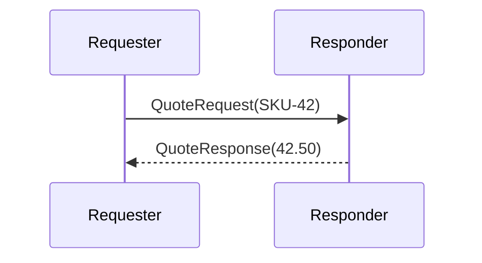
```

- [ ] **Step 4: Build the request/reply solution**

Run: `dotnet build examples/RequestReply/RequestReply.sln`
Expected: `Build succeeded.`

- [ ] **Step 5: Manually run the request/reply example**

Run: `bash examples/RequestReply/run.sh`
Expected: output includes `SUCCESS:request-reply-requester:received 42.50` and `SUCCESS:request-reply-responder:quoted SKU-42`.

- [ ] **Step 6: Commit the request/reply example**

```bash
git add examples/RequestReply
git commit -m "feat: add request-reply example"
```

## Task 6: Add Competing Consumers Example

**Files:**
- Create: `examples/CompetingConsumers/CompetingConsumers.sln`
- Create: `examples/CompetingConsumers/README.md`
- Create: `examples/CompetingConsumers/run.sh`
- Create: `examples/CompetingConsumers/run.ps1`
- Create: `examples/CompetingConsumers/src/ServiceConnect.Examples.CompetingConsumers.Contracts/JobQueued.cs`
- Create: `examples/CompetingConsumers/src/ServiceConnect.Examples.CompetingConsumers.Producer/Program.cs`
- Create: `examples/CompetingConsumers/src/ServiceConnect.Examples.CompetingConsumers.WorkerA/Program.cs`
- Create: `examples/CompetingConsumers/src/ServiceConnect.Examples.CompetingConsumers.WorkerA/JobQueuedHandler.cs`
- Create: `examples/CompetingConsumers/src/ServiceConnect.Examples.CompetingConsumers.WorkerB/Program.cs`
- Create: `examples/CompetingConsumers/src/ServiceConnect.Examples.CompetingConsumers.WorkerB/JobQueuedHandler.cs`

- [ ] **Step 1: Create the shared job message and both worker handlers**

Use one message type:

```csharp
public sealed class JobQueued(Guid correlationId) : Message(correlationId)
{
    public string JobId { get; init; } = string.Empty;
}
```

Handlers log different worker names with `ConsoleStatus.Success`.

- [ ] **Step 2: Create the producer and both worker apps**

Use a shared queue name for both workers: `competing-consumers-work`.

Producer sends 10 jobs:

```csharp
for (var i = 0; i < 10; i++)
{
    await bus.SendAsync(new JobQueued(Guid.NewGuid()) { JobId = $"job-{i}" }, new SendOptions { EndPoint = "competing-consumers-work" });
}
```

- [ ] **Step 3: Create the solution, runners, and README**

README Mermaid block:

```markdown
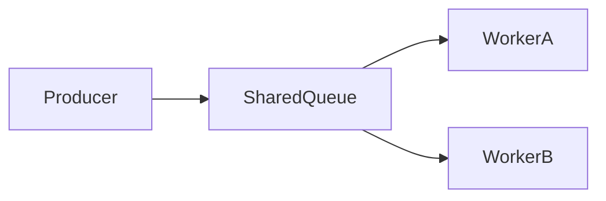
```

- [ ] **Step 4: Build the competing-consumers solution**

Run: `dotnet build examples/CompetingConsumers/CompetingConsumers.sln`
Expected: `Build succeeded.`

- [ ] **Step 5: Manually run the competing-consumers example**

Run: `bash examples/CompetingConsumers/run.sh`
Expected: output includes producer success plus at least one success line from each worker across the batch.

- [ ] **Step 6: Commit the competing-consumers example**

```bash
git add examples/CompetingConsumers
git commit -m "feat: add competing-consumers example"
```

## Task 7: Add Content-Based Routing Example

**Files:**
- Create: `examples/ContentBasedRouting/ContentBasedRouting.sln`
- Create: `examples/ContentBasedRouting/README.md`
- Create: `examples/ContentBasedRouting/run.sh`
- Create: `examples/ContentBasedRouting/run.ps1`
- Create: `examples/ContentBasedRouting/src/ServiceConnect.Examples.ContentBasedRouting.Contracts/PremiumOrderPlaced.cs`
- Create: `examples/ContentBasedRouting/src/ServiceConnect.Examples.ContentBasedRouting.Contracts/StandardOrderPlaced.cs`
- Create: `examples/ContentBasedRouting/src/ServiceConnect.Examples.ContentBasedRouting.Publisher/Program.cs`
- Create: `examples/ContentBasedRouting/src/ServiceConnect.Examples.ContentBasedRouting.PriorityConsumer/Program.cs`
- Create: `examples/ContentBasedRouting/src/ServiceConnect.Examples.ContentBasedRouting.PriorityConsumer/PremiumOrderHandler.cs`
- Create: `examples/ContentBasedRouting/src/ServiceConnect.Examples.ContentBasedRouting.StandardConsumer/Program.cs`
- Create: `examples/ContentBasedRouting/src/ServiceConnect.Examples.ContentBasedRouting.StandardConsumer/StandardOrderHandler.cs`

- [ ] **Step 1: Create the message types and handlers**

Use two message types:

```csharp
public sealed class PremiumOrderPlaced(Guid correlationId) : Message(correlationId)
{
    public string OrderId { get; init; } = string.Empty;
}

public sealed class StandardOrderPlaced(Guid correlationId) : Message(correlationId)
{
    public string OrderId { get; init; } = string.Empty;
}
```

- [ ] **Step 2: Create the publisher and consumer apps**

Publisher emits one premium event and one standard event using `PublishAsync`.

Each consumer registers only the handler for its own message type.

- [ ] **Step 3: Create the solution, runners, and README**

README Mermaid block:

```markdown
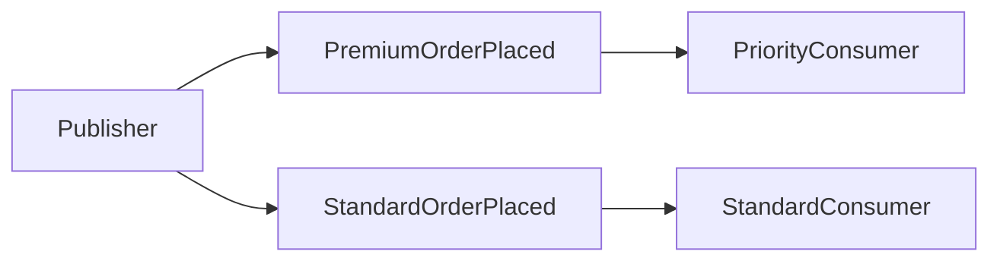
```

- [ ] **Step 4: Build the content-based routing solution**

Run: `dotnet build examples/ContentBasedRouting/ContentBasedRouting.sln`
Expected: `Build succeeded.`

- [ ] **Step 5: Manually run the content-based routing example**

Run: `bash examples/ContentBasedRouting/run.sh`
Expected: output includes one premium-consumer success and one standard-consumer success.

- [ ] **Step 6: Commit the content-based routing example**

```bash
git add examples/ContentBasedRouting
git commit -m "feat: add content-based routing example"
```

## Task 8: Add Routing Slip Example

**Files:**
- Create: `examples/RoutingSlip/RoutingSlip.sln`
- Create: `examples/RoutingSlip/README.md`
- Create: `examples/RoutingSlip/run.sh`
- Create: `examples/RoutingSlip/run.ps1`
- Create: `examples/RoutingSlip/src/ServiceConnect.Examples.RoutingSlip.Contracts/RoutingSlipOrder.cs`
- Create: `examples/RoutingSlip/src/ServiceConnect.Examples.RoutingSlip.Starter/Program.cs`
- Create: `examples/RoutingSlip/src/ServiceConnect.Examples.RoutingSlip.InventoryStep/Program.cs`
- Create: `examples/RoutingSlip/src/ServiceConnect.Examples.RoutingSlip.InventoryStep/RoutingSlipOrderHandler.cs`
- Create: `examples/RoutingSlip/src/ServiceConnect.Examples.RoutingSlip.BillingStep/Program.cs`
- Create: `examples/RoutingSlip/src/ServiceConnect.Examples.RoutingSlip.BillingStep/RoutingSlipOrderHandler.cs`
- Create: `examples/RoutingSlip/src/ServiceConnect.Examples.RoutingSlip.ShippingStep/Program.cs`
- Create: `examples/RoutingSlip/src/ServiceConnect.Examples.RoutingSlip.ShippingStep/RoutingSlipOrderHandler.cs`

- [ ] **Step 1: Create the routing-slip contract**

```csharp
public sealed class RoutingSlipOrder(Guid correlationId) : Message(correlationId)
{
    public string OrderId { get; init; } = string.Empty;
    public string CurrentStep { get; init; } = string.Empty;
}
```

- [ ] **Step 2: Create the starter and three step apps**

Starter uses:

```csharp
await bus.RouteAsync(
    new RoutingSlipOrder(Guid.NewGuid()) { OrderId = "order-200", CurrentStep = "starter" },
    new List<string> { "routing-slip-inventory", "routing-slip-billing", "routing-slip-shipping" });
```

Each handler logs its step name. The first two steps remain pure pass-through listeners; the bus pipeline handles routing-slip forwarding.

- [ ] **Step 3: Create the solution, runners, and README**

README Mermaid block:

```markdown
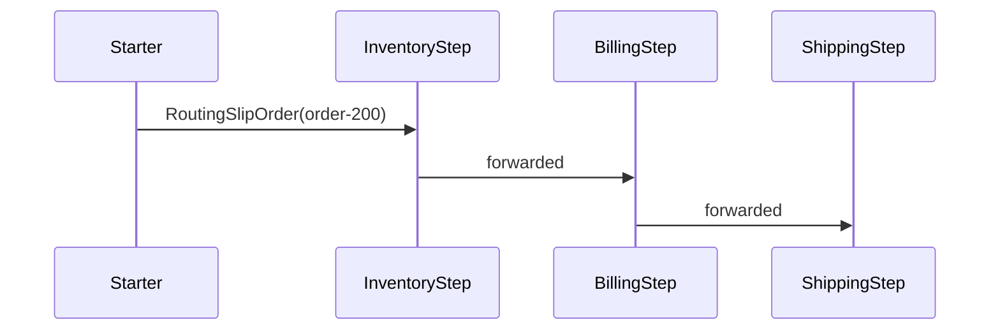
```

- [ ] **Step 4: Build the routing-slip solution**

Run: `dotnet build examples/RoutingSlip/RoutingSlip.sln`
Expected: `Build succeeded.`

- [ ] **Step 5: Manually run the routing-slip example**

Run: `bash examples/RoutingSlip/run.sh`
Expected: output includes inventory, billing, and shipping success markers in order for `order-200`.

- [ ] **Step 6: Commit the routing-slip example**

```bash
git add examples/RoutingSlip
git commit -m "feat: add routing-slip example"
```

## Task 9: Add Scatter/Gather Example

**Files:**
- Create: `examples/ScatterGather/ScatterGather.sln`
- Create: `examples/ScatterGather/README.md`
- Create: `examples/ScatterGather/run.sh`
- Create: `examples/ScatterGather/run.ps1`
- Create: `examples/ScatterGather/src/ServiceConnect.Examples.ScatterGather.Contracts/SearchRequest.cs`
- Create: `examples/ScatterGather/src/ServiceConnect.Examples.ScatterGather.Contracts/SearchResponse.cs`
- Create: `examples/ScatterGather/src/ServiceConnect.Examples.ScatterGather.Requester/Program.cs`
- Create: `examples/ScatterGather/src/ServiceConnect.Examples.ScatterGather.CatalogA/Program.cs`
- Create: `examples/ScatterGather/src/ServiceConnect.Examples.ScatterGather.CatalogA/SearchRequestHandler.cs`
- Create: `examples/ScatterGather/src/ServiceConnect.Examples.ScatterGather.CatalogB/Program.cs`
- Create: `examples/ScatterGather/src/ServiceConnect.Examples.ScatterGather.CatalogB/SearchRequestHandler.cs`

- [ ] **Step 1: Create the request and response contract types**

Use:

```csharp
public sealed class SearchRequest(Guid correlationId) : Message(correlationId)
{
    public string Term { get; init; } = string.Empty;
}

public sealed class SearchResponse(Guid correlationId) : Message(correlationId)
{
    public string CatalogName { get; init; } = string.Empty;
    public string ResultId { get; init; } = string.Empty;
}
```

- [ ] **Step 2: Create the requester and both responder apps**

Requester sends:

```csharp
var replies = await bus.SendRequestMultiAsync<SearchRequest, SearchResponse>(
    new SearchRequest(Guid.NewGuid()) { Term = "laptop" },
    new RequestOptions
    {
        EndPoints = new List<string> { "scatter-gather-catalog-a", "scatter-gather-catalog-b" },
        ExpectedReplyCount = 2,
        Timeout = 30000
    });
```

Each responder replies with its own catalog name.

- [ ] **Step 3: Create the solution, runners, and README**

README Mermaid block:

```markdown
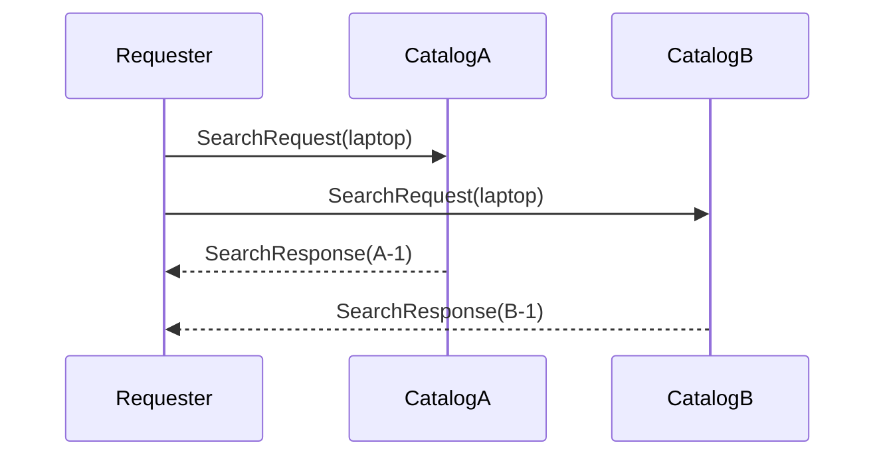
```

- [ ] **Step 4: Build the scatter/gather solution**

Run: `dotnet build examples/ScatterGather/ScatterGather.sln`
Expected: `Build succeeded.`

- [ ] **Step 5: Manually run the scatter/gather example**

Run: `bash examples/ScatterGather/run.sh`
Expected: output includes both catalog response lines and one requester success line reporting 2 replies.

- [ ] **Step 6: Commit the scatter/gather example**

```bash
git add examples/ScatterGather
git commit -m "feat: add scatter-gather example"
```

## Task 10: Add Aggregator Example

**Files:**
- Create: `examples/Aggregator/Aggregator.sln`
- Create: `examples/Aggregator/README.md`
- Create: `examples/Aggregator/run.sh`
- Create: `examples/Aggregator/run.ps1`
- Create: `examples/Aggregator/src/ServiceConnect.Examples.Aggregator.Contracts/TelemetrySlice.cs`
- Create: `examples/Aggregator/src/ServiceConnect.Examples.Aggregator.ProducerA/Program.cs`
- Create: `examples/Aggregator/src/ServiceConnect.Examples.Aggregator.ProducerB/Program.cs`
- Create: `examples/Aggregator/src/ServiceConnect.Examples.Aggregator.Consumer/Program.cs`
- Create: `examples/Aggregator/src/ServiceConnect.Examples.Aggregator.Consumer/TelemetrySliceAggregator.cs`

- [ ] **Step 1: Create the aggregator contract and Mongo-backed aggregator**

Use:

```csharp
public sealed class TelemetrySlice(Guid correlationId) : Message(correlationId)
{
    public string Source { get; init; } = string.Empty;
    public int Value { get; init; }
}
```

Aggregator:

```csharp
public sealed class TelemetrySliceAggregator : Aggregator<TelemetrySlice>
{
    public override int BatchSize() => 2;
    public override TimeSpan Timeout() => TimeSpan.FromSeconds(10);

    public override void Execute(IList<TelemetrySlice> messages)
    {
        ConsoleStatus.Success("aggregator-consumer", $"combined total {messages.Sum(m => m.Value)}");
    }
}
```

- [ ] **Step 2: Create the consumer and two producer apps**

Use `AddExampleBus(settings, "aggregator-consumer", useMongoDb: true, databaseName: "examples_aggregator")` for the consumer.

Producer A sends `TelemetrySlice` with value `10`.

Producer B sends `TelemetrySlice` with value `15`.

- [ ] **Step 3: Create the solution, runners, and README**

README Mermaid block:

```markdown
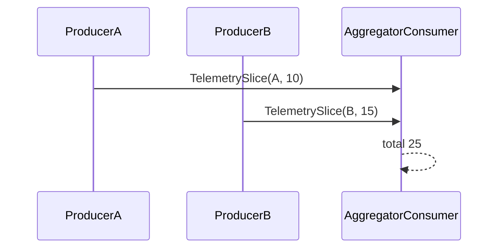
```

- [ ] **Step 4: Build the aggregator solution**

Run: `dotnet build examples/Aggregator/Aggregator.sln`
Expected: `Build succeeded.`

- [ ] **Step 5: Manually run the aggregator example**

Run: `bash examples/Aggregator/run.sh`
Expected: output includes `SUCCESS:aggregator-consumer:combined total 25`.

- [ ] **Step 6: Commit the aggregator example**

```bash
git add examples/Aggregator
git commit -m "feat: add aggregator example"
```

## Task 11: Add Process Manager Example

**Files:**
- Create: `examples/ProcessManager/ProcessManager.sln`
- Create: `examples/ProcessManager/README.md`
- Create: `examples/ProcessManager/run.sh`
- Create: `examples/ProcessManager/run.ps1`
- Create: `examples/ProcessManager/src/ServiceConnect.Examples.ProcessManager.Contracts/OrderSubmitted.cs`
- Create: `examples/ProcessManager/src/ServiceConnect.Examples.ProcessManager.Contracts/InventoryReserved.cs`
- Create: `examples/ProcessManager/src/ServiceConnect.Examples.ProcessManager.Contracts/PaymentCaptured.cs`
- Create: `examples/ProcessManager/src/ServiceConnect.Examples.ProcessManager.Contracts/FulfillmentState.cs`
- Create: `examples/ProcessManager/src/ServiceConnect.Examples.ProcessManager.Starter/Program.cs`
- Create: `examples/ProcessManager/src/ServiceConnect.Examples.ProcessManager.Orchestrator/Program.cs`
- Create: `examples/ProcessManager/src/ServiceConnect.Examples.ProcessManager.Orchestrator/FulfillmentProcessHandler.cs`
- Create: `examples/ProcessManager/src/ServiceConnect.Examples.ProcessManager.InventoryWorker/Program.cs`
- Create: `examples/ProcessManager/src/ServiceConnect.Examples.ProcessManager.InventoryWorker/OrderSubmittedHandler.cs`
- Create: `examples/ProcessManager/src/ServiceConnect.Examples.ProcessManager.PaymentWorker/Program.cs`
- Create: `examples/ProcessManager/src/ServiceConnect.Examples.ProcessManager.PaymentWorker/InventoryReservedHandler.cs`

- [ ] **Step 1: Create the process-manager contracts and state type**

State type:

```csharp
public sealed class FulfillmentState : IProcessManagerData
{
    public Guid CorrelationId { get; set; }
    public bool InventoryReserved { get; set; }
    public bool PaymentCaptured { get; set; }
}
```

- [ ] **Step 2: Create the orchestrator and worker apps using MongoDB persistence**

Use `useMongoDb: true` for the orchestrator bus.

Inventory worker handles `OrderSubmitted` and sends `InventoryReserved` to the orchestrator queue.

Payment worker handles `InventoryReserved` and sends `PaymentCaptured` to the orchestrator queue.

Orchestrator process handlers log progress with `ConsoleStatus.Success` as the state advances.

- [ ] **Step 3: Create the starter, solution, runners, and README**

Starter sends one `OrderSubmitted` with a fixed correlation id.

README Mermaid block:

```markdown
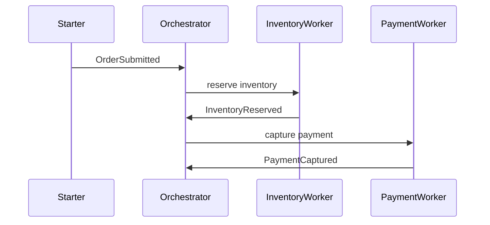
```

- [ ] **Step 4: Build the process-manager solution**

Run: `dotnet build examples/ProcessManager/ProcessManager.sln`
Expected: `Build succeeded.`

- [ ] **Step 5: Manually run the process-manager example**

Run: `bash examples/ProcessManager/run.sh`
Expected: output shows orchestrator, inventory worker, and payment worker success markers for one correlation id.

- [ ] **Step 6: Commit the process-manager example**

```bash
git add examples/ProcessManager
git commit -m "feat: add process-manager example"
```

## Task 12: Add Filters Example

**Files:**
- Create: `examples/Filters/Filters.sln`
- Create: `examples/Filters/README.md`
- Create: `examples/Filters/run.sh`
- Create: `examples/Filters/run.ps1`
- Create: `examples/Filters/src/ServiceConnect.Examples.Filters.Contracts/FilteredNotification.cs`
- Create: `examples/Filters/src/ServiceConnect.Examples.Filters.Sender/Program.cs`
- Create: `examples/Filters/src/ServiceConnect.Examples.Filters.Sender/TraceHeaderFilter.cs`
- Create: `examples/Filters/src/ServiceConnect.Examples.Filters.Consumer/Program.cs`
- Create: `examples/Filters/src/ServiceConnect.Examples.Filters.Consumer/FilteredNotificationHandler.cs`

- [ ] **Step 1: Create the message type and outgoing filter**

```csharp
public sealed class FilteredNotification(Guid correlationId) : Message(correlationId)
{
    public string MessageText { get; init; } = string.Empty;
}
```

```csharp
public sealed class TraceHeaderFilter : IFilter
{
    public Task<bool> ProcessAsync(Envelope envelope, CancellationToken cancellationToken = default)
    {
        envelope.Headers["X-Trace-Id"] = "trace-001";
        return Task.FromResult(true);
    }
}
```

- [ ] **Step 2: Create the sender and consumer apps**

Sender registers `builder.AddOutgoingFilter<TraceHeaderFilter>();`.

Consumer handler reads the header from `IConsumeContext` and logs `SUCCESS:filters-consumer:trace trace-001`.

- [ ] **Step 3: Create the solution, runners, and README**

README Mermaid block:

```markdown
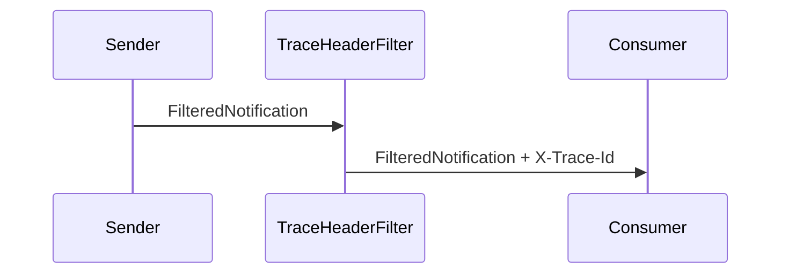
```

- [ ] **Step 4: Build the filters solution**

Run: `dotnet build examples/Filters/Filters.sln`
Expected: `Build succeeded.`

- [ ] **Step 5: Manually run the filters example**

Run: `bash examples/Filters/run.sh`
Expected: output includes `SUCCESS:filters-consumer:trace trace-001`.

- [ ] **Step 6: Commit the filters example**

```bash
git add examples/Filters
git commit -m "feat: add filters example"
```

## Task 13: Add Streaming Example

**Files:**
- Create: `examples/Streaming/Streaming.sln`
- Create: `examples/Streaming/README.md`
- Create: `examples/Streaming/run.sh`
- Create: `examples/Streaming/run.ps1`
- Create: `examples/Streaming/src/ServiceConnect.Examples.Streaming.Contracts/DocumentUploaded.cs`
- Create: `examples/Streaming/src/ServiceConnect.Examples.Streaming.Uploader/Program.cs`
- Create: `examples/Streaming/src/ServiceConnect.Examples.Streaming.Receiver/Program.cs`
- Create: `examples/Streaming/src/ServiceConnect.Examples.Streaming.Receiver/DocumentUploadedHandler.cs`

- [ ] **Step 1: Create the streamed message contract and receiver handler**

```csharp
public sealed class DocumentUploaded(Guid correlationId) : Message(correlationId)
{
    public string FileName { get; init; } = string.Empty;
}
```

```csharp
public sealed class DocumentUploadedHandler : IStreamHandler<DocumentUploaded>
{
    public IMessageBusReadStream Stream { get; set; } = null!;

    public void Execute(DocumentUploaded message)
    {
        var bytes = Stream.Read();
        ConsoleStatus.Success("streaming-receiver", $"received {bytes.Length} bytes for {message.FileName}");
    }
}
```

- [ ] **Step 2: Create the uploader and receiver apps**

Uploader uses `CreateStream<DocumentUploaded>("streaming-receiver")`, writes three chunks, and closes the stream.

Receiver starts consuming before the uploader runs.

- [ ] **Step 3: Create the solution, runners, and README**

README Mermaid block:

```markdown
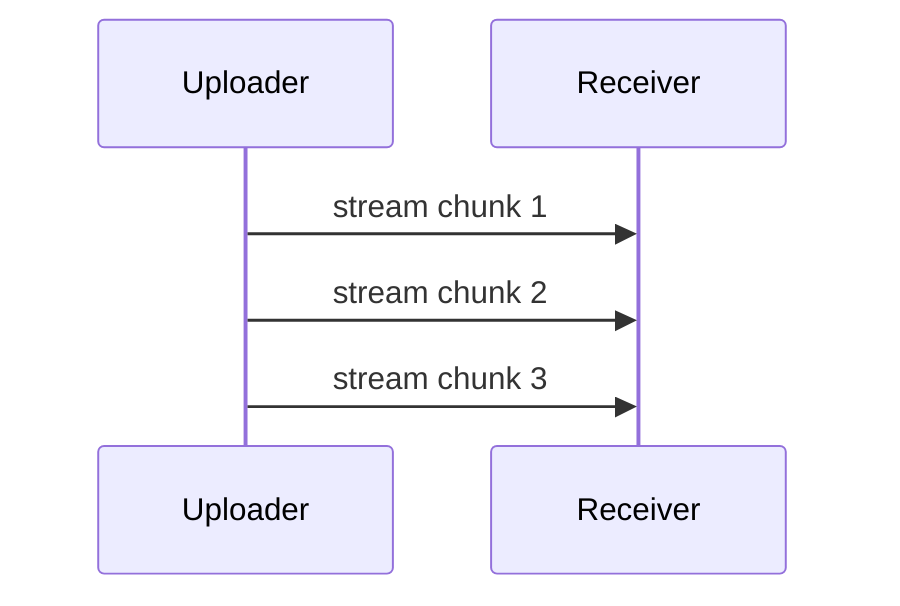
```

- [ ] **Step 4: Build the streaming solution**

Run: `dotnet build examples/Streaming/Streaming.sln`
Expected: `Build succeeded.`

- [ ] **Step 5: Manually run the streaming example**

Run: `bash examples/Streaming/run.sh`
Expected: output includes `SUCCESS:streaming-receiver:received` with a non-zero byte count.

- [ ] **Step 6: Commit the streaming example**

```bash
git add examples/Streaming
git commit -m "feat: add streaming example"
```

## Task 14: Final Integration Pass

**Files:**
- Modify: `examples/README.md`
- Modify: all pattern `README.md` files for consistency
- Modify: all pattern `run.sh` and `run.ps1` files for consistent startup behavior

- [ ] **Step 1: Normalize all README sections**

Apply this exact section order to every pattern README:

```markdown
1. Overview
2. Participants
3. Mermaid Diagram
4. Prerequisites
5. Run This Example
6. Run Manually
7. Expected Output
8. What To Notice
```

- [ ] **Step 2: Normalize all runner scripts**

Apply these concrete conventions to every pattern runner:

```bash
#!/usr/bin/env bash
set -euo pipefail
source ../scripts/common.sh
start_dependencies
PIDS=()

start_passive() {
  dotnet run --project "$1" &
  PIDS+=("$!")
}

# Start one or more passive endpoints here.
sleep 5
# Run the initiator endpoint here.
for pid in "${PIDS[@]}"; do
  kill "$pid" || true
done
for pid in "${PIDS[@]}"; do
  wait "$pid" || true
done
```

Pattern-specific substitutions:

- `PointToPoint`: passive project `ServiceConnect.Examples.PointToPoint.Consumer`, initiator project `ServiceConnect.Examples.PointToPoint.Sender`
- `PublishSubscribe`: passive projects `ServiceConnect.Examples.PublishSubscribe.BillingSubscriber` and `ServiceConnect.Examples.PublishSubscribe.AnalyticsSubscriber`, initiator project `ServiceConnect.Examples.PublishSubscribe.Publisher`
- `RequestReply`: passive project `ServiceConnect.Examples.RequestReply.Responder`, initiator project `ServiceConnect.Examples.RequestReply.Requester`
- `CompetingConsumers`: passive projects `ServiceConnect.Examples.CompetingConsumers.WorkerA` and `ServiceConnect.Examples.CompetingConsumers.WorkerB`, initiator project `ServiceConnect.Examples.CompetingConsumers.Producer`
- `ContentBasedRouting`: passive projects `ServiceConnect.Examples.ContentBasedRouting.PriorityConsumer` and `ServiceConnect.Examples.ContentBasedRouting.StandardConsumer`, initiator project `ServiceConnect.Examples.ContentBasedRouting.Publisher`
- `RoutingSlip`: passive projects `ServiceConnect.Examples.RoutingSlip.InventoryStep`, `ServiceConnect.Examples.RoutingSlip.BillingStep`, and `ServiceConnect.Examples.RoutingSlip.ShippingStep`, initiator project `ServiceConnect.Examples.RoutingSlip.Starter`
- `ScatterGather`: passive projects `ServiceConnect.Examples.ScatterGather.CatalogA` and `ServiceConnect.Examples.ScatterGather.CatalogB`, initiator project `ServiceConnect.Examples.ScatterGather.Requester`
- `Aggregator`: passive project `ServiceConnect.Examples.Aggregator.Consumer`, initiator projects `ServiceConnect.Examples.Aggregator.ProducerA` and `ServiceConnect.Examples.Aggregator.ProducerB`
- `ProcessManager`: passive projects `ServiceConnect.Examples.ProcessManager.Orchestrator`, `ServiceConnect.Examples.ProcessManager.InventoryWorker`, and `ServiceConnect.Examples.ProcessManager.PaymentWorker`, initiator project `ServiceConnect.Examples.ProcessManager.Starter`
- `Filters`: passive project `ServiceConnect.Examples.Filters.Consumer`, initiator project `ServiceConnect.Examples.Filters.Sender`
- `Streaming`: passive project `ServiceConnect.Examples.Streaming.Receiver`, initiator project `ServiceConnect.Examples.Streaming.Uploader`

Use the matching PowerShell runner shape for every `run.ps1`, with the same project ordering.

- [ ] **Step 3: Build every solution**

Run:

```bash
dotnet build examples/PointToPoint/PointToPoint.sln && \
dotnet build examples/PublishSubscribe/PublishSubscribe.sln && \
dotnet build examples/RequestReply/RequestReply.sln && \
dotnet build examples/CompetingConsumers/CompetingConsumers.sln && \
dotnet build examples/ContentBasedRouting/ContentBasedRouting.sln && \
dotnet build examples/RoutingSlip/RoutingSlip.sln && \
dotnet build examples/ScatterGather/ScatterGather.sln && \
dotnet build examples/Aggregator/Aggregator.sln && \
dotnet build examples/ProcessManager/ProcessManager.sln && \
dotnet build examples/Filters/Filters.sln && \
dotnet build examples/Streaming/Streaming.sln
```

Expected: all solutions report `Build succeeded.`

- [ ] **Step 4: Manually verify representative examples**

Run:

```bash
bash examples/PointToPoint/run.sh && \
bash examples/RequestReply/run.sh && \
bash examples/ProcessManager/run.sh && \
bash examples/Streaming/run.sh
```

Expected: all four runs complete with their documented success markers and no unhandled exceptions.

- [ ] **Step 5: Commit the final examples integration pass**

```bash
git add examples
git commit -m "feat: add complete ServiceConnect examples suite"
```

## Self-Review Checklist

### Spec coverage

- shared `examples/` root, compose, and catalog: Tasks 1-2
- per-pattern isolated solutions: Tasks 3-13
- local project references: Task 1 and all pattern projects
- one-command runners and manual run paths: Tasks 3-14
- Mermaid READMEs for each pattern: Tasks 3-13
- shared support code for config and readiness: Task 1
- Mongo-backed patterns: Tasks 10-11
- final consistency pass: Task 14

### Placeholder scan

- no `TBD`, `TODO`, or deferred implementation markers remain
- every task names exact file paths
- every task includes explicit build or manual-run commands

### Consistency

- support namespace remains `ServiceConnect.Examples.Support.*`
- project naming remains `ServiceConnect.Examples.<Pattern>.<Role>`
- success markers use `ConsoleStatus.Success(...)` consistently
- no TDD or test-first steps are used; verification is via builds and smoke runs per user instruction
