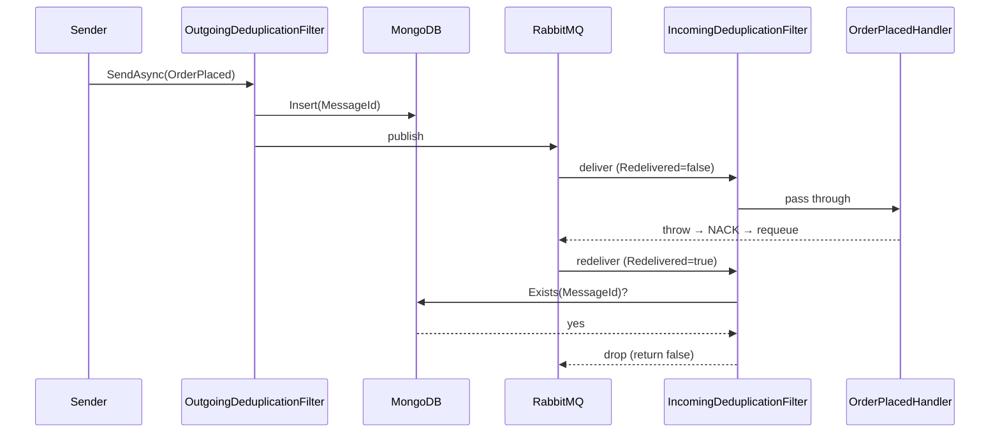

# Message Deduplication Sample & Undocumented Extension Points: Implementation Plan

> **For agentic workers:** REQUIRED SUB-SKILL: Use superpowers:subagent-driven-development (recommended) or superpowers:executing-plans to implement this plan task-by-task. Steps use checkbox (`- [ ]`) syntax for tracking.

**Goal:** Ship a runnable `examples/MessageDeduplication` sample and four new website pages (MessageDeduplication filter reference, operations/idempotency, `ITimeoutStore`, `IRegistryInitializer`, `IRequestReplyManager`) that close documentation gaps identified in an audit of the `v7-clean-architecture` branch.

**Architecture:** A three-project .NET sample (Contracts, Sender, Consumer) following the layout of `examples/Filters`, with a RabbitMQ + MongoDB `docker-compose.yml` and a `run.sh` / `run.ps1` driver that matches `examples/Aggregator`. The Sender and Consumer both register `AddMessageDeduplicationFilter(...)` pointing at the same MongoDB database; the Consumer handler throws after logging to force a broker redelivery, and the `IncomingDeduplicationFilter` blocks the redelivery using the shared persistor. Website additions are Astro MDX pages that template from existing reference pages (`ifilter.mdx`, `ileaseawaretimeoutstore.mdx`, `ihandlerregistry.mdx`) and one new `bus/` subfolder under `reference/extension-points/` for `IRequestReplyManager`.

**Tech Stack:** .NET 10 (`TargetFramework` inherited from `examples/Directory.Build.props`), RabbitMQ via `ServiceConnect.Client.RabbitMQ`, MongoDB via `ServiceConnect.Filters.MessageDeduplication`, `ServiceConnect.Examples.Support` for shared bootstrap (`ExampleBusFactory`, `DependencyWaiter`, `ConsoleStatus`), Astro Starlight for the website.

**Background reading before you start:**
- Spec: [`docs/superpowers/specs/2026-04-22-dedup-sample-and-docs-design.md`](../specs/2026-04-22-dedup-sample-and-docs-design.md)
- Reference sample (Sender/Consumer layout): [`examples/Filters/`](../../../examples/Filters/)
- Reference sample (docker-compose + `wait_for_ready`): [`examples/Aggregator/`](../../../examples/Aggregator/)
- Filter package source: [`filters/ServiceConnect.Filters.MessageDeduplication/`](../../../filters/ServiceConnect.Filters.MessageDeduplication/)
- Filter API in ServiceConnectBuilder: [`src/ServiceConnect/ServiceConnectBuilder.cs`](../../../src/ServiceConnect/ServiceConnectBuilder.cs) — look for `AddBeforeConsumingFilter`, `AddOutgoingFilter`
- E2E test that exercises the same pattern (simulated redelivery via header): [`src/ServiceConnect.EndToEndTests/Filters/MessageDeduplicationTests.cs`](../../../src/ServiceConnect.EndToEndTests/Filters/MessageDeduplicationTests.cs)
- Website templates: [`website/src/content/docs/reference/filters/ifilter.mdx`](../../../website/src/content/docs/reference/filters/ifilter.mdx), [`ileaseawaretimeoutstore.mdx`](../../../website/src/content/docs/reference/extension-points/persistence/ileaseawaretimeoutstore.mdx), [`ihandlerregistry.mdx`](../../../website/src/content/docs/reference/extension-points/registry/ihandlerregistry.mdx)

**Why no per-task unit tests:** The filter package already has unit tests ([`filters/ServiceConnect.Filters.MessageDeduplication/ServiceConnect.Filters.MessageDeduplication.Tests/`](../../../filters/ServiceConnect.Filters.MessageDeduplication/ServiceConnect.Filters.MessageDeduplication.Tests/)) and an E2E test exists for the pattern. The sample's job is to *demonstrate* the behaviour end-to-end — the verification per task is `dotnet build` (compilation), and the integration verification is Task 10 (full run produces the expected output). For the website, `npm run build` from Astro catches broken links and malformed frontmatter. No new unit tests required.

**Working branch:** Continue on `v7-clean-architecture` — do not create a new branch. Commit at the boundaries noted in the spec.

---

## Phase 1: Sample project

### Task 1: Create the Contracts project

**Files:**
- Create: `examples/MessageDeduplication/src/ServiceConnect.Examples.MessageDeduplication.Contracts/ServiceConnect.Examples.MessageDeduplication.Contracts.csproj`
- Create: `examples/MessageDeduplication/src/ServiceConnect.Examples.MessageDeduplication.Contracts/OrderPlaced.cs`

- [ ] **Step 1: Create the directory structure**

```bash
mkdir -p examples/MessageDeduplication/src/ServiceConnect.Examples.MessageDeduplication.Contracts
```

- [ ] **Step 2: Write the Contracts csproj**

`examples/MessageDeduplication/src/ServiceConnect.Examples.MessageDeduplication.Contracts/ServiceConnect.Examples.MessageDeduplication.Contracts.csproj`:

```xml
<Project Sdk="Microsoft.NET.Sdk">
  <ItemGroup>
    <ProjectReference Include="../../../../src/ServiceConnect.Interfaces/ServiceConnect.Interfaces.csproj" />
  </ItemGroup>
</Project>
```

`examples/Directory.Build.props` supplies `TargetFramework=net10.0`, `Nullable=enable`, `ImplicitUsings=enable`, and `TreatWarningsAsErrors=true`, so this csproj is deliberately minimal.

- [ ] **Step 3: Write `OrderPlaced.cs`**

```csharp
using ServiceConnect.Interfaces;

namespace ServiceConnect.Examples.MessageDeduplication.Contracts;

public sealed class OrderPlaced(Guid correlationId) : Message(correlationId)
{
    public string OrderId { get; init; } = string.Empty;
    public decimal Total { get; init; }
}
```

- [ ] **Step 4: Verify the project builds**

```bash
dotnet build examples/MessageDeduplication/src/ServiceConnect.Examples.MessageDeduplication.Contracts/ServiceConnect.Examples.MessageDeduplication.Contracts.csproj
```

Expected: `Build succeeded.` with zero warnings (warnings become errors).

---

### Task 2: Create the Consumer project

**Files:**
- Create: `examples/MessageDeduplication/src/ServiceConnect.Examples.MessageDeduplication.Consumer/ServiceConnect.Examples.MessageDeduplication.Consumer.csproj`
- Create: `examples/MessageDeduplication/src/ServiceConnect.Examples.MessageDeduplication.Consumer/OrderPlacedHandler.cs`
- Create: `examples/MessageDeduplication/src/ServiceConnect.Examples.MessageDeduplication.Consumer/Program.cs`

- [ ] **Step 1: Create the directory**

```bash
mkdir -p examples/MessageDeduplication/src/ServiceConnect.Examples.MessageDeduplication.Consumer
```

- [ ] **Step 2: Write the Consumer csproj**

```xml
<Project Sdk="Microsoft.NET.Sdk">
  <PropertyGroup>
    <OutputType>Exe</OutputType>
  </PropertyGroup>
  <ItemGroup>
    <ProjectReference Include="../ServiceConnect.Examples.MessageDeduplication.Contracts/ServiceConnect.Examples.MessageDeduplication.Contracts.csproj" />
    <ProjectReference Include="../../../ExampleSupport/ServiceConnect.Examples.Support.csproj" />
    <ProjectReference Include="../../../../src/ServiceConnect/ServiceConnect.csproj" />
    <ProjectReference Include="../../../../src/ServiceConnect.Client.RabbitMQ/ServiceConnect.Client.RabbitMQ.csproj" />
    <ProjectReference Include="../../../../filters/ServiceConnect.Filters.MessageDeduplication/ServiceConnect.Filters.MessageDeduplication/ServiceConnect.Filters.MessageDeduplication.csproj" />
  </ItemGroup>
</Project>
```

The filter package reference is the distinguishing addition vs. `examples/Filters/src/ServiceConnect.Examples.Filters.Consumer/ServiceConnect.Examples.Filters.Consumer.csproj` — verify that csproj to confirm the other references match the convention.

- [ ] **Step 3: Write `OrderPlacedHandler.cs`**

```csharp
using ServiceConnect.Examples.MessageDeduplication.Contracts;
using ServiceConnect.Examples.Support.Bootstrap;
using ServiceConnect.Interfaces;

namespace ServiceConnect.Examples.MessageDeduplication.Consumer;

public sealed class OrderPlacedHandler : IMessageHandler<OrderPlaced>
{
    public Task HandleAsync(OrderPlaced message)
    {
        ConsoleStatus.Success("dedup-consumer", $"handled {message.OrderId}");

        // Simulate a crash after the side effect. The broker will requeue the
        // message with Redelivered=true; the IncomingDeduplicationFilter blocks
        // that redelivery because the Sender's OutgoingDeduplicationFilter
        // already recorded the MessageId in the shared MongoDB persistor.
        throw new InvalidOperationException(
            "Simulated crash after handling — expect redelivery to be filtered.");
    }
}
```

The method is `HandleAsync` (confirmed against [`IMessageHandler.cs`](../../../src/ServiceConnect.Interfaces/Handlers/IMessageHandler.cs)). `ConsoleStatus.Success` emits `SUCCESS:dedup-consumer:handled <orderId>` — the run scripts grep for this marker.

- [ ] **Step 4: Write `Program.cs`**

```csharp
using Microsoft.Extensions.DependencyInjection;
using Microsoft.Extensions.Logging;
using ServiceConnect.Examples.MessageDeduplication.Consumer;
using ServiceConnect.Examples.MessageDeduplication.Contracts;
using ServiceConnect.Examples.Support.Bootstrap;
using ServiceConnect.Examples.Support.Configuration;
using ServiceConnect.Filters.MessageDeduplication;
using ServiceConnect.Filters.MessageDeduplication.Filters;
using ServiceConnect.Interfaces;

var settings = ExampleSettingsLoader.Load();
var queueName = Environment.GetEnvironmentVariable("SC_EXAMPLES_QUEUE_NAME") ?? "dedup-consumer";
var mongoDbName = Environment.GetEnvironmentVariable("SC_DEDUP_MONGO_DB") ?? "dedup-sample";

await DependencyWaiter.WaitForRabbitMqAsync(
    settings.RabbitMqHost,
    settings.RabbitMqPort,
    settings.RabbitMqUsername,
    settings.RabbitMqPassword,
    CancellationToken.None);

await DependencyWaiter.WaitForMongoDbAsync(
    settings.MongoConnectionString,
    CancellationToken.None);

var handlerReferences = new List<HandlerReference>
{
    new() { HandlerType = typeof(OrderPlacedHandler), MessageType = typeof(OrderPlaced) }
};

var services = new ServiceCollection();
services.AddSingleton<IList<HandlerReference>>(handlerReferences);
services.AddTransient<IMessageHandler<OrderPlaced>, OrderPlacedHandler>();

services.AddMessageDeduplicationFilter(options =>
{
    options.PersistorType = PersistorType.MongoDb;
    options.ConnectionStringMongoDb = settings.MongoConnectionString;
    options.DatabaseNameMongoDb = mongoDbName;
    options.CollectionNameMongoDb = "ProcessedMessages";
    options.MsgExpiryHours = 24;
});

services.AddExampleBus(settings, queueName, configureBuilder: builder =>
{
    builder.AddBeforeConsumingFilter<IncomingDeduplicationFilter>();
});

await using var provider = services.BuildServiceProvider();
var bus = provider.GetRequiredService<IBus>();
await bus.StartConsumingAsync();
ConsoleStatus.Ready("dedup-consumer");
await Console.Out.FlushAsync();
await Task.Delay(Timeout.InfiniteTimeSpan);
```

Key details:
- `AddMessageDeduplicationFilter(options => ...)` registers the persistor + cleanup hosted service (see [`AddMessageDeduplicationFilterExtensions.cs`](../../../filters/ServiceConnect.Filters.MessageDeduplication/ServiceConnect.Filters.MessageDeduplication/AddMessageDeduplicationFilterExtensions.cs)). It does *not* wire the filter into the bus pipeline — that's what `AddBeforeConsumingFilter<IncomingDeduplicationFilter>()` does on the `ServiceConnectBuilder`.
- The field names (`ConnectionStringMongoDb`, `DatabaseNameMongoDb`, `CollectionNameMongoDb`, `MsgExpiryHours`) match the settings class exactly — don't rename them.

- [ ] **Step 5: Verify the Consumer builds**

```bash
dotnet build examples/MessageDeduplication/src/ServiceConnect.Examples.MessageDeduplication.Consumer/ServiceConnect.Examples.MessageDeduplication.Consumer.csproj
```

Expected: `Build succeeded.` with zero warnings.

---

### Task 3: Create the Sender project

**Files:**
- Create: `examples/MessageDeduplication/src/ServiceConnect.Examples.MessageDeduplication.Sender/ServiceConnect.Examples.MessageDeduplication.Sender.csproj`
- Create: `examples/MessageDeduplication/src/ServiceConnect.Examples.MessageDeduplication.Sender/Program.cs`

- [ ] **Step 1: Create the directory**

```bash
mkdir -p examples/MessageDeduplication/src/ServiceConnect.Examples.MessageDeduplication.Sender
```

- [ ] **Step 2: Write the Sender csproj**

Identical structure to the Consumer csproj in Task 2 Step 2 — same five `ProjectReference`s.

```xml
<Project Sdk="Microsoft.NET.Sdk">
  <PropertyGroup>
    <OutputType>Exe</OutputType>
  </PropertyGroup>
  <ItemGroup>
    <ProjectReference Include="../ServiceConnect.Examples.MessageDeduplication.Contracts/ServiceConnect.Examples.MessageDeduplication.Contracts.csproj" />
    <ProjectReference Include="../../../ExampleSupport/ServiceConnect.Examples.Support.csproj" />
    <ProjectReference Include="../../../../src/ServiceConnect/ServiceConnect.csproj" />
    <ProjectReference Include="../../../../src/ServiceConnect.Client.RabbitMQ/ServiceConnect.Client.RabbitMQ.csproj" />
    <ProjectReference Include="../../../../filters/ServiceConnect.Filters.MessageDeduplication/ServiceConnect.Filters.MessageDeduplication/ServiceConnect.Filters.MessageDeduplication.csproj" />
  </ItemGroup>
</Project>
```

- [ ] **Step 3: Write the Sender `Program.cs`**

```csharp
using Microsoft.Extensions.DependencyInjection;
using ServiceConnect.Examples.MessageDeduplication.Contracts;
using ServiceConnect.Examples.Support.Bootstrap;
using ServiceConnect.Examples.Support.Configuration;
using ServiceConnect.Filters.MessageDeduplication;
using ServiceConnect.Filters.MessageDeduplication.Filters;
using ServiceConnect.Interfaces;

var settings = ExampleSettingsLoader.Load();
var queueName = Environment.GetEnvironmentVariable("SC_EXAMPLES_QUEUE_NAME") ?? "dedup-sender";
var mongoDbName = Environment.GetEnvironmentVariable("SC_DEDUP_MONGO_DB") ?? "dedup-sample";
var consumerQueue = Environment.GetEnvironmentVariable("SC_EXAMPLES_CONSUMER_QUEUE") ?? "dedup-consumer";

await DependencyWaiter.WaitForRabbitMqAsync(
    settings.RabbitMqHost,
    settings.RabbitMqPort,
    settings.RabbitMqUsername,
    settings.RabbitMqPassword,
    CancellationToken.None);

await DependencyWaiter.WaitForMongoDbAsync(
    settings.MongoConnectionString,
    CancellationToken.None);

var services = new ServiceCollection();

services.AddMessageDeduplicationFilter(options =>
{
    options.PersistorType = PersistorType.MongoDb;
    options.ConnectionStringMongoDb = settings.MongoConnectionString;
    options.DatabaseNameMongoDb = mongoDbName;
    options.CollectionNameMongoDb = "ProcessedMessages";
    options.MsgExpiryHours = 24;
});

services.AddExampleBus(settings, queueName, configureBuilder: builder =>
{
    builder.AddOutgoingFilter<OutgoingDeduplicationFilter>();
});

await using var provider = services.BuildServiceProvider();
var bus = provider.GetRequiredService<IBus>();

var orderId = Guid.NewGuid().ToString("N").Substring(0, 8);
var message = new OrderPlaced(Guid.NewGuid())
{
    OrderId = orderId,
    Total = 42.50m
};

await bus.SendAsync(consumerQueue, message);
ConsoleStatus.Success("dedup-sender", $"sent {orderId}");
await Console.Out.FlushAsync();
```

Key details:
- The Sender **sends one message**. That is the whole contribution — the broker's redelivery after the Consumer's exception is what exercises the filter. Do not send multiple messages from here.
- `SendAsync(consumerQueue, message)` is point-to-point; the Consumer's queue name must match `consumerQueue`. The `run.sh` in Task 7 sets `SC_EXAMPLES_QUEUE_NAME` on the Consumer and `SC_EXAMPLES_CONSUMER_QUEUE` on the Sender to the same value.
- `AddOutgoingFilter<OutgoingDeduplicationFilter>()` is what inserts the outgoing MessageId into MongoDB so the Consumer's incoming filter can find it on redelivery.

- [ ] **Step 4: Verify the Sender builds**

```bash
dotnet build examples/MessageDeduplication/src/ServiceConnect.Examples.MessageDeduplication.Sender/ServiceConnect.Examples.MessageDeduplication.Sender.csproj
```

Expected: `Build succeeded.` with zero warnings.

---

### Task 4: Create the solution file

**Files:**
- Create: `examples/MessageDeduplication/MessageDeduplication.sln`

- [ ] **Step 1: Generate the .sln via dotnet CLI**

```bash
cd examples/MessageDeduplication
dotnet new sln -n MessageDeduplication
dotnet sln MessageDeduplication.sln add \
  src/ServiceConnect.Examples.MessageDeduplication.Contracts/ServiceConnect.Examples.MessageDeduplication.Contracts.csproj \
  src/ServiceConnect.Examples.MessageDeduplication.Consumer/ServiceConnect.Examples.MessageDeduplication.Consumer.csproj \
  src/ServiceConnect.Examples.MessageDeduplication.Sender/ServiceConnect.Examples.MessageDeduplication.Sender.csproj
cd ../..
```

- [ ] **Step 2: Verify the solution builds**

```bash
dotnet build examples/MessageDeduplication/MessageDeduplication.sln
```

Expected: all three projects build successfully.

---

### Task 5: Create appsettings.json

**Files:**
- Create: `examples/MessageDeduplication/appsettings.json`

- [ ] **Step 1: Confirm whether a local appsettings is needed**

```bash
ls examples/Filters/appsettings.json 2>/dev/null || ls examples/appsettings.json
```

The root `examples/appsettings.json` is picked up by `ExampleSettingsLoader`. If that file already defines `RabbitMqHost`, `MongoConnectionString`, etc., the sample does not need its own `appsettings.json`. Skip to Task 6 if so.

- [ ] **Step 2: If (and only if) the root file is missing any field the Consumer/Sender use, add a local override**

```json
{
  "Examples": {
    "RabbitMqHost": "localhost",
    "RabbitMqPort": 5672,
    "RabbitMqUsername": "guest",
    "RabbitMqPassword": "guest",
    "MongoConnectionString": "mongodb://localhost:27017"
  }
}
```

Field names must match `ExampleSettings` exactly — check [`examples/ExampleSupport/Configuration/ExampleSettings.cs`](../../../examples/ExampleSupport/Configuration/ExampleSettings.cs) before adding.

---

### Task 6: Create docker-compose.yml

**Files:**
- Create: `examples/MessageDeduplication/docker-compose.yml`

- [ ] **Step 1: Write docker-compose.yml**

```yaml
services:
  rabbitmq:
    image: rabbitmq:3.13-management
    ports:
      - "5672:5672"
      - "15672:15672"
    environment:
      RABBITMQ_DEFAULT_USER: guest
      RABBITMQ_DEFAULT_PASS: guest
    healthcheck:
      test: ["CMD", "rabbitmq-diagnostics", "-q", "ping"]
      interval: 5s
      timeout: 5s
      retries: 10
  mongodb:
    image: mongo:7.0
    ports:
      - "27017:27017"
    healthcheck:
      test: ["CMD", "mongosh", "--quiet", "--eval", "db.adminCommand('ping').ok"]
      interval: 5s
      timeout: 5s
      retries: 10
```

Both services expose healthchecks — `run.sh` will use `docker compose ps --format json` to poll for health rather than relying on `depends_on`, because the samples run the .NET processes on the host, not inside compose. `DependencyWaiter.WaitForRabbitMqAsync` + `WaitForMongoDbAsync` inside the Consumer/Sender give a second layer of readiness.

- [ ] **Step 2: Verify the compose file parses**

```bash
docker compose -f examples/MessageDeduplication/docker-compose.yml config > /dev/null
```

Expected: no output, exit code 0. If `docker` is not in your PATH, run through `sg docker -c '...'` (the user is not in the docker group).

---

### Task 7: Create run.sh

**Files:**
- Create: `examples/MessageDeduplication/run.sh`

Before writing, read [`examples/Aggregator/run.sh`](../../../examples/Aggregator/run.sh) front to back — the shape below mirrors it but drops the multi-producer bits and adds a docker-compose boot.

- [ ] **Step 1: Write run.sh**

```bash
#!/usr/bin/env bash
set -euo pipefail

SAMPLE_DIR="$(cd "$(dirname "${BASH_SOURCE[0]}")" && pwd)"
OUTPUT_LOG="${SAMPLE_DIR}/output.log"
COMPOSE_FILE="${SAMPLE_DIR}/docker-compose.yml"

: > "$OUTPUT_LOG"

cleanup() {
  local pid="${1:-}"
  if [[ -n "$pid" ]]; then
    kill "$pid" 2>/dev/null || true
    wait "$pid" 2>/dev/null || true
  fi
  docker compose -f "$COMPOSE_FILE" down -v --remove-orphans >/dev/null 2>&1 || true
}

wait_for_ready() {
  local attempt=0
  local max_attempts=120
  while [ $attempt -lt $max_attempts ]; do
    if grep -q '^READY:dedup-consumer$' "$OUTPUT_LOG" 2>/dev/null; then
      return 0
    fi
    sleep 0.5
    attempt=$((attempt + 1))
  done
  return 1
}

wait_for_blocked_redelivery() {
  local attempt=0
  local max_attempts=40   # 20 seconds
  while [ $attempt -lt $max_attempts ]; do
    # Success marker: the handler logged exactly one "SUCCESS:dedup-consumer:handled" line
    # AND at least one retry attempt was filtered (we assume the filter fires
    # within 20s of the initial handle).
    local handled_count
    handled_count=$(grep -c 'SUCCESS:dedup-consumer:handled' "$OUTPUT_LOG" 2>/dev/null || echo 0)
    if [ "$handled_count" -ge 1 ]; then
      # Give the broker a chance to redeliver + filter to block
      sleep 2
      # After the grace period, the handled count should still be 1 — the
      # filter blocked the redelivery so the handler was not called again.
      local final_count
      final_count=$(grep -c 'SUCCESS:dedup-consumer:handled' "$OUTPUT_LOG" 2>/dev/null || echo 0)
      if [ "$final_count" -eq 1 ]; then
        return 0
      fi
      echo "FAIL: handler ran $final_count times — expected 1 (filter did not block redelivery)"
      return 1
    fi
    sleep 0.5
    attempt=$((attempt + 1))
  done
  echo "FAIL: handler never invoked within 20s"
  return 1
}

echo "Starting RabbitMQ + MongoDB via docker-compose..."
docker compose -f "$COMPOSE_FILE" up -d

echo "Waiting for services to be healthy..."
for svc in rabbitmq mongodb; do
  for _ in $(seq 1 60); do
    status=$(docker compose -f "$COMPOSE_FILE" ps --format json "$svc" \
      | grep -o '"Health":"[^"]*"' | head -n 1 | cut -d'"' -f4 || true)
    if [ "$status" = "healthy" ]; then break; fi
    sleep 1
  done
done

echo "Starting Consumer..."
dotnet run --project "$SAMPLE_DIR/src/ServiceConnect.Examples.MessageDeduplication.Consumer" \
  --no-launch-profile >> "$OUTPUT_LOG" 2>&1 &
CONSUMER_PID=$!

trap "cleanup $CONSUMER_PID" EXIT

if ! wait_for_ready; then
  echo "ERROR: Consumer did not become ready within 60 seconds"
  cat "$OUTPUT_LOG"
  exit 1
fi

echo "Running Sender (publishes one OrderPlaced)..."
dotnet run --project "$SAMPLE_DIR/src/ServiceConnect.Examples.MessageDeduplication.Sender" \
  --no-launch-profile >> "$OUTPUT_LOG" 2>&1

echo "Waiting for redelivery to be filtered..."
if ! wait_for_blocked_redelivery; then
  exit 1
fi

echo "SUCCESS: handler invoked exactly once; filter blocked the redelivery."
```

- [ ] **Step 2: Make run.sh executable**

```bash
chmod +x examples/MessageDeduplication/run.sh
```

- [ ] **Step 3: Syntax-check run.sh**

```bash
bash -n examples/MessageDeduplication/run.sh
```

Expected: no output, exit code 0.

---

### Task 8: Create run.ps1

**Files:**
- Create: `examples/MessageDeduplication/run.ps1`

- [ ] **Step 1: Write the PowerShell equivalent of run.sh**

Mirror the bash script's structure. Use `Select-String -Pattern '^READY:dedup-consumer$'` for ready-detection and `(Get-Content -ErrorAction SilentlyContinue | Select-String 'SUCCESS:dedup-consumer:handled').Count` for handled-count. Follow the shape of [`examples/Aggregator/run.ps1`](../../../examples/Aggregator/run.ps1) — copy its process/trap patterns rather than reinventing them.

```powershell
#Requires -Version 7.0
param()

$ErrorActionPreference = 'Stop'
$SampleDir = Split-Path -Parent $PSCommandPath
$OutputLog = Join-Path $SampleDir 'output.log'
$ComposeFile = Join-Path $SampleDir 'docker-compose.yml'

'' | Set-Content -Path $OutputLog -Encoding utf8

$ConsumerProcess = $null

$cleanup = {
    if ($script:ConsumerProcess -and -not $script:ConsumerProcess.HasExited) {
        $script:ConsumerProcess.Kill() | Out-Null
        $script:ConsumerProcess.WaitForExit(5000) | Out-Null
    }
    docker compose -f $ComposeFile down -v --remove-orphans 2>$null | Out-Null
}

try {
    Write-Host 'Starting RabbitMQ + MongoDB via docker-compose...'
    docker compose -f $ComposeFile up -d | Out-Null

    Write-Host 'Waiting for services to be healthy...'
    foreach ($svc in 'rabbitmq', 'mongodb') {
        for ($i = 0; $i -lt 60; $i++) {
            $raw = docker compose -f $ComposeFile ps --format json $svc 2>$null
            if ($raw -match '"Health":"healthy"') { break }
            Start-Sleep -Seconds 1
        }
    }

    Write-Host 'Starting Consumer...'
    $ConsumerProcess = Start-Process -FilePath 'dotnet' `
        -ArgumentList 'run', '--project',
            (Join-Path $SampleDir 'src/ServiceConnect.Examples.MessageDeduplication.Consumer'),
            '--no-launch-profile' `
        -RedirectStandardOutput $OutputLog -RedirectStandardError $OutputLog `
        -NoNewWindow -PassThru

    $ready = $false
    for ($i = 0; $i -lt 120; $i++) {
        if (Select-String -Path $OutputLog -Pattern '^READY:dedup-consumer$' -Quiet) {
            $ready = $true; break
        }
        Start-Sleep -Milliseconds 500
    }
    if (-not $ready) {
        Write-Error 'Consumer did not become ready within 60 seconds'
        Get-Content $OutputLog
        exit 1
    }

    Write-Host 'Running Sender (publishes one OrderPlaced)...'
    dotnet run --project (Join-Path $SampleDir 'src/ServiceConnect.Examples.MessageDeduplication.Sender') `
        --no-launch-profile *>> $OutputLog

    Write-Host 'Waiting for redelivery to be filtered...'
    for ($i = 0; $i -lt 40; $i++) {
        $handled = (Select-String -Path $OutputLog -Pattern 'SUCCESS:dedup-consumer:handled').Count
        if ($handled -ge 1) {
            Start-Sleep -Seconds 2
            $final = (Select-String -Path $OutputLog -Pattern 'SUCCESS:dedup-consumer:handled').Count
            if ($final -eq 1) {
                Write-Host 'SUCCESS: handler invoked exactly once; filter blocked the redelivery.'
                exit 0
            }
            Write-Error "FAIL: handler ran $final times — expected 1"
            exit 1
        }
        Start-Sleep -Milliseconds 500
    }
    Write-Error 'FAIL: handler never invoked within 20s'
    exit 1
}
finally {
    & $cleanup
}
```

- [ ] **Step 2: Syntax-check run.ps1** (optional — only if pwsh is available)

```bash
pwsh -NoProfile -Command "Get-Content examples/MessageDeduplication/run.ps1 | Out-Null"
```

---

### Task 9: Write README.md

**Files:**
- Create: `examples/MessageDeduplication/README.md`

- [ ] **Step 1: Read [`examples/Aggregator/README.md`](../../../examples/Aggregator/README.md) to match the template** — the seven sections are: Overview, Participants, Message Flow, Prerequisites, Run This Example, Run Manually, Expected Output, What To Notice.

- [ ] **Step 2: Write the README**

```markdown
# Message Deduplication

Demonstrates the `ServiceConnect.Filters.MessageDeduplication` filter blocking a duplicate delivery that the broker retries after a consumer-side failure. Pair with [`../../website/src/content/docs/learn/operations/idempotency.mdx`](../../website/src/content/docs/learn/operations/idempotency.mdx) and the [filter reference](../../website/src/content/docs/reference/filters/messagededuplication.mdx).

## Participants

- **Contracts** — `OrderPlaced` message type shared between Sender and Consumer.
- **Sender** — publishes one `OrderPlaced` via `SendAsync`. Registers `OutgoingDeduplicationFilter`, which writes the outgoing `MessageId` to the shared MongoDB persistor.
- **Consumer** — registers `IncomingDeduplicationFilter`. Its handler logs and then throws, causing the broker to redeliver with `Redelivered=true`. On the redelivery the filter sees the `MessageId` in MongoDB and blocks it — the handler is not invoked a second time.

## Message Flow



## Prerequisites

- Docker with the Compose plugin.
- .NET 10 SDK.

## Run This Example

```bash
./run.sh
```

On Windows:

```powershell
./run.ps1
```

The script boots RabbitMQ + MongoDB via docker-compose, waits for both to be healthy, starts the Consumer in the background, runs the Sender, and verifies the handler was invoked exactly once.

## Run Manually

In one terminal:

```bash
docker compose -f examples/MessageDeduplication/docker-compose.yml up -d
dotnet run --project examples/MessageDeduplication/src/ServiceConnect.Examples.MessageDeduplication.Consumer
```

In another:

```bash
dotnet run --project examples/MessageDeduplication/src/ServiceConnect.Examples.MessageDeduplication.Sender
```

## Expected Output

Consumer log (abbreviated):

```
READY:dedup-consumer
SUCCESS:dedup-consumer:handled 3a1b2c4d
... exception stacktrace from the handler's simulated crash ...
... no second "SUCCESS:dedup-consumer:handled" line — the IncomingDeduplicationFilter blocked the redelivery ...
```

The run script's success criterion is: exactly one `SUCCESS:dedup-consumer:handled` line in the Consumer log after waiting for the redelivery window.

## What To Notice

- `AddMessageDeduplicationFilter` registers DI and the cleanup hosted service but does *not* wire the filter into the pipeline. The Sender chains `builder.AddOutgoingFilter<OutgoingDeduplicationFilter>()` and the Consumer chains `builder.AddBeforeConsumingFilter<IncomingDeduplicationFilter>()`.
- The persistor must be shared across the Sender and Consumer processes. The sample uses MongoDB. The InMemory persistor is a valid choice for single-process scenarios (tests, in-process fan-out) but will not demonstrate dedup when the Sender and Consumer are separate processes.
- The filter only blocks messages where `Redelivered=true`. A first delivery with a new `MessageId` always passes through.
```

---

### Task 10: End-to-end verification and commit (Phase 1)

- [ ] **Step 1: Build the whole sample solution**

```bash
dotnet build examples/MessageDeduplication/MessageDeduplication.sln
```

Expected: all three projects build with zero warnings.

- [ ] **Step 2: Run the sample end-to-end**

```bash
sg docker -c 'cd /home/tim/source/ServiceConnect-CSharp && ./examples/MessageDeduplication/run.sh'
```

Expected final line: `SUCCESS: handler invoked exactly once; filter blocked the redelivery.`

If `FAIL: handler ran N times — expected 1` appears:
- Check [`src/ServiceConnect/Bus.cs`](../../../src/ServiceConnect/Bus.cs) for NACK/redeliver behaviour on handler exceptions. If ServiceConnect dead-letters instead of requeueing, switch the Sender to publish **two** messages — the second with `Headers = { ["Redelivered"] = "True" }` via `SendOptions` — mirroring [`MessageDeduplicationTests.cs`](../../../src/ServiceConnect.EndToEndTests/Filters/MessageDeduplicationTests.cs) lines 120–140. Adjust the Consumer handler to *not* throw. Update the README "Message Flow" section accordingly.
- Check `examples/MessageDeduplication/output.log` for handler-side errors that aren't the simulated throw.

- [ ] **Step 3: Tear down any stray containers**

```bash
sg docker -c 'docker compose -f /home/tim/source/ServiceConnect-CSharp/examples/MessageDeduplication/docker-compose.yml down -v'
```

- [ ] **Step 4: Stage and commit**

```bash
git add examples/MessageDeduplication/
git commit -m "$(cat <<'EOF'
feat(samples): add MessageDeduplication sample with shared MongoDB persistor

Adds a runnable three-project sample (Contracts, Sender, Consumer) that
demonstrates the IncomingDeduplicationFilter blocking a broker-redelivered
message after the Consumer handler throws.

Co-Authored-By: Claude Opus 4.7 (1M context) <noreply@anthropic.com>
EOF
)"
```

---

## Phase 2: MessageDeduplication documentation

### Task 11: Write the MessageDeduplication filter reference page

**Files:**
- Create: `website/src/content/docs/reference/filters/messagededuplication.mdx`

- [ ] **Step 1: Read the template** — [`website/src/content/docs/reference/filters/ifilter.mdx`](../../../website/src/content/docs/reference/filters/ifilter.mdx) — and [`DeduplicationFilterSettings.cs`](../../../filters/ServiceConnect.Filters.MessageDeduplication/ServiceConnect.Filters.MessageDeduplication/DeduplicationFilterSettings.cs), [`IncomingDeduplicationFilter.cs`](../../../filters/ServiceConnect.Filters.MessageDeduplication/ServiceConnect.Filters.MessageDeduplication/Filters/IncomingDeduplicationFilter.cs), [`OutgoingDeduplicationFilter.cs`](../../../filters/ServiceConnect.Filters.MessageDeduplication/ServiceConnect.Filters.MessageDeduplication/Filters/OutgoingDeduplicationFilter.cs), [`DeduplicationCleanupHostedService.cs`](../../../filters/ServiceConnect.Filters.MessageDeduplication/ServiceConnect.Filters.MessageDeduplication/DeduplicationCleanupHostedService.cs), [`IMessageDeduplicationPersistor.cs`](../../../filters/ServiceConnect.Filters.MessageDeduplication/ServiceConnect.Filters.MessageDeduplication/Persistors/IMessageDeduplicationPersistor.cs). The prose below is grounded in those files — do not paraphrase without re-reading.

- [ ] **Step 2: Write the page**

```mdx
---
title: Message Deduplication
description: Filter package that blocks redelivered messages whose MessageId has already been processed, using an in-memory or MongoDB persistor.
---

import { Aside, Code } from '@astrojs/starlight/components';

`ServiceConnect.Filters.MessageDeduplication` is an opt-in filter package that
drops broker redeliveries whose `MessageId` has already been processed. It
ships two filters, two persistors, and a cleanup hosted service, all wired up
via a single DI extension.

Pair this page with the operational guidance on
[Idempotency](/learn/operations/idempotency/) and the runnable
[sample](https://github.com/ruffer/ServiceConnect-CSharp/tree/master/examples/MessageDeduplication).

## When to use it

You have a ServiceConnect consumer that does non-idempotent work — sending
email, taking payment, inserting rows without a natural upsert key — and the
broker occasionally redelivers. Handler-side idempotency is the first line of
defence; this filter is the infrastructure-level belt-and-braces.

<Aside type="caution">
  The filter only blocks messages whose `Redelivered` header is `true`. A first
  delivery with a new `MessageId` always passes through. The filter does not
  prevent the same message from being sent twice by application code — for that,
  design idempotent producers or use the `OutgoingDeduplicationFilter` on the
  sender side to short-circuit duplicate *outbound* sends.
</Aside>

## Install

```bash
dotnet add package ServiceConnect.Filters.MessageDeduplication
```

## Register

```csharp
services.AddMessageDeduplicationFilter(options =>
{
    options.PersistorType = PersistorType.MongoDb;
    options.ConnectionStringMongoDb = "mongodb://localhost:27017";
    options.DatabaseNameMongoDb    = "service-dedup";
    options.CollectionNameMongoDb  = "ProcessedMessages";
    options.MsgExpiryHours         = 24;
});

services.AddServiceConnect(builder =>
{
    builder.UseRabbitMQ(t => { /* ... */ });
    builder.AddBeforeConsumingFilter<IncomingDeduplicationFilter>();
    builder.AddOutgoingFilter<OutgoingDeduplicationFilter>();
});
```

`AddMessageDeduplicationFilter` registers the configured persistor (singleton),
both filter types (transient), and the [`DeduplicationCleanupHostedService`](#cleanup)
background worker. It does *not* wire the filters into the bus pipeline — do
that explicitly on the `ServiceConnectBuilder` so you pick which side (sender,
receiver, or both) runs which filter.

## Settings

Every field on [`DeduplicationFilterSettings`](https://github.com/ruffer/ServiceConnect-CSharp/blob/master/filters/ServiceConnect.Filters.MessageDeduplication/ServiceConnect.Filters.MessageDeduplication/DeduplicationFilterSettings.cs):

| Field | Type | Default | Purpose |
|---|---|---|---|
| `PersistorType` | `PersistorType` | `InMemory` | `InMemory` or `MongoDb`. See [Choosing a persistor](#choosing-a-persistor). |
| `MsgExpiryHours` | `int` | `24` | Retention — how far back the filter remembers `MessageId`s. Must be ≥ broker redelivery window. |
| `MsgCleanupIntervalMinutes` | `int` | `60` | How often the cleanup worker sweeps expired entries. |
| `DisableMsgExpiry` | `bool` | `false` | When `true`, entries never expire and the cleanup worker no-ops. Useful for tests. |
| `ConnectionStringMongoDb` | `string?` | `mongodb://localhost` | MongoDB persistor only. |
| `DatabaseNameMongoDb` | `string?` | `ServiceConnect-Filters-MessageDeduplication` | MongoDB persistor only. |
| `CollectionNameMongoDb` | `string?` | `ProcessedMessages` | MongoDB persistor only. |
| `MongoDbCertPath` | `string?` | `null` | Path to an X509 client certificate. Enables TLS when set. |
| `MongoDbCertBase64` | `string?` | `null` | Base64 X509 client certificate, alternative to `MongoDbCertPath`. |
| `MongoDbCertPassphrase` | `string?` | `null` | Passphrase for either cert source. |

## Filters

### `IncomingDeduplicationFilter`

Wire with `builder.AddBeforeConsumingFilter<IncomingDeduplicationFilter>()`.

- Fast-path returns `true` (pass through) when the `Redelivered` header is
  missing or `false`.
- Parses `MessageId` as a `Guid` from the envelope headers. A missing or
  malformed id is tolerated — the message passes through rather than failing,
  because deduplication cannot apply without a valid key.
- Queries the configured persistor; returns `false` (block) when the id is
  already recorded.

### `OutgoingDeduplicationFilter`

Wire with `builder.AddOutgoingFilter<OutgoingDeduplicationFilter>()`.

- Records every outgoing `MessageId` in the persistor with an expiry of
  `UtcNow + MsgExpiryHours`.
- Fail-closed: no try/catch. If the persistor throws, the send fails. This
  preserves the dedup guarantee at the cost of send availability when the
  backing store is down.

## Choosing a persistor

`PersistorType.InMemory` uses a per-process `ConcurrentDictionary`. It is
appropriate when the sender and receiver run in the same process (in-process
tests, self-publishing, or a single-tenant worker that deduplicates its own
redeliveries). Across processes or replicas it is effectively a no-op —
each process has its own dictionary.

`PersistorType.MongoDb` uses a single collection keyed by `MessageId`, shared
across every process that points at the same database. Use this when the
sender and receiver are separate services, or when the receiver runs as
multiple replicas behind a shared queue.

Implement `IMessageDeduplicationPersistor` for other backends (Redis, Postgres,
etc.):

```csharp
public interface IMessageDeduplicationPersistor
{
    Task<bool> GetMessageExistsAsync(Guid messageId, CancellationToken cancellationToken = default);
    Task InsertAsync(Guid messageId, DateTime messageExpiry, CancellationToken cancellationToken = default);
    Task RemoveExpiredMessagesAsync(DateTime messageExpiry, CancellationToken cancellationToken = default);
}
```

Register your implementation *before* calling `AddMessageDeduplicationFilter` —
the extension's default registration uses `TryAdd`-like semantics, so the first
registration wins. (Verify this against the extension source if your DI
container behaves differently.)

## Cleanup

`DeduplicationCleanupHostedService` is registered automatically by
`AddMessageDeduplicationFilter`. On a cadence of `MsgCleanupIntervalMinutes`
it calls `IMessageDeduplicationPersistor.RemoveExpiredMessagesAsync` with a
cutoff of `UtcNow`. Entries inserted with `messageExpiry < UtcNow` are
removed, keeping the store bounded.

Set `DisableMsgExpiry = true` to turn this off — entries will remain in the
store indefinitely. Only do this when you know the volume is bounded by
external means (a test fixture, for example).

## See also

- [`IFilter`](/reference/filters/ifilter/) — the base interface the filters implement
- [Idempotency](/learn/operations/idempotency/) — operational guidance and handler-side patterns
- [MessageDeduplication sample](https://github.com/ruffer/ServiceConnect-CSharp/tree/master/examples/MessageDeduplication)
```

- [ ] **Step 3: Verify frontmatter renders**

```bash
cd website && npm run build
```

Expected: clean build, the new page appears under `dist/reference/filters/messagededuplication/`.

---

### Task 12: Write the Idempotency operations page

**Files:**
- Create: `website/src/content/docs/learn/operations/idempotency.mdx`

- [ ] **Step 1: Read an existing `learn/operations/` page** (e.g. [`error-handling.mdx`](../../../website/src/content/docs/learn/operations/error-handling.mdx)) to match the frontmatter shape and prose tone.

- [ ] **Step 2: Write the page**

```mdx
---
title: Idempotency
description: Why duplicates happen in ServiceConnect, how to design handlers that tolerate them, and when to add infrastructure-level deduplication.
---

import { Aside } from '@astrojs/starlight/components';

ServiceConnect delivers messages at least once. Most of the time you receive
a message exactly once, but occasionally you will see the same message twice
— the broker redelivers when a consumer NACKs or disconnects before
acknowledging. If the handler's side effects are not idempotent, the second
delivery corrupts state.

There are two places to defend against this, and they are not exclusive.

## Handler-side idempotency (preferred)

Design the handler so that processing the same message twice produces the same
end state as processing it once. This is the most reliable defence because it
survives every kind of duplicate — broker redelivery, publisher retries, manual
requeues.

Common patterns:

- **Natural keys and upserts.** `INSERT ... ON CONFLICT DO NOTHING` against a
  table with a unique index on the message's business id. The second delivery
  does nothing.
- **Domain-specific dedup tables.** Record the `MessageId` in the same
  transaction as the side effect, keyed and indexed. Before doing work, check
  the table.
- **Outbox / inbox pattern.** The handler writes the processed-id alongside
  the outgoing events in a single transaction. Subsequent deliveries find the
  inbox row and skip.

The common thread: the dedup check lives inside the same consistency boundary
as the side effect.

## Infrastructure-level deduplication

When the side effect lives outside your consistency boundary (calling a
third-party API, sending an email, charging a card), you cannot always make
the handler idempotent. For these cases ServiceConnect provides the
`ServiceConnect.Filters.MessageDeduplication` filter package.

The filter records outgoing `MessageId`s in a shared persistor (MongoDB is the
cross-process option) and blocks incoming messages whose `Redelivered` header
is `true` and whose `MessageId` is already recorded. The handler never sees
the redelivery.

See the [filter reference](/reference/filters/messagededuplication/) for
configuration, persistor selection, and wiring, and the runnable
[sample](https://github.com/ruffer/ServiceConnect-CSharp/tree/master/examples/MessageDeduplication)
for an end-to-end demonstration.

<Aside type="note">
  The filter only blocks *broker redeliveries*. It does not protect against a
  misbehaving publisher that sends two messages with different `MessageId`s
  for the same logical event — for that, use handler-side idempotency or
  enforce dedup at the publisher.
</Aside>

## Combining the two

In practice, production services use both. Handler-side idempotency is
correctness; infrastructure dedup is a performance optimisation (skip the
work entirely) and a backstop for the cases where the handler's own check
is expensive.

Rough rule:

- Small, idempotent handlers → handler-side only.
- Expensive or externally-visible side effects with cheap `MessageId` lookup
  → both.
- Purely external side effects with no natural idempotency key (e.g. sending
  an SMS) → infrastructure filter is your only option short of redesigning
  the downstream API.
```

- [ ] **Step 3: Verify the page builds**

```bash
cd website && npm run build
```

---

### Task 13: Wire MessageDeduplication into nav and samples catalog

**Files:**
- Modify: `website/astro.config.mjs`
- Modify: `website/src/content/docs/samples.mdx`

- [ ] **Step 1: Open [`astro.config.mjs`](../../../website/astro.config.mjs)** and find the `Filters & Middleware` sidebar group (search for `label: 'Filters'` or the first filter-related link). Add the new page alongside `IFilter`:

```js
{
  label: 'Message Deduplication',
  link: '/reference/filters/messagededuplication/',
},
```

Insert it below `IFilter` in the list.

- [ ] **Step 2: Find the `Operations` sidebar group** and add:

```js
{
  label: 'Idempotency',
  link: '/learn/operations/idempotency/',
},
```

Match the alphabetical / semantic ordering used by the neighbouring entries (`configuration`, `error-handling`, `hosting`, `observability`).

- [ ] **Step 3: Add a row to [`samples.mdx`](../../../website/src/content/docs/samples.mdx)** for the new sample. Match the shape of existing rows.

- [ ] **Step 4: Build the website**

```bash
cd website && npm run build
```

Expected: clean build, sidebar shows both new entries, sample appears in the catalog.

- [ ] **Step 5: Commit**

```bash
git add website/src/content/docs/reference/filters/messagededuplication.mdx \
        website/src/content/docs/learn/operations/idempotency.mdx \
        website/src/content/docs/samples.mdx \
        website/astro.config.mjs
git commit -m "$(cat <<'EOF'
docs(website): document MessageDeduplication filter and idempotency operations

Adds a reference page for the ServiceConnect.Filters.MessageDeduplication
package (InMemory + MongoDB persistors, filter wiring, cleanup service) and
a learn/operations page covering handler-side vs infrastructure dedup.
Registers the new pages in the sidebar and adds the sample to samples.mdx.

Co-Authored-By: Claude Opus 4.7 (1M context) <noreply@anthropic.com>
EOF
)"
```

---

## Phase 3: Extension-point documentation

### Task 14: Write the `ITimeoutStore` reference page and back-link

**Files:**
- Create: `website/src/content/docs/reference/extension-points/persistence/itimeoutstore.mdx`
- Modify: `website/src/content/docs/reference/extension-points/persistence/ileaseawaretimeoutstore.mdx` (add back-link)

- [ ] **Step 1: Read the source** — [`ITimeoutStore.cs`](../../../src/ServiceConnect.Interfaces/Persistence/ITimeoutStore.cs), [`ILeaseAwareTimeoutStore.cs`](../../../src/ServiceConnect.Interfaces/Persistence/ILeaseAwareTimeoutStore.cs), and any in-memory or SQL default implementation under `src/ServiceConnect/` or `src/ServiceConnect.Persistence.*/` to ground the "Implementing" section.

- [ ] **Step 2: Read the template** — [`ileaseawaretimeoutstore.mdx`](../../../website/src/content/docs/reference/extension-points/persistence/ileaseawaretimeoutstore.mdx) — and mirror its section layout: Overview → Reference (interface code + per-method docs) → Implementing (invariants, skeletal example) → Usage (registration) → See also.

- [ ] **Step 3: Write `itimeoutstore.mdx`**

Frontmatter:

```mdx
---
title: ITimeoutStore
description: Persists scheduled timeouts for later dispatch. Base interface for the ServiceConnect timeout manager.
---
```

**Interface code block** (copy verbatim from [`ITimeoutStore.cs`](../../../src/ServiceConnect.Interfaces/Persistence/ITimeoutStore.cs)):

```csharp
public interface ITimeoutStore
{
    Task InsertTimeoutAsync(TimeoutData timeoutData, CancellationToken cancellationToken = default);
    Task<TimeoutsBatch> GetTimeoutsBatchAsync(CancellationToken cancellationToken = default);
    Task RemoveDispatchedTimeoutAsync(Guid id, CancellationToken cancellationToken = default);
    Task ReleaseDispatchedTimeoutAsync(Guid id, CancellationToken cancellationToken = default);
}
```

**Per-method docs** — carry the XML doc comments from the source verbatim into the prose; don't reword. The method semantics the page must cover, grounded in the source:

- `InsertTimeoutAsync` — persist a future timeout for later dispatch.
- `GetTimeoutsBatchAsync` — return the next batch of due timeouts plus the next recommended poll time. The caller uses the recommended poll time to backoff.
- `RemoveDispatchedTimeoutAsync` — delete a timeout after successful dispatch (commit).
- `ReleaseDispatchedTimeoutAsync` — release a timeout back to the queue for retry (dispatch failed before the downstream work completed).

**Implementing** — invariants an implementer must preserve:

1. `GetTimeoutsBatchAsync` must not return the same timeout twice to concurrent callers without locking. Implementations in clustered setups should use `ILeaseAwareTimeoutStore` instead.
2. `RemoveDispatchedTimeoutAsync` and `ReleaseDispatchedTimeoutAsync` must be idempotent — the manager may retry on transient storage failures.

**Relationship to `ILeaseAwareTimeoutStore`** — single-instance deployments use `ITimeoutStore`; multi-instance deployments should implement the lease-aware variant so concurrent timeout managers do not each dispatch the same timeout. Link to [`/reference/extension-points/persistence/ileaseawaretimeoutstore/`](/reference/extension-points/persistence/ileaseawaretimeoutstore/).

**Usage** — paste the registration pattern from the sibling page (DI `AddSingleton<ITimeoutStore, YourImpl>()`), adjusted for this interface.

**See also** — `ILeaseAwareTimeoutStore`, `IAggregatorPersistor`, `IProcessManagerFinder`.

- [ ] **Step 4: Add a back-link from `ileaseawaretimeoutstore.mdx`**

Find the "See also" section (or the top-of-page "Overview" if no See also exists) and add a link to `/reference/extension-points/persistence/itimeoutstore/`. The existing page currently references the base interface in prose but does not link to it — that is the gap we are closing.

- [ ] **Step 5: Verify the build**

```bash
cd website && npm run build
```

---

### Task 15: Write the `IRegistryInitializer` reference page

**Files:**
- Create: `website/src/content/docs/reference/extension-points/registry/iregistryinitializer.mdx`

- [ ] **Step 1: Read the source** — [`IRegistryInitializer.cs`](../../../src/ServiceConnect.Interfaces/Handlers/IRegistryInitializer.cs) and [`RegistryInitializer.cs`](../../../src/ServiceConnect/Services/RegistryInitializer.cs). The interface is one method:

```csharp
public interface IRegistryInitializer
{
    void Initialize();
}
```

The default implementation is internal — it resolves every `IHandlerRegistry` in DI, which forces eager construction and handler-configuration validation at startup.

- [ ] **Step 2: Read the template** — [`ihandlerregistry.mdx`](../../../website/src/content/docs/reference/extension-points/registry/ihandlerregistry.mdx) — and match its section shape.

- [ ] **Step 3: Write `iregistryinitializer.mdx`**

Frontmatter:

```mdx
---
title: IRegistryInitializer
description: Bootstrap hook called during bus construction that eagerly initializes handler registries, failing fast on misconfigured handlers.
---
```

Cover:

- **Overview** — one-sentence summary, cross-link to `IHandlerRegistry`. Explain that the default implementation (internal) resolves every `IHandlerRegistry` in DI during `Bus` construction, which triggers construction of each registry and surfaces misconfiguration as a startup failure rather than a first-message failure.
- **Reference** — the interface code block verbatim, explanation of the single `Initialize()` method.
- **When to implement** — custom assembly scanning, handler filtering, metrics-on-startup. If you only want to validate handler config, you don't need a custom implementation — the default covers it.
- **Usage** — `services.AddSingleton<IRegistryInitializer, YourImpl>()` pattern. Note that registering your own replaces the default; if you still want the default's eager-resolution behaviour, call it from your implementation.
- **See also** — [`IHandlerRegistry`](/reference/extension-points/registry/ihandlerregistry/).

- [ ] **Step 4: Verify the build**

```bash
cd website && npm run build
```

---

### Task 16: Write the `IRequestReplyManager` reference page

**Files:**
- Create: `website/src/content/docs/reference/extension-points/bus/irequestreplymanager.mdx`
- Create directory: `website/src/content/docs/reference/extension-points/bus/` (new subfolder)

- [ ] **Step 1: Create the directory**

```bash
mkdir -p website/src/content/docs/reference/extension-points/bus
```

- [ ] **Step 2: Read the source** — [`IRequestReplyManager.cs`](../../../src/ServiceConnect.Interfaces/Bus/IRequestReplyManager.cs) (four methods: `SendRequestAsync<TRequest,TReply>`, `SendRequestMultiAsync<TRequest,TReply>`, `PublishRequestAsync<TRequest,TReply>`, `ProcessReply`). Also look at [`RequestReplyManager.cs`](../../../src/ServiceConnect/Services/RequestReplyManager.cs) — the default implementation — to understand the correlation mechanism (request-id headers).

- [ ] **Step 3: Write `irequestreplymanager.mdx`**

Frontmatter:

```mdx
---
title: IRequestReplyManager
description: Coordinates request/reply interactions on top of the transport pipeline — tracks in-flight requests and correlates replies by message id.
---
```

Cover:

- **Overview** — What it does: when `IBus.SendRequestAsync` is called, `IRequestReplyManager` serialises the request, sends it via the transport, records the pending correlation, and awaits the matching reply. When a reply arrives, the consumer dispatches it back through `ProcessReply`.
- **Reference** — The full interface code block, each method documented from the XML docs in the source. Four methods: `SendRequestAsync`, `SendRequestMultiAsync`, `PublishRequestAsync` (callback-based for streaming replies), `ProcessReply`.
- **Where it sits** — Between `IBus.SendRequestAsync` and the transport's outgoing pipeline. A reference-arrow diagram is nice-to-have but not required; the prose description is fine.
- **When to implement** — You rarely replace this. Common reasons: custom timeout/retention behaviour, storing pending requests in a durable store for survivor behaviour across process restarts, or instrumenting request/reply with telemetry.
- **Usage** — Registration pattern. Note that the default implementation (`RequestReplyManager`) also implements an internal `IReplyStatusRequestReplyManager` interface used by the reply consumer — if you replace the public interface, wire up an internal adapter or keep the default.
- **See also** — `IBus`, `RequestOptions`, the Request/Reply messaging pattern page.

<Aside type="note">
  Note: the default implementation tracks pending requests in-memory. Requests
  in flight when the process restarts are lost (the `TaskCompletionSource` is
  gone). This is usually acceptable because the caller will have already
  raised its own timeout by the time the process comes back up. If it matters
  for your use case, implement a durable variant.
</Aside>

- [ ] **Step 4: Verify the build**

```bash
cd website && npm run build
```

---

### Task 17: Wire extension-point pages into nav, final build, commit

**Files:**
- Modify: `website/astro.config.mjs`

- [ ] **Step 1: In [`astro.config.mjs`](../../../website/astro.config.mjs)** find the existing `Persistence` sidebar group under `reference/extension-points/` and add:

```js
{
  label: 'ITimeoutStore',
  link: '/reference/extension-points/persistence/itimeoutstore/',
},
```

Position it adjacent to `ILeaseAwareTimeoutStore` in the list (e.g. immediately before it, since `ITimeoutStore` is the base).

- [ ] **Step 2: Find the `Registry` sidebar group** and add:

```js
{
  label: 'IRegistryInitializer',
  link: '/reference/extension-points/registry/iregistryinitializer/',
},
```

Position it after `IHandlerRegistry`.

- [ ] **Step 3: Add a new `Bus` group under `extension-points`** (this is a new subfolder). Mirror the shape of the existing `Persistence` / `Registry` / `Serialization` / `Transport` groups:

```js
{
  label: 'Bus',
  items: [
    {
      label: 'IRequestReplyManager',
      link: '/reference/extension-points/bus/irequestreplymanager/',
    },
  ],
},
```

Place it alphabetically among the existing subgroups (before `Persistence`).

- [ ] **Step 4: Run the full build**

```bash
cd website && npm run build
```

Expected: clean build, all four new pages and the sidebar entries resolve. If any link fails, the Astro build will report "`<path>` does not exist" — fix the typo and rebuild.

- [ ] **Step 5: Spot-check the dev server**

```bash
cd website && npm run dev
```

Open the new pages in the browser, confirm each renders with the expected sidebar entries, check that cross-links resolve. Stop the dev server with Ctrl+C.

- [ ] **Step 6: Commit**

```bash
git add website/src/content/docs/reference/extension-points/persistence/itimeoutstore.mdx \
        website/src/content/docs/reference/extension-points/persistence/ileaseawaretimeoutstore.mdx \
        website/src/content/docs/reference/extension-points/registry/iregistryinitializer.mdx \
        website/src/content/docs/reference/extension-points/bus/irequestreplymanager.mdx \
        website/astro.config.mjs
git commit -m "$(cat <<'EOF'
docs(website): document ITimeoutStore, IRegistryInitializer, IRequestReplyManager

Adds reference pages for three public extension-point interfaces that
previously had no coverage on the website. Introduces a new bus/ subfolder
under reference/extension-points/ for IRequestReplyManager and wires the
new pages into the sidebar. Adds a back-link from ILeaseAwareTimeoutStore
to its base interface.

Co-Authored-By: Claude Opus 4.7 (1M context) <noreply@anthropic.com>
EOF
)"
```

---

## Done criteria

The plan is complete when:

1. `dotnet build examples/MessageDeduplication/MessageDeduplication.sln` succeeds with zero warnings.
2. `./examples/MessageDeduplication/run.sh` exits 0 with `SUCCESS: handler invoked exactly once; filter blocked the redelivery.`
3. `cd website && npm run build` produces a clean Astro build with no broken link warnings.
4. `git log v7-clean-architecture --oneline -5` shows the four commits created by Tasks 10, 13, and 17.
5. The four new sidebar entries (`Message Deduplication`, `Idempotency`, `ITimeoutStore`, `IRegistryInitializer`, `IRequestReplyManager`) render in the dev server with working cross-links.
