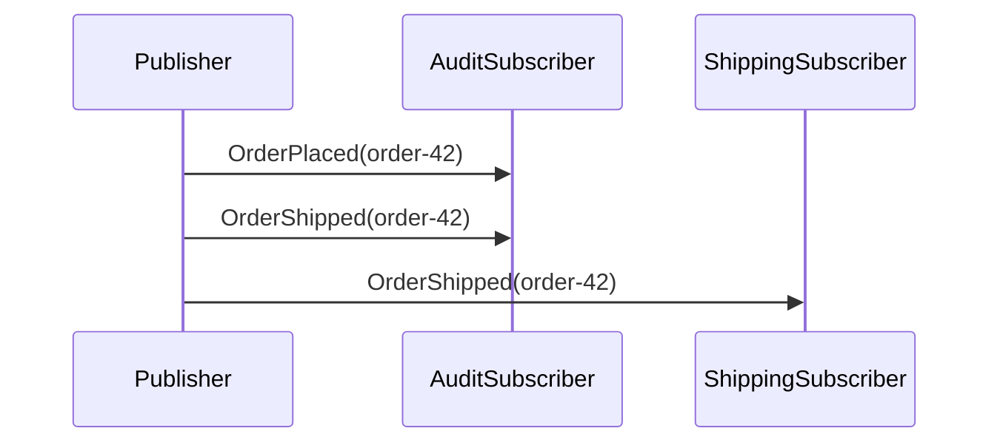

# Polymorphic Messages: Sample & Docs Implementation Plan

> **For agentic workers:** REQUIRED SUB-SKILL: Use superpowers:subagent-driven-development (recommended) or superpowers:executing-plans to implement this plan task-by-task. Steps use checkbox (`- [ ]`) syntax for tracking.

**Goal:** Ship a runnable `examples/PolymorphicMessages` sample plus a first-class website page for the polymorphic-messages pattern, softening the existing "avoid inheritance" guidance in the process.

**Architecture:** A four-project .NET sample (contracts, publisher, audit subscriber, shipping subscriber) following the exact layout of `examples/PublishSubscribe`. The audit subscriber demonstrates the key idiom: manual `HandlerReference` entries for every derived type the subscriber should receive, because subscription setup does not walk the type hierarchy (only dispatch does). The website gets a new pattern page plus edits to three existing files (`messages.mdx`, `samples.mdx`, `astro.config.mjs`).

**Tech Stack:** .NET 10 (`TargetFramework` inherited from `examples/Directory.Build.props`), RabbitMQ via `ServiceConnect.Client.RabbitMQ`, `ServiceConnect.Examples.Support` for shared bootstrap (`ExampleBusFactory`, `ConsoleStatus`, `DependencyWaiter`), Astro Starlight for the website.

**Background reading before you start:**
- Spec: [`docs/superpowers/specs/2026-04-22-polymorphic-messages-sample-and-docs-design.md`](../specs/2026-04-22-polymorphic-messages-sample-and-docs-design.md)
- Reference sample to mirror exactly: [`examples/PublishSubscribe/`](../../../examples/PublishSubscribe/)
- Library test confirming dispatcher behaviour: [`src/ServiceConnect.EndToEndTests/Routing/PolymorphicMessageTests.cs`](../../../src/ServiceConnect.EndToEndTests/Routing/PolymorphicMessageTests.cs)

**Why no per-task unit tests:** Polymorphic dispatch is already covered by `PolymorphicMessageTests.cs` — the library behaviour has a regression oracle. The sample's job is to *demonstrate* that behaviour end-to-end. The verification per task is `dotnet build` (compilation passes), and the integration verification is Task 9 (full run produces the expected output). For the website, Astro's build-time link checker catches broken links. No new unit tests required.

---

### Task 1: Create the Contracts project

**Files:**
- Create: `examples/PolymorphicMessages/src/ServiceConnect.Examples.PolymorphicMessages.Contracts/ServiceConnect.Examples.PolymorphicMessages.Contracts.csproj`
- Create: `examples/PolymorphicMessages/src/ServiceConnect.Examples.PolymorphicMessages.Contracts/DomainEvent.cs`
- Create: `examples/PolymorphicMessages/src/ServiceConnect.Examples.PolymorphicMessages.Contracts/OrderPlaced.cs`
- Create: `examples/PolymorphicMessages/src/ServiceConnect.Examples.PolymorphicMessages.Contracts/OrderShipped.cs`

- [ ] **Step 1: Create the directory structure**

```bash
mkdir -p examples/PolymorphicMessages/src/ServiceConnect.Examples.PolymorphicMessages.Contracts
```

- [ ] **Step 2: Write the Contracts csproj**

`examples/PolymorphicMessages/src/ServiceConnect.Examples.PolymorphicMessages.Contracts/ServiceConnect.Examples.PolymorphicMessages.Contracts.csproj`:

```xml
<Project Sdk="Microsoft.NET.Sdk">
  <ItemGroup>
    <ProjectReference Include="../../../../src/ServiceConnect.Interfaces/ServiceConnect.Interfaces.csproj" />
  </ItemGroup>
</Project>
```

This mirrors `examples/PublishSubscribe/src/ServiceConnect.Examples.PublishSubscribe.Contracts/ServiceConnect.Examples.PublishSubscribe.Contracts.csproj` exactly. `examples/Directory.Build.props` supplies `TargetFramework=net10.0`, `Nullable=enable`, `ImplicitUsings=enable`, and `TreatWarningsAsErrors=true`, so this csproj is deliberately minimal.

- [ ] **Step 3: Write `DomainEvent.cs`**

```csharp
using ServiceConnect.Interfaces;

namespace ServiceConnect.Examples.PolymorphicMessages.Contracts;

public abstract class DomainEvent(Guid correlationId) : Message(correlationId)
{
    public DateTime OccurredAt { get; init; } = DateTime.UtcNow;
}
```

`abstract` prevents `DomainEvent` from being published directly; its whole purpose is as a categoriser.

- [ ] **Step 4: Write `OrderPlaced.cs`**

```csharp
namespace ServiceConnect.Examples.PolymorphicMessages.Contracts;

public sealed class OrderPlaced(Guid correlationId) : DomainEvent(correlationId)
{
    public string OrderId { get; init; } = string.Empty;
    public decimal Total { get; init; }
}
```

- [ ] **Step 5: Write `OrderShipped.cs`**

```csharp
namespace ServiceConnect.Examples.PolymorphicMessages.Contracts;

public sealed class OrderShipped(Guid correlationId) : DomainEvent(correlationId)
{
    public string OrderId { get; init; } = string.Empty;
    public string Carrier { get; init; } = string.Empty;
}
```

- [ ] **Step 6: Build the Contracts project**

Run: `dotnet build examples/PolymorphicMessages/src/ServiceConnect.Examples.PolymorphicMessages.Contracts/ServiceConnect.Examples.PolymorphicMessages.Contracts.csproj`

Expected: `Build succeeded.` with 0 warnings and 0 errors. (`TreatWarningsAsErrors=true` means any warning aborts the build.)

- [ ] **Step 7: Commit**

```bash
git add examples/PolymorphicMessages/src/ServiceConnect.Examples.PolymorphicMessages.Contracts
git commit -m "feat(examples): add PolymorphicMessages contracts project

DomainEvent base plus OrderPlaced and OrderShipped derived events for
the polymorphic-messages sample.

Co-Authored-By: Claude Opus 4.7 (1M context) <noreply@anthropic.com>"
```

---

### Task 2: Create the ShippingSubscriber project (the simple case)

**Files:**
- Create: `examples/PolymorphicMessages/src/ServiceConnect.Examples.PolymorphicMessages.ShippingSubscriber/ServiceConnect.Examples.PolymorphicMessages.ShippingSubscriber.csproj`
- Create: `examples/PolymorphicMessages/src/ServiceConnect.Examples.PolymorphicMessages.ShippingSubscriber/OrderShippedHandler.cs`
- Create: `examples/PolymorphicMessages/src/ServiceConnect.Examples.PolymorphicMessages.ShippingSubscriber/Program.cs`

This task builds the straightforward single-type subscriber first — it has no polymorphism concerns and establishes the scaffolding that Task 3 will reuse.

- [ ] **Step 1: Create the directory**

```bash
mkdir -p examples/PolymorphicMessages/src/ServiceConnect.Examples.PolymorphicMessages.ShippingSubscriber
```

- [ ] **Step 2: Write the ShippingSubscriber csproj**

`examples/PolymorphicMessages/src/ServiceConnect.Examples.PolymorphicMessages.ShippingSubscriber/ServiceConnect.Examples.PolymorphicMessages.ShippingSubscriber.csproj`:

```xml
<Project Sdk="Microsoft.NET.Sdk">
  <PropertyGroup>
    <OutputType>Exe</OutputType>
  </PropertyGroup>

  <ItemGroup>
    <ProjectReference Include="../../../../examples/ExampleSupport/ServiceConnect.Examples.Support.csproj" />
    <ProjectReference Include="../ServiceConnect.Examples.PolymorphicMessages.Contracts/ServiceConnect.Examples.PolymorphicMessages.Contracts.csproj" />
  </ItemGroup>
</Project>
```

The `ExampleSupport` reference provides `ExampleBusFactory`, `ConsoleStatus`, `DependencyWaiter`, and `ExampleSettingsLoader`. `ExampleBusFactory` already disables scanning (`ScanForMessageHandlers = false`) and wires up RabbitMQ from `appsettings.json` — so every example declares handler references explicitly. That's the repo convention this sample follows.

- [ ] **Step 3: Write `OrderShippedHandler.cs`**

```csharp
using ServiceConnect.Examples.PolymorphicMessages.Contracts;
using ServiceConnect.Examples.Support.Bootstrap;
using ServiceConnect.Interfaces;

namespace ServiceConnect.Examples.PolymorphicMessages.ShippingSubscriber;

public sealed class OrderShippedHandler : IMessageHandler<OrderShipped>
{
    public IConsumeContext Context { get; set; } = null!;

    public Task HandleAsync(OrderShipped message)
    {
        ConsoleStatus.Success("shipping-subscriber", $"processed order-shipped {message.OrderId}");
        return Task.CompletedTask;
    }
}
```

- [ ] **Step 4: Write `Program.cs`**

```csharp
using Microsoft.Extensions.DependencyInjection;
using ServiceConnect.Examples.PolymorphicMessages.Contracts;
using ServiceConnect.Examples.PolymorphicMessages.ShippingSubscriber;
using ServiceConnect.Examples.Support.Bootstrap;
using ServiceConnect.Examples.Support.Configuration;
using ServiceConnect.Interfaces;

var settings = ExampleSettingsLoader.Load();
await DependencyWaiter.WaitForRabbitMqAsync(
    settings.RabbitMqHost,
    settings.RabbitMqPort,
    settings.RabbitMqUsername,
    settings.RabbitMqPassword,
    CancellationToken.None);

var handlerReferences = new List<HandlerReference>
{
    new() { HandlerType = typeof(OrderShippedHandler), MessageType = typeof(OrderShipped) }
};

var services = new ServiceCollection();
services.AddSingleton<IList<HandlerReference>>(handlerReferences);
services.AddTransient<IMessageHandler<OrderShipped>, OrderShippedHandler>();
services.AddExampleBus(settings, "shipping-subscriber");

await using var provider = services.BuildServiceProvider();
var bus = provider.GetRequiredService<IBus>();
await bus.StartConsumingAsync();
ConsoleStatus.Ready("shipping-subscriber");
await Task.Delay(Timeout.InfiniteTimeSpan);
```

This is the exact shape of `examples/PublishSubscribe/src/ServiceConnect.Examples.PublishSubscribe.AnalyticsSubscriber/Program.cs` — one handler reference for one message type.

- [ ] **Step 5: Build ShippingSubscriber**

Run: `dotnet build examples/PolymorphicMessages/src/ServiceConnect.Examples.PolymorphicMessages.ShippingSubscriber/ServiceConnect.Examples.PolymorphicMessages.ShippingSubscriber.csproj`

Expected: `Build succeeded.` with 0 warnings and 0 errors.

- [ ] **Step 6: Commit**

```bash
git add examples/PolymorphicMessages/src/ServiceConnect.Examples.PolymorphicMessages.ShippingSubscriber
git commit -m "feat(examples): add ShippingSubscriber to PolymorphicMessages sample

Single-type subscriber handling OrderShipped only. Establishes the
scaffolding shape before the polymorphic AuditSubscriber in the next
commit.

Co-Authored-By: Claude Opus 4.7 (1M context) <noreply@anthropic.com>"
```

---

### Task 3: Create the AuditSubscriber project (the polymorphic case)

**Files:**
- Create: `examples/PolymorphicMessages/src/ServiceConnect.Examples.PolymorphicMessages.AuditSubscriber/ServiceConnect.Examples.PolymorphicMessages.AuditSubscriber.csproj`
- Create: `examples/PolymorphicMessages/src/ServiceConnect.Examples.PolymorphicMessages.AuditSubscriber/DomainEventHandler.cs`
- Create: `examples/PolymorphicMessages/src/ServiceConnect.Examples.PolymorphicMessages.AuditSubscriber/Program.cs`

This is the teaching moment of the whole sample: one handler catches every `DomainEvent` because of the runtime dispatcher walk, and the three `HandlerReference` entries are what make the queue actually receive those derived types.

- [ ] **Step 1: Create the directory**

```bash
mkdir -p examples/PolymorphicMessages/src/ServiceConnect.Examples.PolymorphicMessages.AuditSubscriber
```

- [ ] **Step 2: Write the AuditSubscriber csproj**

`examples/PolymorphicMessages/src/ServiceConnect.Examples.PolymorphicMessages.AuditSubscriber/ServiceConnect.Examples.PolymorphicMessages.AuditSubscriber.csproj`:

```xml
<Project Sdk="Microsoft.NET.Sdk">
  <PropertyGroup>
    <OutputType>Exe</OutputType>
  </PropertyGroup>

  <ItemGroup>
    <ProjectReference Include="../../../../examples/ExampleSupport/ServiceConnect.Examples.Support.csproj" />
    <ProjectReference Include="../ServiceConnect.Examples.PolymorphicMessages.Contracts/ServiceConnect.Examples.PolymorphicMessages.Contracts.csproj" />
  </ItemGroup>
</Project>
```

- [ ] **Step 3: Write `DomainEventHandler.cs`**

```csharp
using ServiceConnect.Examples.PolymorphicMessages.Contracts;
using ServiceConnect.Examples.Support.Bootstrap;
using ServiceConnect.Interfaces;

namespace ServiceConnect.Examples.PolymorphicMessages.AuditSubscriber;

// IMessageHandler<DomainEvent>: ServiceConnect's dispatcher walks the runtime type
// hierarchy when resolving handlers, so this one handler receives OrderPlaced,
// OrderShipped, and any future DomainEvent subtype. The matching HandlerReference
// entries in Program.cs are what make the audit queue actually bound to each
// derived type's exchange — subscription setup does not walk the hierarchy.
public sealed class DomainEventHandler : IMessageHandler<DomainEvent>
{
    public IConsumeContext Context { get; set; } = null!;

    public Task HandleAsync(DomainEvent message)
    {
        var concreteTypeName = message.GetType().Name;
        var orderId = message switch
        {
            OrderPlaced placed => placed.OrderId,
            OrderShipped shipped => shipped.OrderId,
            _ => "unknown",
        };
        ConsoleStatus.Success("audit-subscriber", $"audited {concreteTypeName} {orderId}");
        return Task.CompletedTask;
    }
}
```

The comment is here (not removed) because it explains *why* this shape works — the WHY is non-obvious from reading the code alone and is the one doc-comment the sample earns.

- [ ] **Step 4: Write `Program.cs`**

```csharp
using Microsoft.Extensions.DependencyInjection;
using ServiceConnect.Examples.PolymorphicMessages.AuditSubscriber;
using ServiceConnect.Examples.PolymorphicMessages.Contracts;
using ServiceConnect.Examples.Support.Bootstrap;
using ServiceConnect.Examples.Support.Configuration;
using ServiceConnect.Interfaces;

var settings = ExampleSettingsLoader.Load();
await DependencyWaiter.WaitForRabbitMqAsync(
    settings.RabbitMqHost,
    settings.RabbitMqPort,
    settings.RabbitMqUsername,
    settings.RabbitMqPassword,
    CancellationToken.None);

// One handler class, three handler references. Registering HandlerReference for
// each derived type is what binds the audit queue to each derived type's
// exchange in RabbitMQ. Without the OrderPlaced and OrderShipped entries below,
// the queue would only be bound to the DomainEvent exchange and would never
// receive the concrete events that the publisher emits.
var handlerReferences = new List<HandlerReference>
{
    new() { HandlerType = typeof(DomainEventHandler), MessageType = typeof(DomainEvent) },
    new() { HandlerType = typeof(DomainEventHandler), MessageType = typeof(OrderPlaced) },
    new() { HandlerType = typeof(DomainEventHandler), MessageType = typeof(OrderShipped) },
};

var services = new ServiceCollection();
services.AddSingleton<IList<HandlerReference>>(handlerReferences);
services.AddTransient<IMessageHandler<DomainEvent>, DomainEventHandler>();
services.AddExampleBus(settings, "audit-subscriber");

await using var provider = services.BuildServiceProvider();
var bus = provider.GetRequiredService<IBus>();
await bus.StartConsumingAsync();
ConsoleStatus.Ready("audit-subscriber");
await Task.Delay(Timeout.InfiniteTimeSpan);
```

- [ ] **Step 5: Build AuditSubscriber**

Run: `dotnet build examples/PolymorphicMessages/src/ServiceConnect.Examples.PolymorphicMessages.AuditSubscriber/ServiceConnect.Examples.PolymorphicMessages.AuditSubscriber.csproj`

Expected: `Build succeeded.` with 0 warnings and 0 errors.

- [ ] **Step 6: Commit**

```bash
git add examples/PolymorphicMessages/src/ServiceConnect.Examples.PolymorphicMessages.AuditSubscriber
git commit -m "feat(examples): add AuditSubscriber to PolymorphicMessages sample

One DomainEventHandler receives every concrete DomainEvent subtype via
dispatcher hierarchy walk. Three HandlerReferences bind the audit queue
to base, OrderPlaced, and OrderShipped exchanges.

Co-Authored-By: Claude Opus 4.7 (1M context) <noreply@anthropic.com>"
```

---

### Task 4: Create the Publisher project

**Files:**
- Create: `examples/PolymorphicMessages/src/ServiceConnect.Examples.PolymorphicMessages.Publisher/ServiceConnect.Examples.PolymorphicMessages.Publisher.csproj`
- Create: `examples/PolymorphicMessages/src/ServiceConnect.Examples.PolymorphicMessages.Publisher/Program.cs`

- [ ] **Step 1: Create the directory**

```bash
mkdir -p examples/PolymorphicMessages/src/ServiceConnect.Examples.PolymorphicMessages.Publisher
```

- [ ] **Step 2: Write the Publisher csproj**

`examples/PolymorphicMessages/src/ServiceConnect.Examples.PolymorphicMessages.Publisher/ServiceConnect.Examples.PolymorphicMessages.Publisher.csproj`:

```xml
<Project Sdk="Microsoft.NET.Sdk">
  <PropertyGroup>
    <OutputType>Exe</OutputType>
  </PropertyGroup>

  <ItemGroup>
    <ProjectReference Include="../../../../examples/ExampleSupport/ServiceConnect.Examples.Support.csproj" />
    <ProjectReference Include="../ServiceConnect.Examples.PolymorphicMessages.Contracts/ServiceConnect.Examples.PolymorphicMessages.Contracts.csproj" />
  </ItemGroup>
</Project>
```

- [ ] **Step 3: Write `Program.cs`**

```csharp
using Microsoft.Extensions.DependencyInjection;
using ServiceConnect.Examples.PolymorphicMessages.Contracts;
using ServiceConnect.Examples.Support.Bootstrap;
using ServiceConnect.Examples.Support.Configuration;
using ServiceConnect.Interfaces;

var settings = ExampleSettingsLoader.Load();
await DependencyWaiter.WaitForRabbitMqAsync(
    settings.RabbitMqHost,
    settings.RabbitMqPort,
    settings.RabbitMqUsername,
    settings.RabbitMqPassword,
    CancellationToken.None);

var services = new ServiceCollection();
services.AddSingleton<IList<HandlerReference>>(new List<HandlerReference>());
services.AddExampleBus(settings, "polymorphic-messages-publisher");

await using var provider = services.BuildServiceProvider();
var bus = provider.GetRequiredService<IBus>();

// Same correlation id on both events so downstream audit logs can tie the
// OrderPlaced and its later OrderShipped back to one conversation. This is the
// idiom documented in learn/core-concepts/messages.mdx.
var correlationId = Guid.NewGuid();
const string orderId = "order-42";

await bus.PublishAsync(new OrderPlaced(correlationId)
{
    OrderId = orderId,
    Total = 129.99m,
});
ConsoleStatus.Success("polymorphic-messages-publisher", $"published order-placed {orderId}");

await bus.PublishAsync(new OrderShipped(correlationId)
{
    OrderId = orderId,
    Carrier = "UPS",
});
ConsoleStatus.Success("polymorphic-messages-publisher", $"published order-shipped {orderId}");
```

- [ ] **Step 4: Build Publisher**

Run: `dotnet build examples/PolymorphicMessages/src/ServiceConnect.Examples.PolymorphicMessages.Publisher/ServiceConnect.Examples.PolymorphicMessages.Publisher.csproj`

Expected: `Build succeeded.` with 0 warnings and 0 errors.

- [ ] **Step 5: Commit**

```bash
git add examples/PolymorphicMessages/src/ServiceConnect.Examples.PolymorphicMessages.Publisher
git commit -m "feat(examples): add Publisher to PolymorphicMessages sample

Publishes one OrderPlaced followed by one OrderShipped, both sharing a
correlation id so downstream audit logs can tie them together.

Co-Authored-By: Claude Opus 4.7 (1M context) <noreply@anthropic.com>"
```

---

### Task 5: Build the solution file

**Files:**
- Create: `examples/PolymorphicMessages/PolymorphicMessages.sln`

Use `dotnet sln` commands rather than a hand-crafted `.sln` — `dotnet` generates correct project GUIDs and the `src` solution folder matches the existing convention.

- [ ] **Step 1: Create the empty solution**

```bash
dotnet new sln --name PolymorphicMessages --output examples/PolymorphicMessages
```

Expected output: `The template "Solution File" was created successfully.`

- [ ] **Step 2: Add all four projects to the solution under the `src` folder**

```bash
dotnet sln examples/PolymorphicMessages/PolymorphicMessages.sln add \
  --solution-folder src \
  examples/PolymorphicMessages/src/ServiceConnect.Examples.PolymorphicMessages.Contracts/ServiceConnect.Examples.PolymorphicMessages.Contracts.csproj \
  examples/PolymorphicMessages/src/ServiceConnect.Examples.PolymorphicMessages.Publisher/ServiceConnect.Examples.PolymorphicMessages.Publisher.csproj \
  examples/PolymorphicMessages/src/ServiceConnect.Examples.PolymorphicMessages.AuditSubscriber/ServiceConnect.Examples.PolymorphicMessages.AuditSubscriber.csproj \
  examples/PolymorphicMessages/src/ServiceConnect.Examples.PolymorphicMessages.ShippingSubscriber/ServiceConnect.Examples.PolymorphicMessages.ShippingSubscriber.csproj
```

Expected: four lines like `Project \`…\` added to the solution.`

- [ ] **Step 3: Build the full solution**

Run: `dotnet build examples/PolymorphicMessages/PolymorphicMessages.sln`

Expected: `Build succeeded.` — all four projects compile, zero warnings, zero errors.

- [ ] **Step 4: Commit**

```bash
git add examples/PolymorphicMessages/PolymorphicMessages.sln
git commit -m "feat(examples): add PolymorphicMessages solution file

Co-Authored-By: Claude Opus 4.7 (1M context) <noreply@anthropic.com>"
```

---

### Task 6: Write `run.sh`

**Files:**
- Create: `examples/PolymorphicMessages/run.sh`

- [ ] **Step 1: Write the script**

`examples/PolymorphicMessages/run.sh`:

```bash
#!/usr/bin/env bash
set -euo pipefail

SCRIPT_DIR="$(cd "$(dirname "${BASH_SOURCE[0]}")" && pwd)"
source "$SCRIPT_DIR/../scripts/common.sh"

OUTPUT_LOG="$SCRIPT_DIR/output.log"
PIDS=()

wait_for_ready() {
  local timeout=30

  for i in $(seq 1 $((timeout * 2))); do
    if grep -q "READY:audit-subscriber" "$OUTPUT_LOG" && grep -q "READY:shipping-subscriber" "$OUTPUT_LOG"; then
      return 0
    fi
    sleep 0.5
  done

  return 1
}

wait_for_success() {
  local timeout=30

  for i in $(seq 1 $((timeout * 2))); do
    if grep -q "SUCCESS:audit-subscriber:audited OrderPlaced order-42" "$OUTPUT_LOG" &&
      grep -q "SUCCESS:audit-subscriber:audited OrderShipped order-42" "$OUTPUT_LOG" &&
      grep -q "SUCCESS:shipping-subscriber:processed order-shipped order-42" "$OUTPUT_LOG"; then
      return 0
    fi
    sleep 0.5
  done

  return 1
}

start_passive() {
  dotnet run --project "$1" >> "$OUTPUT_LOG" 2>&1 &
  PIDS+=("$!")
}

start_dependencies
> "$OUTPUT_LOG"
start_passive "$SCRIPT_DIR/src/ServiceConnect.Examples.PolymorphicMessages.AuditSubscriber/ServiceConnect.Examples.PolymorphicMessages.AuditSubscriber.csproj"
start_passive "$SCRIPT_DIR/src/ServiceConnect.Examples.PolymorphicMessages.ShippingSubscriber/ServiceConnect.Examples.PolymorphicMessages.ShippingSubscriber.csproj"

if ! wait_for_ready; then
  echo "ERROR: Subscribers did not become ready within 30 seconds"
  for pid in "${PIDS[@]}"; do
    kill "$pid" 2>/dev/null || true
  done
  exit 1
fi

dotnet run --project "$SCRIPT_DIR/src/ServiceConnect.Examples.PolymorphicMessages.Publisher/ServiceConnect.Examples.PolymorphicMessages.Publisher.csproj" &
PUBLISHER_PID=$!
PIDS+=("$PUBLISHER_PID")
wait "$PUBLISHER_PID"

if ! wait_for_success; then
  echo "ERROR: Subscribers did not observe all three expected SUCCESS lines within 30 seconds"
  for pid in "${PIDS[@]}"; do
    kill "$pid" 2>/dev/null || true
  done
  exit 1
fi

for pid in "${PIDS[@]}"; do
  kill "$pid" 2>/dev/null || true
done
for pid in "${PIDS[@]}"; do
  wait "$pid" 2>/dev/null || true
done

cat "$OUTPUT_LOG"
```

This is structurally identical to `examples/PublishSubscribe/run.sh` — the only differences are the project paths and the three `SUCCESS` lines it waits on (two audit, one shipping). The three checks are the whole point: two base-type catches on `audit-subscriber` plus one specific-type catch on `shipping-subscriber`.

- [ ] **Step 2: Make it executable**

```bash
chmod +x examples/PolymorphicMessages/run.sh
```

- [ ] **Step 3: Commit**

```bash
git add examples/PolymorphicMessages/run.sh
git commit -m "feat(examples): add run.sh for PolymorphicMessages sample

Co-Authored-By: Claude Opus 4.7 (1M context) <noreply@anthropic.com>"
```

---

### Task 7: Write `run.ps1`

**Files:**
- Create: `examples/PolymorphicMessages/run.ps1`

- [ ] **Step 1: Write the script**

`examples/PolymorphicMessages/run.ps1`:

```powershell
$ErrorActionPreference = 'Stop'
$PSNativeCommandUseErrorActionPreference = $true

. "$PSScriptRoot/../scripts/common.ps1"

$auditSubscriberProject = Join-Path $PSScriptRoot 'src/ServiceConnect.Examples.PolymorphicMessages.AuditSubscriber/ServiceConnect.Examples.PolymorphicMessages.AuditSubscriber.csproj'
$shippingSubscriberProject = Join-Path $PSScriptRoot 'src/ServiceConnect.Examples.PolymorphicMessages.ShippingSubscriber/ServiceConnect.Examples.PolymorphicMessages.ShippingSubscriber.csproj'
$publisherProject = Join-Path $PSScriptRoot 'src/ServiceConnect.Examples.PolymorphicMessages.Publisher/ServiceConnect.Examples.PolymorphicMessages.Publisher.csproj'
$auditProcess = $null
$shippingProcess = $null
$publisherJob = $null

function Wait-ForSubscribersReady {
    $timeout = 30
    $elapsed = 0
    $auditReady = $false
    $shippingReady = $false

    while ($elapsed -lt $timeout) {
        if ((Test-Path $OUTPUT_LOG) -and (Select-String -Path $OUTPUT_LOG -Pattern "READY:audit-subscriber" -Quiet) -and -not $auditReady) {
            $auditReady = $true
        }
        if ((Test-Path $OUTPUT_LOG) -and (Select-String -Path $OUTPUT_LOG -Pattern "READY:shipping-subscriber" -Quiet) -and -not $shippingReady) {
            $shippingReady = $true
        }

        if ($auditReady -and $shippingReady) {
            return $true
        }

        Start-Sleep -Milliseconds 500
        $elapsed += 0.5
    }

    return $false
}

function Wait-ForSubscriberSuccess {
    $timeout = 30
    $elapsed = 0

    while ($elapsed -lt $timeout) {
        if ((Test-Path $OUTPUT_LOG) -and
            (Select-String -Path $OUTPUT_LOG -Pattern 'SUCCESS:audit-subscriber:audited OrderPlaced order-42' -Quiet) -and
            (Select-String -Path $OUTPUT_LOG -Pattern 'SUCCESS:audit-subscriber:audited OrderShipped order-42' -Quiet) -and
            (Select-String -Path $OUTPUT_LOG -Pattern 'SUCCESS:shipping-subscriber:processed order-shipped order-42' -Quiet)) {
            return $true
        }

        Start-Sleep -Milliseconds 500
        $elapsed += 0.5
    }

    return $false
}

$OUTPUT_LOG = Join-Path $PSScriptRoot "output.log"

try {
    Start-ExampleDependencies
    "" | Set-Content -Path $OUTPUT_LOG
    $auditProcess = Start-Process dotnet -ArgumentList @('run', '--project', $auditSubscriberProject) -PassThru -NoNewWindow -RedirectStandardOutput $OUTPUT_LOG -RedirectStandardError $OUTPUT_LOG
    $shippingProcess = Start-Process dotnet -ArgumentList @('run', '--project', $shippingSubscriberProject) -PassThru -NoNewWindow -RedirectStandardOutput $OUTPUT_LOG -RedirectStandardError $OUTPUT_LOG -Append

    if (-not (Wait-ForSubscribersReady)) {
        throw "Subscribers did not become ready within 30 seconds"
    }

    $publisherJob = Start-Job -ScriptBlock {
        dotnet run --project $using:publisherProject 2>&1 | Out-File -FilePath $using:OUTPUT_LOG -Append
    }

    $publisherJob | Wait-Job | Remove-Job -Force

    if (-not (Wait-ForSubscriberSuccess)) {
        throw 'Subscribers did not observe all three expected SUCCESS lines within 30 seconds'
    }
}
finally {
    if ($null -ne $auditProcess -and -not $auditProcess.HasExited) {
        Stop-Process -Id $auditProcess.Id -Force -ErrorAction SilentlyContinue
        $auditProcess.WaitForExit()
    }
    if ($null -ne $shippingProcess -and -not $shippingProcess.HasExited) {
        Stop-Process -Id $shippingProcess.Id -Force -ErrorAction SilentlyContinue
        $shippingProcess.WaitForExit()
    }
}
```

Mirror of `examples/PublishSubscribe/run.ps1` — renamed variables, updated subscriber names, three `SUCCESS` patterns. Nothing else changes.

- [ ] **Step 2: Commit**

```bash
git add examples/PolymorphicMessages/run.ps1
git commit -m "feat(examples): add run.ps1 for PolymorphicMessages sample

Co-Authored-By: Claude Opus 4.7 (1M context) <noreply@anthropic.com>"
```

---

### Task 8: Write the sample README

**Files:**
- Create: `examples/PolymorphicMessages/README.md`

- [ ] **Step 1: Write the README**

`examples/PolymorphicMessages/README.md`:

````markdown
# PolymorphicMessages

## Overview

Publish derived events; let a base-type handler catch the whole category. One publisher emits `OrderPlaced` and `OrderShipped` (both derived from `DomainEvent`). The audit subscriber handles `DomainEvent` and catches **both**; the shipping subscriber handles `OrderShipped` and catches only that one. Same publish, two handlers, different specificities.

## Participants

- `ServiceConnect.Examples.PolymorphicMessages.Publisher`
- `ServiceConnect.Examples.PolymorphicMessages.AuditSubscriber`
- `ServiceConnect.Examples.PolymorphicMessages.ShippingSubscriber`

## Message Flow



## Prerequisites

`docker compose -f ../docker-compose.yml up -d`

## Run This Example

`bash run.sh`

## Run Manually

Run both subscribers first, then the publisher.

`dotnet run --project src/ServiceConnect.Examples.PolymorphicMessages.AuditSubscriber/ServiceConnect.Examples.PolymorphicMessages.AuditSubscriber.csproj`

`dotnet run --project src/ServiceConnect.Examples.PolymorphicMessages.ShippingSubscriber/ServiceConnect.Examples.PolymorphicMessages.ShippingSubscriber.csproj`

`dotnet run --project src/ServiceConnect.Examples.PolymorphicMessages.Publisher/ServiceConnect.Examples.PolymorphicMessages.Publisher.csproj`

## Expected Output

```
READY:audit-subscriber
READY:shipping-subscriber
SUCCESS:polymorphic-messages-publisher:published order-placed order-42
SUCCESS:audit-subscriber:audited OrderPlaced order-42
SUCCESS:polymorphic-messages-publisher:published order-shipped order-42
SUCCESS:audit-subscriber:audited OrderShipped order-42
SUCCESS:shipping-subscriber:processed order-shipped order-42
```

Note: Lines from the two subscriber processes may interleave with each other and with the publisher's `SUCCESS:` lines, since all three run concurrently. The exact order may vary between runs.

## What To Notice

The audit subscriber registers `DomainEventHandler` (one handler class) but lists **three** `HandlerReference` entries — one for `DomainEvent`, one for `OrderPlaced`, one for `OrderShipped`. That is the idiom that makes polymorphic subscription work:

- **Dispatch walks the type hierarchy.** At runtime, a published `OrderPlaced` resolves to every handler whose registered type is an ancestor in the concrete type's inheritance chain — so `DomainEventHandler` receives both `OrderPlaced` and `OrderShipped` without any `switch` statement of its own.
- **Subscription does not walk the hierarchy.** Each `HandlerReference` creates a RabbitMQ binding for exactly that message type's exchange. Without the `OrderPlaced` and `OrderShipped` entries, the audit queue would only be bound to the `DomainEvent` exchange — and the concrete events published by the publisher would never arrive.

The shipping subscriber is a plain single-type subscriber for contrast: one `HandlerReference` for `OrderShipped`, one handler class, catches only that specific event.

See the [Polymorphic Messages pattern page](https://r-suite.github.io/ServiceConnect-CSharp/learn/messaging-patterns/polymorphic-messages/) for the full write-up.
````

- [ ] **Step 2: Commit**

```bash
git add examples/PolymorphicMessages/README.md
git commit -m "docs(examples): add README for PolymorphicMessages sample

Co-Authored-By: Claude Opus 4.7 (1M context) <noreply@anthropic.com>"
```

---

### Task 9: Run the sample end-to-end and verify output

This is the integration gate. It verifies every preceding task works together: the contracts serialise, the handler references bind the audit queue to all three exchanges, the dispatcher walks the hierarchy at runtime, the publisher emits both events, and the run script observes all three `SUCCESS` lines.

This task runs Docker — on this machine the user is **not** in the docker group, so every docker-adjacent command must be wrapped in `sg docker -c '...'`. (This is from auto-memory: `feedback_docker_access.md`.)

- [ ] **Step 1: Start the docker dependencies**

Run:
```bash
sg docker -c 'docker compose -f examples/docker-compose.yml up -d'
```

Expected: RabbitMQ (and MongoDB — not used by this sample but started by the shared compose file) come up healthy. Check with:
```bash
sg docker -c 'docker compose -f examples/docker-compose.yml ps'
```

- [ ] **Step 2: Run the sample**

Run:
```bash
sg docker -c 'bash examples/PolymorphicMessages/run.sh'
```

The script exits with code 0 and prints the `output.log` to stdout on success, or `ERROR: …` on timeout.

Expected (ordering of `SUCCESS:` lines may vary, but all seven of these must appear):
```
READY:audit-subscriber
READY:shipping-subscriber
SUCCESS:polymorphic-messages-publisher:published order-placed order-42
SUCCESS:audit-subscriber:audited OrderPlaced order-42
SUCCESS:polymorphic-messages-publisher:published order-shipped order-42
SUCCESS:audit-subscriber:audited OrderShipped order-42
SUCCESS:shipping-subscriber:processed order-shipped order-42
```

- [ ] **Step 3: If the run fails with "subscribers did not observe all three expected SUCCESS lines"**

This is the **most likely failure mode** — it means polymorphic subscription isn't working. Diagnostic order:

1. Check the run's `output.log`: `cat examples/PolymorphicMessages/output.log`
2. Confirm `SUCCESS:audit-subscriber:audited OrderPlaced order-42` appears. If it does not, the audit queue isn't bound to the `OrderPlaced` exchange — recheck Task 3 Step 4's `handlerReferences` list: all three entries must be present, and each must use the correct `MessageType`.
3. If `READY:audit-subscriber` is missing, the audit subscriber didn't start — check for exceptions in the log.
4. If RabbitMQ ports are taken, `docker compose ps` will show it unhealthy — stop any stray local RabbitMQ before retrying.

Do **not** relax the expected-output checks to make the test pass. A missing audit line means the pattern is genuinely broken and the sample no longer demonstrates what it claims.

- [ ] **Step 4: Clean up the log file (not committed)**

The run creates `examples/PolymorphicMessages/output.log`. `examples/.gitignore` (if present) or per-sample `.gitignore` should already exclude it — confirm with `git status examples/PolymorphicMessages/` shows no `output.log` entry. If it does appear, check `examples/PublishSubscribe/` for how that sample excludes it and mirror the arrangement.

- [ ] **Step 5: Leave the docker services up for Task 13**

Don't stop the containers — they will be useful if any later task needs to re-run the sample.

No commit for this task (verification only).

---

### Task 10: Write the website pattern page

**Files:**
- Create: `website/src/content/docs/learn/messaging-patterns/polymorphic-messages.mdx`

- [ ] **Step 1: Write the page**

`website/src/content/docs/learn/messaging-patterns/polymorphic-messages.mdx`:

````mdx
---
title: Polymorphic Messages
description: Publish derived events and let a base-type handler catch the whole category. One handler, many concrete types, clean categorisation across subscribers.
---

**Polymorphic messages** let you categorise events in code and have one handler catch the whole category. A publisher emits a concrete event — `OrderPlaced`, `OrderShipped` — and a subscriber that handles the shared base type receives every one of them. A second subscriber can still bind a handler to one specific type for focused processing. Same publish, two handlers, different specificities.

This page walks through the shape with a runnable example: one base type, two concrete events, two subscribers — one cross-cutting, one specific.

## When to reach for it

Polymorphism pays off when you have **cross-cutting subscribers that care about a category of events rather than specific ones**:

- **Audit / outbox / archival.** "Record every domain event that happens." One handler, grows automatically as new event subtypes appear.
- **Metrics.** "Emit a counter for every `OrderEvent`." Type-specific labels come from `message.GetType().Name`.
- **Replay and debugging harnesses.** Tail a whole category of events into a dev console without enumerating subtypes.

If your subscribers all care about specific event types, skip polymorphism — flat contracts give you the most predictable wire shape and the cleanest handler interfaces. Polymorphism is useful when categorisation is actually there in the domain, not because it happens to be a language feature.

## The contract hierarchy

Shared by publisher and every subscriber:

```csharp
// Contracts/DomainEvent.cs
using ServiceConnect.Interfaces;

public abstract class DomainEvent(Guid correlationId) : Message(correlationId)
{
    public DateTime OccurredAt { get; init; } = DateTime.UtcNow;
}
```

```csharp
// Contracts/OrderPlaced.cs
public sealed class OrderPlaced(Guid correlationId) : DomainEvent(correlationId)
{
    public string OrderId { get; init; } = string.Empty;
    public decimal Total { get; init; }
}
```

```csharp
// Contracts/OrderShipped.cs
public sealed class OrderShipped(Guid correlationId) : DomainEvent(correlationId)
{
    public string OrderId { get; init; } = string.Empty;
    public string Carrier { get; init; } = string.Empty;
}
```

A few conventions that matter:

- **`abstract` on the base.** `DomainEvent` is not a thing you publish; it's a category. Abstract makes "can't be published by itself" a compile-time guarantee.
- **`sealed` on the leaves.** Concrete events are the contract. Sealing them stops accidental second-level hierarchies and keeps the serialised shape predictable.
- **One level of inheritance.** `OrderPlaced : DomainEvent : Message` is two hops; that's deliberate. Deeper hierarchies make the JSON shape harder to reason about, especially for polyglot consumers.

## The cross-cutting handler

The audit subscriber handles the base type. It uses `GetType()` on the incoming message to find out which concrete event it received:

```csharp
// AuditSubscriber/DomainEventHandler.cs
using ServiceConnect.Interfaces;

public sealed class DomainEventHandler : IMessageHandler<DomainEvent>
{
    public IConsumeContext Context { get; set; } = null!;

    public Task HandleAsync(DomainEvent message)
    {
        var concreteTypeName = message.GetType().Name;
        var orderId = message switch
        {
            OrderPlaced placed => placed.OrderId,
            OrderShipped shipped => shipped.OrderId,
            _ => "unknown",
        };
        Console.WriteLine($"Audit: {concreteTypeName} {orderId}");
        return Task.CompletedTask;
    }
}
```

The type switch is optional — `GetType().Name` and `ServiceConnect.Interfaces.Message.CorrelationId` alone are often enough for an audit log. Use a `switch` when the handler actually needs the specifics.

## The specific handler

The shipping subscriber is a plain single-type handler — exactly what you'd write without polymorphism:

```csharp
// ShippingSubscriber/OrderShippedHandler.cs
public sealed class OrderShippedHandler : IMessageHandler<OrderShipped>
{
    public IConsumeContext Context { get; set; } = null!;

    public Task HandleAsync(OrderShipped message)
    {
        Console.WriteLine($"Shipping: {message.OrderId} via {message.Carrier}");
        return Task.CompletedTask;
    }
}
```

Both subscribers receive the `OrderShipped` publish. The polymorphic one receives it **because its handler is registered for an ancestor type**; the specific one receives it because its handler is registered for the exact type. Nothing weird happens — the publish produces one message, two queues copy it, each queue's handler runs.

## Wiring the cross-cutting subscriber

Here's where the pattern has its one genuine subtlety. The audit subscriber has one handler class, and needs three `HandlerReference` entries:

```csharp
// AuditSubscriber/Program.cs
using ServiceConnect.Interfaces;

var handlerReferences = new List<HandlerReference>
{
    new() { HandlerType = typeof(DomainEventHandler), MessageType = typeof(DomainEvent) },
    new() { HandlerType = typeof(DomainEventHandler), MessageType = typeof(OrderPlaced) },
    new() { HandlerType = typeof(DomainEventHandler), MessageType = typeof(OrderShipped) },
};

var services = new ServiceCollection();
services.AddSingleton<IList<HandlerReference>>(handlerReferences);
services.AddTransient<IMessageHandler<DomainEvent>, DomainEventHandler>();
services.AddServiceConnect(builder =>
{
    builder.UseRabbitMQ(/* … */);
    builder.ConfigureQueues(q => q.QueueName = "audit-subscriber");
    builder.ConfigureBus(bus => bus.ScanForMessageHandlers = false);
});
```

The three references look redundant — the DI registration only mentions `IMessageHandler<DomainEvent>`, so why list the derived types? Because:

## Dispatch versus subscription

- **Dispatch walks the type hierarchy.** When a message arrives, the bus finds every handler whose registered message type is an ancestor of the concrete message type. That's what makes one handler receive both `OrderPlaced` and `OrderShipped`.
- **Subscription does not walk the hierarchy.** Each `HandlerReference` binds the subscriber's queue to exactly one RabbitMQ exchange — the one named after that `MessageType`. The publisher emits `OrderPlaced` to the `OrderPlaced` exchange; if nothing bound the audit queue to that exchange, the message never arrives.

So the three `HandlerReference` entries aren't redundant — they do two different jobs. The `DomainEvent` entry is what the runtime dispatcher matches when resolving the handler. The `OrderPlaced` and `OrderShipped` entries are what binds the audit queue to each concrete exchange at startup. You need both.

This is deliberate, not a rough edge. Auto-subscribing a base-type handler to every possible subtype would surprise consumers who don't want the base class treated as "subscribe to everything below it." Making the subtypes explicit keeps the subscription surface visible in the bootstrap code.

## The publisher

The publisher has nothing special to do:

```csharp
// Publisher/Program.cs
var correlationId = Guid.NewGuid();

await bus.PublishAsync(new OrderPlaced(correlationId)
{
    OrderId = "order-42",
    Total = 129.99m,
});

await bus.PublishAsync(new OrderShipped(correlationId)
{
    OrderId = "order-42",
    Carrier = "UPS",
});
```

Two publishes, one correlation id — downstream logs can tie them together. See [Messages / correlation id in practice](/ServiceConnect-CSharp/learn/core-concepts/messages/#correlation-id-in-practice).

## Trade-offs worth knowing

- **Serialised shape is coupled across levels.** Every derived type's JSON payload carries the base type's fields. Renaming or changing a base field is a wire-format change for every subtype simultaneously. Prefer adding fields on the base, never changing them — the same rule as any contract.
- **Polyglot consumers.** If a non-.NET service deserialises these messages, a flat contract is easier to reason about than an inherited one. For mixed-language systems, consider duplicating shared fields across flat message types instead of a shared base class. Composition over inheritance buys you wire predictability at the cost of some local duplication.
- **Keep the hierarchy shallow.** One level of inheritance is the documented sweet spot. Deeper trees multiply the above trade-offs without adding much value.

## Reference

- [`IBus.PublishAsync`](/ServiceConnect-CSharp/reference/bus/ibus/#publishasynct) — the publish method; unchanged for polymorphic types.
- [`HandlerReference`](/ServiceConnect-CSharp/reference/handlers/imessagehandler/) — the struct that binds a queue to a message type's exchange.
- [Messages](/ServiceConnect-CSharp/learn/core-concepts/messages/) — the base-class and correlation-id conventions this page builds on.

## What comes next

- [Pub/Sub](/ServiceConnect-CSharp/learn/messaging-patterns/pub-sub/) — the base fan-out pattern polymorphic dispatch rides on top of.
- [Content-Based Routing](/ServiceConnect-CSharp/learn/messaging-patterns/content-based-routing/) — the other answer to "which subscriber sees which message", based on message type rather than inheritance.
- [Samples → Polymorphic Messages](/ServiceConnect-CSharp/samples/#polymorphic-messages) — the runnable example this page walks through.
````

- [ ] **Step 2: Commit**

```bash
git add website/src/content/docs/learn/messaging-patterns/polymorphic-messages.mdx
git commit -m "docs(website): add polymorphic messages pattern page

Co-Authored-By: Claude Opus 4.7 (1M context) <noreply@anthropic.com>"
```

---

### Task 11: Update `messages.mdx` guidance

**Files:**
- Modify: `website/src/content/docs/learn/core-concepts/messages.mdx`

- [ ] **Step 1: Verify the current text is exactly what the plan expects**

Run: `sed -n '80,82p' website/src/content/docs/learn/core-concepts/messages.mdx`

Expected output (this is what the `Edit` in Step 2 expects to find verbatim; if the file has drifted from this text since the spec was written, stop and re-align rather than silently pass-through):
```
**Avoid cross-service inheritance.** Don't have `OrderPlaced` extend a shared `DomainEvent` that itself extends `Message`. A single layer of inheritance (`YourMessage : Message`) keeps the serialised shape predictable across language boundaries and keeps polymorphic dispatch simple.
```

- [ ] **Step 2: Replace the paragraph**

Use the `Edit` tool on `website/src/content/docs/learn/core-concepts/messages.mdx`.

**Find (exact text, no surrounding blank lines):**

```
**Avoid cross-service inheritance.** Don't have `OrderPlaced` extend a shared `DomainEvent` that itself extends `Message`. A single layer of inheritance (`YourMessage : Message`) keeps the serialised shape predictable across language boundaries and keeps polymorphic dispatch simple.
```

**Replace with:**

```
**Inheritance is supported, but use it deliberately.** A single level of inheritance (`OrderPlaced : DomainEvent : Message`) lets one handler catch a whole category of events — useful for audit, metrics, and outbox subscribers. See [Polymorphic Messages](/ServiceConnect-CSharp/learn/messaging-patterns/polymorphic-messages/) for the pattern. Keep the hierarchy shallow: deep trees make the serialised shape harder to reason about, especially for polyglot consumers.
```

- [ ] **Step 3: Verify the edit**

Run: `grep -n "Inheritance is supported" website/src/content/docs/learn/core-concepts/messages.mdx`

Expected: one match on a single line (the paragraph is all on one line in the source). Run `grep -c "Avoid cross-service inheritance" website/src/content/docs/learn/core-concepts/messages.mdx` and confirm `0`.

- [ ] **Step 4: Commit**

```bash
git add website/src/content/docs/learn/core-concepts/messages.mdx
git commit -m "docs(website): soften messages.mdx guidance on inheritance

Previously advised to avoid cross-service inheritance; now presents
one-level inheritance as supported and links to the Polymorphic
Messages pattern page.

Co-Authored-By: Claude Opus 4.7 (1M context) <noreply@anthropic.com>"
```

---

### Task 12: Add the sample to `samples.mdx`

**Files:**
- Modify: `website/src/content/docs/samples.mdx`

Insert a new section between `### Content-Based Routing` and `### Routing Slip` — matching the sidebar ordering set up in Task 13.

- [ ] **Step 1: Use the `Edit` tool on `website/src/content/docs/samples.mdx`**

**Find (exact text):**

```
### Content-Based Routing

Publish split-by-type events; different consumers bind to the types they care about.

- Pattern: [Content-Based Routing](/ServiceConnect-CSharp/learn/messaging-patterns/content-based-routing/)
- Source: [`examples/ContentBasedRouting`](https://github.com/R-Suite/ServiceConnect-CSharp/tree/master/examples/ContentBasedRouting)

### Routing Slip
```

**Replace with:**

```
### Content-Based Routing

Publish split-by-type events; different consumers bind to the types they care about.

- Pattern: [Content-Based Routing](/ServiceConnect-CSharp/learn/messaging-patterns/content-based-routing/)
- Source: [`examples/ContentBasedRouting`](https://github.com/R-Suite/ServiceConnect-CSharp/tree/master/examples/ContentBasedRouting)

### Polymorphic Messages

Publish derived events; a base-type handler catches the whole category while specific handlers catch one type.

- Pattern: [Polymorphic Messages](/ServiceConnect-CSharp/learn/messaging-patterns/polymorphic-messages/)
- Source: [`examples/PolymorphicMessages`](https://github.com/R-Suite/ServiceConnect-CSharp/tree/master/examples/PolymorphicMessages)

### Routing Slip
```

- [ ] **Step 2: Verify the edit**

Run: `grep -n "### Polymorphic Messages" website/src/content/docs/samples.mdx`

Expected: one match.

- [ ] **Step 3: Commit**

```bash
git add website/src/content/docs/samples.mdx
git commit -m "docs(website): add PolymorphicMessages to samples catalog

Co-Authored-By: Claude Opus 4.7 (1M context) <noreply@anthropic.com>"
```

---

### Task 13: Add the sidebar entry in `astro.config.mjs`

**Files:**
- Modify: `website/astro.config.mjs`

Insert the entry between Content-Based Routing and Routing Slip in the Messaging Patterns sidebar.

- [ ] **Step 1: Use the `Edit` tool on `website/astro.config.mjs`**

**Find (exact text — line 50 in the current file):**

```
                { label: 'Content-Based Routing', link: '/learn/messaging-patterns/content-based-routing/' },
                { label: 'Routing Slip', link: '/learn/messaging-patterns/routing-slip/' },
```

**Replace with:**

```
                { label: 'Content-Based Routing', link: '/learn/messaging-patterns/content-based-routing/' },
                { label: 'Polymorphic Messages', link: '/learn/messaging-patterns/polymorphic-messages/' },
                { label: 'Routing Slip', link: '/learn/messaging-patterns/routing-slip/' },
```

- [ ] **Step 2: Verify the edit**

Run: `grep -n "Polymorphic Messages" website/astro.config.mjs`

Expected: one match.

- [ ] **Step 3: Commit**

```bash
git add website/astro.config.mjs
git commit -m "docs(website): add Polymorphic Messages to sidebar navigation

Co-Authored-By: Claude Opus 4.7 (1M context) <noreply@anthropic.com>"
```

---

### Task 14: Build the website and verify

The Astro/Starlight build checks internal links — a broken link on any of the new or edited pages will fail the build.

- [ ] **Step 1: Install website dependencies (only if the `node_modules` is missing)**

Run:
```bash
test -d website/node_modules || (cd website && npm ci)
```

The `test -d` gate avoids re-running install if it's already present.

- [ ] **Step 2: Build the website**

Run:
```bash
cd website && npm run build
```

Expected: Astro emits something like `17:23:45 [build] 46 page(s) built in ...ms` with no broken-link errors. The new page `polymorphic-messages.mdx` should appear in the count (the delta vs. a previous build).

- [ ] **Step 3: If the build fails on a broken link**

Check the error carefully — Astro reports the exact path. The most likely failures:

- `/learn/messaging-patterns/polymorphic-messages/` not resolving: the new mdx file is misnamed or in the wrong directory (must be `website/src/content/docs/learn/messaging-patterns/polymorphic-messages.mdx`).
- `/samples/#polymorphic-messages` anchor not resolving: Starlight generates the anchor from the `### Polymorphic Messages` heading; confirm Task 12's edit landed.
- `/reference/handlers/imessagehandler/` or other reference links: these should already exist — if a link fails, check that the reference page exists and only then adjust the link in Task 10.

Do not weaken the link-check. Fix the actual link.

- [ ] **Step 4: Spot-check the rendered page in preview**

Run:
```bash
cd website && npm run dev
```

In a browser, navigate to:
- `http://localhost:4321/ServiceConnect-CSharp/learn/messaging-patterns/polymorphic-messages/` — confirm the page renders, the code blocks have C# syntax highlighting, and the new sidebar entry shows in the expected slot (between Content-Based Routing and Routing Slip).
- `http://localhost:4321/ServiceConnect-CSharp/learn/core-concepts/messages/` — scroll to the "Designing contracts that age well" section and confirm the softened paragraph.
- `http://localhost:4321/ServiceConnect-CSharp/samples/` — confirm the Polymorphic Messages section renders between Content-Based Routing and Routing Slip, and the two links work.

Stop the dev server with Ctrl-C when done.

No commit for this task (verification only).

---

### Task 15: Verify no uncommitted changes

Final cleanup / sanity check.

- [ ] **Step 1: Confirm a clean working tree**

Run: `git status`

Expected: `nothing to commit, working tree clean` — or at worst, only `examples/PolymorphicMessages/output.log` and `website/dist/` which should be git-ignored.

If anything else is uncommitted, review it against the plan and either commit it against the relevant task or drop it if it was unintentional.

- [ ] **Step 2: Confirm the commit log reads sensibly**

Run: `git log --oneline -15`

Expected: fourteen commits added by this plan, in task order:
1. contracts project
2. shipping subscriber
3. audit subscriber
4. publisher
5. solution file
6. run.sh
7. run.ps1
8. README
9. (no commit — integration verification)
10. pattern page
11. messages.mdx softening
12. samples catalog
13. sidebar entry
14. (no commit — website build verification)
15. (no commit — cleanup)

Eleven commits total (tasks with no commit are skipped).

No commit for this task.

---

## Post-implementation verification checklist

- [ ] Solution builds: `dotnet build examples/PolymorphicMessages/PolymorphicMessages.sln` returns zero warnings, zero errors.
- [ ] Sample run produces every expected output line: covered by Task 9.
- [ ] Existing E2E test still passes (unchanged but worth confirming the refactor hasn't affected the library): `dotnet test src/ServiceConnect.EndToEndTests/ --filter "FullyQualifiedName~PolymorphicMessageTests"` (needs Docker running).
- [ ] Website builds with no broken links: covered by Task 14.
- [ ] The pattern page, softened guidance, samples entry, and sidebar entry all render correctly in the dev preview: covered by Task 14 Step 4.
