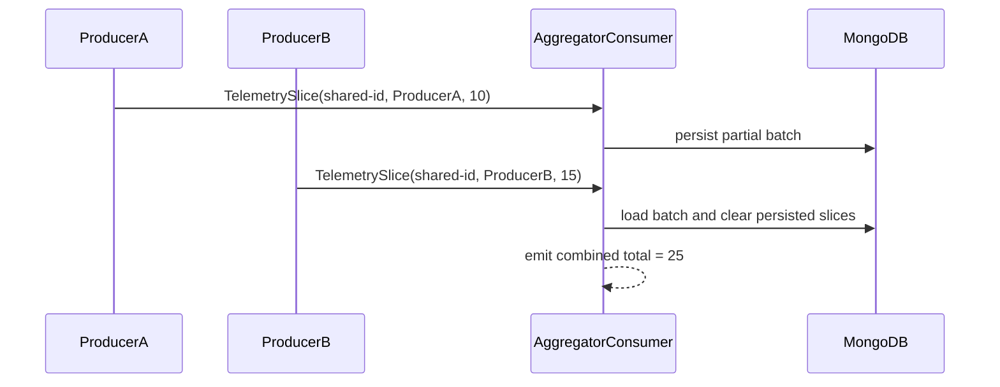

# Aggregator

## Overview

Two producers send telemetry slices to the same aggregator endpoint. The consumer uses `Aggregator<TelemetrySlice>` to wait for both slices, then emits one success line with the combined total.

## Participants

- `ServiceConnect.Examples.Aggregator.Consumer`
- `ServiceConnect.Examples.Aggregator.ProducerA`
- `ServiceConnect.Examples.Aggregator.ProducerB`

## Message Flow



## Prerequisites

`docker compose -f ../docker-compose.yml up -d`

## Run This Example

`bash run.sh`

The scripted runners use unique queue and MongoDB database names on each run so repeated smoke tests stay isolated.

## Run Manually

Start the consumer first, then run both producers with the same queue name and the same shared correlation id. The consumer also needs the matching MongoDB database name.

```bash
SC_EXAMPLES_QUEUE_NAME=aggregator-consumer \
SC_EXAMPLES_DATABASE_NAME=aggregator_consumer \
dotnet run --project src/ServiceConnect.Examples.Aggregator.Consumer/ServiceConnect.Examples.Aggregator.Consumer.csproj &

SC_EXAMPLES_CORRELATION_ID=11111111-1111-1111-1111-111111111111 \
SC_EXAMPLES_QUEUE_NAME=aggregator-consumer \
dotnet run --project src/ServiceConnect.Examples.Aggregator.ProducerA/ServiceConnect.Examples.Aggregator.ProducerA.csproj

SC_EXAMPLES_CORRELATION_ID=11111111-1111-1111-1111-111111111111 \
SC_EXAMPLES_QUEUE_NAME=aggregator-consumer \
dotnet run --project src/ServiceConnect.Examples.Aggregator.ProducerB/ServiceConnect.Examples.Aggregator.ProducerB.csproj
```

## Expected Output

`READY:aggregator-consumer`

`SUCCESS:aggregator-producer-a:sent ProducerA/10`

`SUCCESS:aggregator-producer-b:sent ProducerB/15`

`SUCCESS:aggregator-consumer:combined total 25 from 2 slices`

## What To Notice

The consumer never handles a single slice immediately. Instead, the aggregator groups slices by `CorrelationId`, persists them in MongoDB, and flushes when the batch reaches 2 messages or the 10 second timeout elapses.
