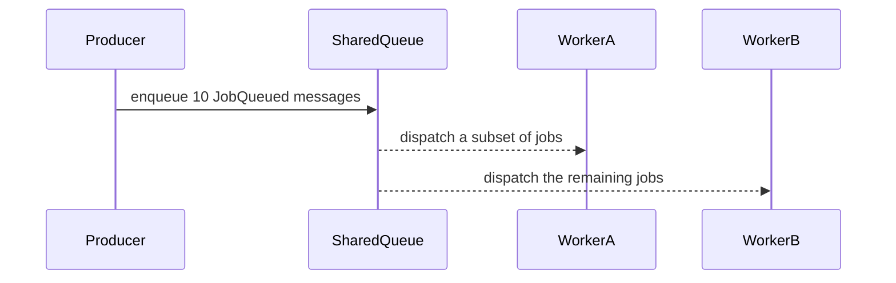

# CompetingConsumers

## Overview

Multiple workers listen on the same queue, competing to process messages. In this example run, the smoke test verifies that the 10 queued jobs are observed once across the workers, demonstrating shared-queue consumption by competing consumers.

## Participants

- `ServiceConnect.Examples.CompetingConsumers.Producer`
- `ServiceConnect.Examples.CompetingConsumers.WorkerA`
- `ServiceConnect.Examples.CompetingConsumers.WorkerB`

## Message Flow



## Prerequisites

`docker compose -f ../docker-compose.yml up -d`

## Run This Example

`bash run.sh`

The scripted runner uses a unique queue name for each run to avoid interference from earlier smoke tests.

## Run Manually

Start both workers first, then the producer.

```bash
SC_EXAMPLES_QUEUE_NAME=competing-consumers-work dotnet run --project src/ServiceConnect.Examples.CompetingConsumers.WorkerA/ServiceConnect.Examples.CompetingConsumers.WorkerA.csproj &
SC_EXAMPLES_QUEUE_NAME=competing-consumers-work dotnet run --project src/ServiceConnect.Examples.CompetingConsumers.WorkerB/ServiceConnect.Examples.CompetingConsumers.WorkerB.csproj &
SC_EXAMPLES_QUEUE_NAME=competing-consumers-work dotnet run --project src/ServiceConnect.Examples.CompetingConsumers.Producer/ServiceConnect.Examples.CompetingConsumers.Producer.csproj
```

The manual commands above use the fixed shared queue name from the plan. The scripted runner chooses a unique queue name automatically so repeated smoke runs stay isolated.

## Expected Output

`READY:worker-a`

`READY:worker-b`

`SUCCESS:competing-consumers-producer:sent 10 jobs`

Exactly 10 total lines matching `SUCCESS:worker-a:processed job-XXX` or `SUCCESS:worker-b:processed job-XXX`

Each of `job-001` through `job-010` appears exactly once across those 10 lines

The split between worker-a and worker-b can vary by run, including runs where one worker processes more messages than the other

## What To Notice

Both workers listen on the same queue name, and the smoke test waits for both `READY` lines before sending work. The distribution can vary between runs, but a successful demonstration shows that the 10 jobs sent in that run were all observed once across the competing consumers.
