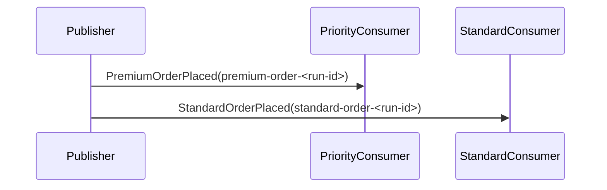

# ContentBasedRouting

## Overview

Publish two different event types from one publisher, then let each consumer handle only the message type that matches its route. In this example, routing is driven by message type rather than by inspecting a shared payload at runtime.

## Participants

- `ServiceConnect.Examples.ContentBasedRouting.Publisher`
- `ServiceConnect.Examples.ContentBasedRouting.PriorityConsumer`
- `ServiceConnect.Examples.ContentBasedRouting.StandardConsumer`

## Message Flow

## Prerequisites

`docker compose -f ../docker-compose.yml up -d`

## Run This Example

`bash run.sh`

## Run Manually

Run both consumers first, then the publisher.

`dotnet run --project src/ServiceConnect.Examples.ContentBasedRouting.PriorityConsumer/ServiceConnect.Examples.ContentBasedRouting.PriorityConsumer.csproj`

`dotnet run --project src/ServiceConnect.Examples.ContentBasedRouting.StandardConsumer/ServiceConnect.Examples.ContentBasedRouting.StandardConsumer.csproj`

`dotnet run --project src/ServiceConnect.Examples.ContentBasedRouting.Publisher/ServiceConnect.Examples.ContentBasedRouting.Publisher.csproj`

## Expected Output

`READY:priority-consumer`

`READY:standard-consumer`

`SUCCESS:content-based-routing-publisher:published premium-order-<run-id> and standard-order-<run-id>`

`SUCCESS:priority-consumer:processed premium-order-<run-id>`

`SUCCESS:standard-consumer:processed standard-order-<run-id>`

The exact line order can vary because the two consumers run concurrently.

## What To Notice

The publisher sends one premium event and one standard event, but no consumer needs to inspect a shared payload and branch manually. Message type selection performs the routing, so each consumer only subscribes to the event it is meant to process.
