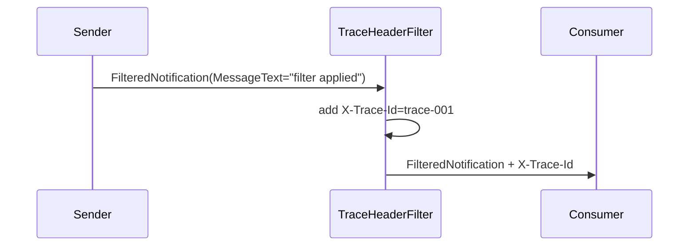

# Filters

## Overview

Send one message through an outgoing filter that stamps a custom trace header before the consumer receives it.

## Participants

- `ServiceConnect.Examples.Filters.Sender`
- `ServiceConnect.Examples.Filters.Consumer`
- `TraceHeaderFilter`

## Message Flow

## Prerequisites

`docker compose -f ../docker-compose.yml up -d`

## Run This Example

`bash run.sh`

## Run Manually

Run the consumer first, then the sender.

`SC_EXAMPLES_QUEUE_NAME=filters-consumer-manual dotnet run --project src/ServiceConnect.Examples.Filters.Consumer/ServiceConnect.Examples.Filters.Consumer.csproj`

`SC_EXAMPLES_QUEUE_NAME=filters-consumer-manual dotnet run --project src/ServiceConnect.Examples.Filters.Sender/ServiceConnect.Examples.Filters.Sender.csproj`

## Expected Output

`READY:filters-consumer`

`SUCCESS:filters-sender:sent filter applied`

`SUCCESS:filters-consumer:trace trace-001`

## What To Notice

The sender does not set the trace header directly on the send call. The outgoing filter centralizes that concern, so the consumer sees the stamped header without the message contract needing a dedicated trace property.
