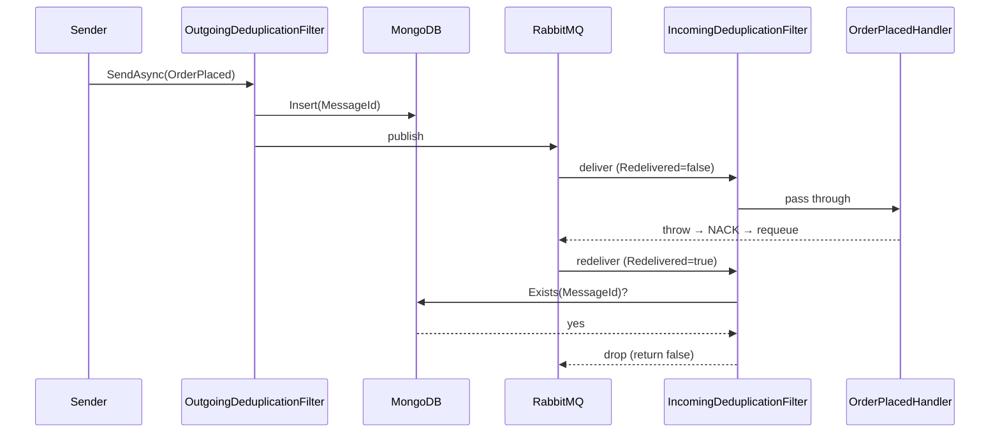

# Message Deduplication

Demonstrates the `ServiceConnect.Filters.MessageDeduplication` filter blocking a duplicate delivery that the broker retries after a consumer-side failure. Pair with [`../../website/src/content/docs/learn/operations/idempotency.mdx`](../../website/src/content/docs/learn/operations/idempotency.mdx) and the [filter reference](../../website/src/content/docs/reference/filters/messagededuplication.mdx).

## Participants

- **Contracts** — `OrderPlaced` message type shared between Sender and Consumer.
- **Sender** — publishes one `OrderPlaced` via `SendAsync`. Registers `OutgoingDeduplicationFilter`, which writes the outgoing `MessageId` to the shared MongoDB persistor.
- **Consumer** — registers `IncomingDeduplicationFilter`. Its handler logs and then throws, causing the broker to redeliver with `Redelivered=true`. On the redelivery the filter sees the `MessageId` in MongoDB and blocks it — the handler is not invoked a second time.

## Message Flow



## Prerequisites

- Docker with the Compose plugin.
- .NET 10 SDK.

## Run This Example

```bash
./run.sh
```

On Windows:

```powershell
./run.ps1
```

The script boots the shared `examples/docker-compose.yml` stack (RabbitMQ + MongoDB) via `scripts/common.sh`, starts the Consumer in the background, runs the Sender, and verifies the handler was invoked exactly once.

## Run Manually

Start the shared broker + Mongo (used by every `examples/*` sample):

```bash
docker compose -f examples/docker-compose.yml up -d rabbitmq mongodb
```

In one terminal:

```bash
dotnet run --project examples/MessageDeduplication/src/ServiceConnect.Examples.MessageDeduplication.Consumer
```

In another:

```bash
dotnet run --project examples/MessageDeduplication/src/ServiceConnect.Examples.MessageDeduplication.Sender
```

## Expected Output

Consumer log (abbreviated):

```
READY:dedup-consumer
SUCCESS:dedup-consumer:handled 3a1b2c4d
... exception stacktrace from the handler's simulated crash ...
... no second "SUCCESS:dedup-consumer:handled" line — the IncomingDeduplicationFilter blocked the redelivery ...
```

The run script's success criterion is: exactly one `SUCCESS:dedup-consumer:handled` line in the Consumer log after waiting for the redelivery window.

## What To Notice

- `AddMessageDeduplicationFilter` registers DI and the cleanup hosted service but does *not* wire the filter into the pipeline. The Sender chains `builder.AddOutgoingFilter<OutgoingDeduplicationFilter>()` and the Consumer chains `builder.AddBeforeConsumingFilter<IncomingDeduplicationFilter>()`.
- The persistor must be shared across the Sender and Consumer processes. The sample uses MongoDB. The InMemory persistor is a valid choice for single-process scenarios (tests, in-process fan-out) but will not demonstrate dedup when the Sender and Consumer are separate processes.
- The filter only blocks messages where `Redelivered=true`. A first delivery with a new `MessageId` always passes through.
