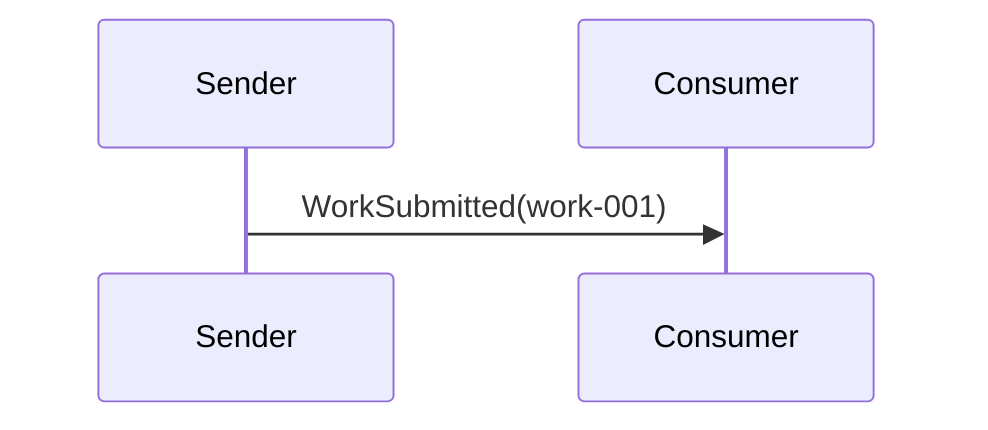

# PointToPoint

## Overview

Send one command from one sender to one consumer queue.

## Participants

- `ServiceConnect.Examples.PointToPoint.Sender`
- `ServiceConnect.Examples.PointToPoint.Consumer`

## Message Flow

## Prerequisites

`docker compose -f ../docker-compose.yml up -d`

## Run This Example

`bash run.sh`

## Run Manually

Run the consumer first, then the sender.

`dotnet run --project src/ServiceConnect.Examples.PointToPoint.Consumer/ServiceConnect.Examples.PointToPoint.Consumer.csproj`

`dotnet run --project src/ServiceConnect.Examples.PointToPoint.Sender/ServiceConnect.Examples.PointToPoint.Sender.csproj`

## Expected Output

`READY:point-to-point-consumer`

`SUCCESS:point-to-point-sender:sent work-001`

`SUCCESS:point-to-point-consumer:processed work-001`

## What To Notice

The sender targets a single endpoint, so exactly one queue receives the message.
