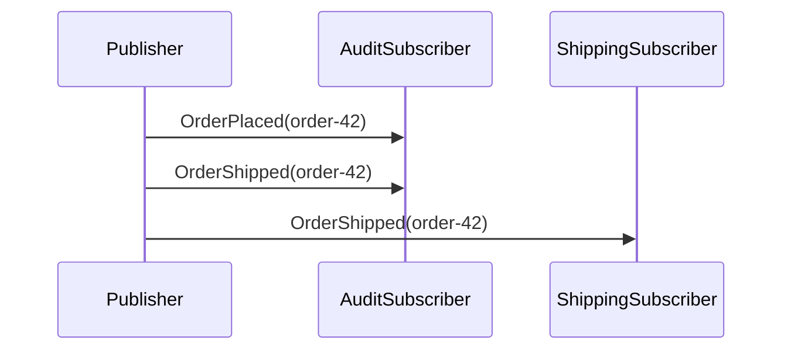

# PolymorphicMessages

## Overview

Publish derived events; let a base-type handler catch the whole category. One publisher emits `OrderPlaced` and `OrderShipped` (both derived from `DomainEvent`). The audit subscriber handles `DomainEvent` and catches **both**; the shipping subscriber handles `OrderShipped` and catches only that one. Same publish, two handlers, different specificities.

## Participants

- `ServiceConnect.Examples.PolymorphicMessages.Publisher`
- `ServiceConnect.Examples.PolymorphicMessages.AuditSubscriber`
- `ServiceConnect.Examples.PolymorphicMessages.ShippingSubscriber`

## Message Flow



## Prerequisites

`docker compose -f ../docker-compose.yml up -d`

## Run This Example

`bash run.sh`

## Run Manually

Run both subscribers first, then the publisher.

`dotnet run --project src/ServiceConnect.Examples.PolymorphicMessages.AuditSubscriber/ServiceConnect.Examples.PolymorphicMessages.AuditSubscriber.csproj`

`dotnet run --project src/ServiceConnect.Examples.PolymorphicMessages.ShippingSubscriber/ServiceConnect.Examples.PolymorphicMessages.ShippingSubscriber.csproj`

`dotnet run --project src/ServiceConnect.Examples.PolymorphicMessages.Publisher/ServiceConnect.Examples.PolymorphicMessages.Publisher.csproj`

## Expected Output

```
READY:audit-subscriber
READY:shipping-subscriber
SUCCESS:polymorphic-messages-publisher:published order-placed order-42
SUCCESS:audit-subscriber:audited OrderPlaced order-42
SUCCESS:polymorphic-messages-publisher:published order-shipped order-42
SUCCESS:audit-subscriber:audited OrderShipped order-42
SUCCESS:shipping-subscriber:processed order-shipped order-42
```

Note: Lines from the two subscriber processes may interleave with each other and with the publisher's `SUCCESS:` lines, since all three run concurrently. The exact order may vary between runs.

## What To Notice

The audit subscriber registers `DomainEventHandler` (one handler class) but lists **three** `HandlerReference` entries — one for `DomainEvent`, one for `OrderPlaced`, one for `OrderShipped`. That is the idiom that makes polymorphic subscription work:

- **Dispatch walks the type hierarchy.** At runtime, a published `OrderPlaced` resolves to every handler whose registered type is an ancestor in the concrete type's inheritance chain — so `DomainEventHandler` receives both `OrderPlaced` and `OrderShipped` without any `switch` statement of its own.
- **Subscription does not walk the hierarchy.** Each `HandlerReference` creates a RabbitMQ binding for exactly that message type's exchange. Without the `OrderPlaced` and `OrderShipped` entries, the audit queue would only be bound to the `DomainEvent` exchange — and the concrete events published by the publisher would never arrive.

The shipping subscriber is a plain single-type subscriber for contrast: one `HandlerReference` for `OrderShipped`, one handler class, catches only that specific event.

See the [Polymorphic Messages pattern page](https://r-suite.github.io/ServiceConnect-CSharp/learn/messaging-patterns/polymorphic-messages/) for the full write-up.
