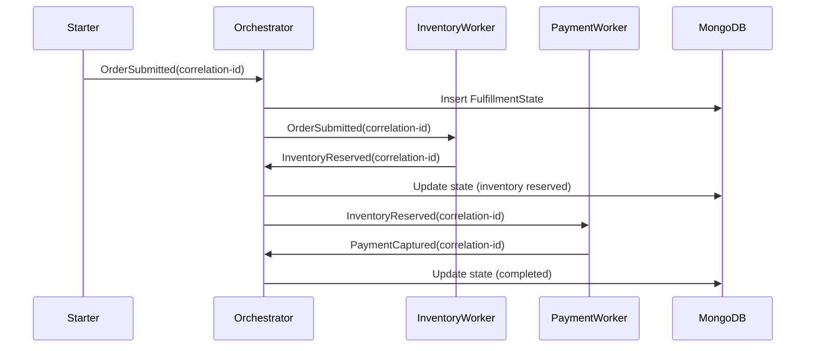

# ProcessManager

## Overview

One orchestrator owns a fulfillment workflow keyed by `CorrelationId`. The starter submits an order to the orchestrator queue, the orchestrator persists `FulfillmentState` in MongoDB, then advances the process by sending work to inventory and payment workers as each prior step completes.

## Participants

- `ServiceConnect.Examples.ProcessManager.Starter`
- `ServiceConnect.Examples.ProcessManager.Orchestrator`
- `ServiceConnect.Examples.ProcessManager.InventoryWorker`
- `ServiceConnect.Examples.ProcessManager.PaymentWorker`
- `MongoDB`

## Message Flow



## Prerequisites

`docker compose -f ../docker-compose.yml up -d`

## Run This Example

`bash run.sh`

The scripted runners generate unique workflow queues, worker queues, and MongoDB database names so repeated runs stay isolated.

## Run Manually

Start the orchestrator and both workers first, then run the starter with the same queue names and correlation id.

```bash
SC_EXAMPLES_WORKFLOW_QUEUE_NAME=process-manager-orchestrator \
SC_EXAMPLES_INVENTORY_QUEUE_NAME=process-manager-inventory \
SC_EXAMPLES_PAYMENT_QUEUE_NAME=process-manager-payment \
SC_EXAMPLES_DATABASE_NAME=process_manager \
dotnet run --project src/ServiceConnect.Examples.ProcessManager.Orchestrator/ServiceConnect.Examples.ProcessManager.Orchestrator.csproj &

SC_EXAMPLES_WORKFLOW_QUEUE_NAME=process-manager-orchestrator \
SC_EXAMPLES_INVENTORY_QUEUE_NAME=process-manager-inventory \
dotnet run --project src/ServiceConnect.Examples.ProcessManager.InventoryWorker/ServiceConnect.Examples.ProcessManager.InventoryWorker.csproj &

SC_EXAMPLES_WORKFLOW_QUEUE_NAME=process-manager-orchestrator \
SC_EXAMPLES_PAYMENT_QUEUE_NAME=process-manager-payment \
dotnet run --project src/ServiceConnect.Examples.ProcessManager.PaymentWorker/ServiceConnect.Examples.ProcessManager.PaymentWorker.csproj &

SC_EXAMPLES_WORKFLOW_QUEUE_NAME=process-manager-orchestrator \
SC_EXAMPLES_CORRELATION_ID=11111111-1111-1111-1111-111111111111 \
dotnet run --project src/ServiceConnect.Examples.ProcessManager.Starter/ServiceConnect.Examples.ProcessManager.Starter.csproj
```

## Expected Output

`READY:process-manager-orchestrator`

`READY:inventory-worker`

`READY:payment-worker`

`SUCCESS:process-manager-starter:submitted <correlation-id>`

`SUCCESS:process-manager-orchestrator:started workflow <correlation-id>`

`SUCCESS:inventory-worker:reserved inventory for <correlation-id>`

`SUCCESS:process-manager-orchestrator:inventory reserved for <correlation-id>`

`SUCCESS:payment-worker:captured payment for <correlation-id>`

`SUCCESS:process-manager-orchestrator:completed workflow <correlation-id>`

## What To Notice

The workers do not persist workflow state and do not decide the next step. They only report completion events back to the orchestrator queue. The orchestrator is the single place that correlates messages, mutates `FulfillmentState`, and makes the next routing decision.
