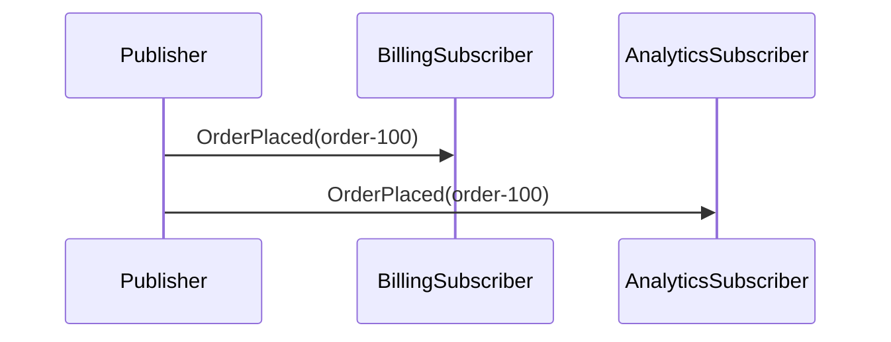

# PublishSubscribe

## Overview

Publish one event from a publisher to multiple subscribers. The event is sent to all subscribers simultaneously, demonstrating the fan-out messaging pattern.

## Participants

- `ServiceConnect.Examples.PublishSubscribe.Publisher`
- `ServiceConnect.Examples.PublishSubscribe.BillingSubscriber`
- `ServiceConnect.Examples.PublishSubscribe.AnalyticsSubscriber`

## Message Flow

## Prerequisites

`docker compose -f ../docker-compose.yml up -d`

## Run This Example

`bash run.sh`

## Run Manually

Run both subscribers first, then the publisher.

`dotnet run --project src/ServiceConnect.Examples.PublishSubscribe.BillingSubscriber/ServiceConnect.Examples.PublishSubscribe.BillingSubscriber.csproj`

`dotnet run --project src/ServiceConnect.Examples.PublishSubscribe.AnalyticsSubscriber/ServiceConnect.Examples.PublishSubscribe.AnalyticsSubscriber.csproj`

`dotnet run --project src/ServiceConnect.Examples.PublishSubscribe.Publisher/ServiceConnect.Examples.PublishSubscribe.Publisher.csproj`

## Expected Output

`READY:billing-subscriber`

`READY:analytics-subscriber`

`SUCCESS:publish-subscribe-publisher:published order-100`

`SUCCESS:billing-subscriber:processed order-100`

`SUCCESS:analytics-subscriber:processed order-100`

Note: The `SUCCESS` lines from the two subscriber processes may interleave in the output, since they run concurrently. The exact order of those two lines may vary between runs.

## What To Notice

The publisher broadcasts the event to all subscribers. Each subscriber independently processes the same message, demonstrating how publish/subscribe enables one-to-many message distribution.
