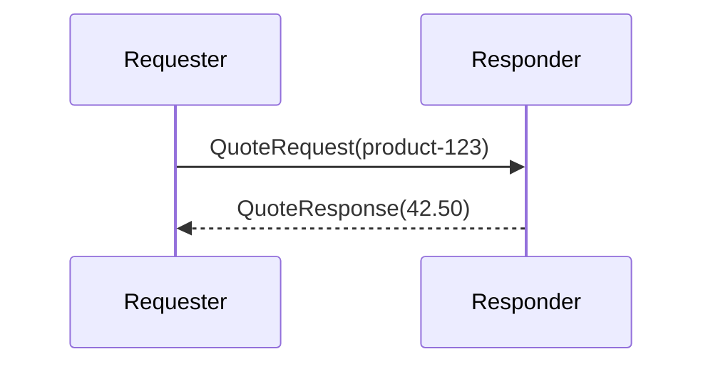

# RequestReply

## Overview

Send a request message to a responder and wait for a reply. The requester uses `SendRequestAsync` with a timeout, and the responder uses `context.ReplyAsync` to send the reply back.

## Participants

- `ServiceConnect.Examples.RequestReply.Requester`
- `ServiceConnect.Examples.RequestReply.Responder`

## Message Flow



## Prerequisites

`docker compose -f ../docker-compose.yml up -d`

## Run This Example

`bash run.sh`

## Run Manually

Run the responder first, then the requester.

`dotnet run --project src/ServiceConnect.Examples.RequestReply.Responder/ServiceConnect.Examples.RequestReply.Responder.csproj`

`dotnet run --project src/ServiceConnect.Examples.RequestReply.Requester/ServiceConnect.Examples.RequestReply.Requester.csproj`

## Expected Output

`READY:request-reply-responder`

`SUCCESS:request-reply-requester:received price 42.50`

`SUCCESS:request-reply-responder:processed product-123`

## What To Notice

The requester sends a `QuoteRequest` and waits up to 30 seconds for a `QuoteResponse`. The responder receives the request and uses `context.ReplyAsync` to send the reply back, which the request/reply manager correlates to the original request.

## v8 Contracts

**v8 handler signature.** Handlers now take the per-message `IConsumeContext` as a parameter to `HandleAsync`. Pre-v8 the framework set a `Context` property before each call, which was unsafe for singleton-registered handlers. Migration is mechanical: append `IConsumeContext context` to the method signature; replace `this.Context` reads with `context`.

```csharp
// v8
public async Task HandleAsync(QuoteRequest message, IConsumeContext context, CancellationToken cancellationToken = default)
{
    await context.ReplyAsync(new QuoteResponse(message.CorrelationId) { Price = 42.50m });
}
```
