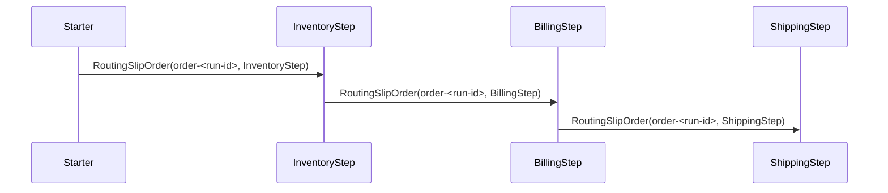

# RoutingSlip

## Overview

Route one message through three ordered processing steps. The starter sends a single `RoutingSlipOrder` with a routing slip, and ServiceConnect forwards that same message from inventory to billing to shipping after each handler completes.

## Participants

- `ServiceConnect.Examples.RoutingSlip.Starter`
- `ServiceConnect.Examples.RoutingSlip.InventoryStep`
- `ServiceConnect.Examples.RoutingSlip.BillingStep`
- `ServiceConnect.Examples.RoutingSlip.ShippingStep`

## Message Flow



## Prerequisites

`docker compose -f ../docker-compose.yml up -d`

## Run This Example

`bash run.sh`

The scripted runners use unique queue names for each run so old messages do not interfere with the current routing-slip flow.

## Run Manually

Start the three step consumers first, then run the starter with the same queue names.

```bash
SC_EXAMPLES_INVENTORY_QUEUE_NAME=routing-slip-inventory SC_EXAMPLES_BILLING_QUEUE_NAME=routing-slip-billing SC_EXAMPLES_SHIPPING_QUEUE_NAME=routing-slip-shipping dotnet run --project src/ServiceConnect.Examples.RoutingSlip.InventoryStep/ServiceConnect.Examples.RoutingSlip.InventoryStep.csproj &
SC_EXAMPLES_INVENTORY_QUEUE_NAME=routing-slip-inventory SC_EXAMPLES_BILLING_QUEUE_NAME=routing-slip-billing SC_EXAMPLES_SHIPPING_QUEUE_NAME=routing-slip-shipping dotnet run --project src/ServiceConnect.Examples.RoutingSlip.BillingStep/ServiceConnect.Examples.RoutingSlip.BillingStep.csproj &
SC_EXAMPLES_INVENTORY_QUEUE_NAME=routing-slip-inventory SC_EXAMPLES_BILLING_QUEUE_NAME=routing-slip-billing SC_EXAMPLES_SHIPPING_QUEUE_NAME=routing-slip-shipping dotnet run --project src/ServiceConnect.Examples.RoutingSlip.ShippingStep/ServiceConnect.Examples.RoutingSlip.ShippingStep.csproj &
SC_EXAMPLES_INVENTORY_QUEUE_NAME=routing-slip-inventory SC_EXAMPLES_BILLING_QUEUE_NAME=routing-slip-billing SC_EXAMPLES_SHIPPING_QUEUE_NAME=routing-slip-shipping SC_EXAMPLES_ORDER_ID=order-001 dotnet run --project src/ServiceConnect.Examples.RoutingSlip.Starter/ServiceConnect.Examples.RoutingSlip.Starter.csproj
```

## Expected Output

`READY:inventory-step`

`READY:billing-step`

`READY:shipping-step`

`SUCCESS:routing-slip-starter:routed order-<run-id>`

`SUCCESS:inventory-step:processed order-<run-id> at InventoryStep`

`SUCCESS:billing-step:processed order-<run-id> at BillingStep`

`SUCCESS:shipping-step:processed order-<run-id> at ShippingStep`

The three `SUCCESS` lines from the processing steps arrive asynchronously, but the route order remains inventory, then billing, then shipping.

## What To Notice

The starter only names the ordered queue list once in `RouteAsync`. Each handler updates `CurrentStep`, then ServiceConnect reads the remaining routing-slip destinations from the message headers and forwards the message automatically to the next queue.

## Contracts

**Cross-service routing.** Slip destinations are not required to appear in the local `IQueueConfiguration`. Format validation (non-empty, length-bounded, no AMQP control characters) is all that is required. RabbitMQ's alternate-exchange or mandatory-return is the appropriate surface for catching genuinely unknown destinations.

**Slip behavior on handler throw.** When a handler throws, the in-flight slip-forward is skipped; the slip data remains in the message envelope's `RoutingSlip` header. Messages that land on the DLQ — or are replayed manually — can still resume the chain from the current step without losing the remaining destination list.
