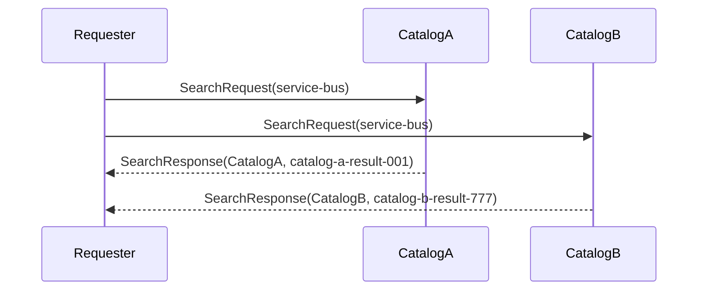

# ScatterGather

## Overview

Send one search request to multiple catalog endpoints and wait for all expected replies. The requester uses `SendRequestMultiAsync` to collect results from `CatalogA` and `CatalogB` in a single call.

## Participants

- `ServiceConnect.Examples.ScatterGather.Requester`
- `ServiceConnect.Examples.ScatterGather.CatalogA`
- `ServiceConnect.Examples.ScatterGather.CatalogB`

## Message Flow

## Prerequisites

`docker compose -f ../docker-compose.yml up -d`

## Run This Example

`bash run.sh`

The scripted runner writes the child-process output to `output.log` and verifies the success markers there.

## Run Manually

Run both catalogs first, then the requester.

`dotnet run --project src/ServiceConnect.Examples.ScatterGather.CatalogA/ServiceConnect.Examples.ScatterGather.CatalogA.csproj`

`dotnet run --project src/ServiceConnect.Examples.ScatterGather.CatalogB/ServiceConnect.Examples.ScatterGather.CatalogB.csproj`

`dotnet run --project src/ServiceConnect.Examples.ScatterGather.Requester/ServiceConnect.Examples.ScatterGather.Requester.csproj`

## Expected Output

`READY:scatter-gather-catalog-a`

`READY:scatter-gather-catalog-b`

`SUCCESS:scatter-gather-requester:received 2 replies`

`SUCCESS:scatter-gather-catalog-a:returned CatalogA/catalog-a-result-001 for service-bus-...`

`SUCCESS:scatter-gather-catalog-b:returned CatalogB/catalog-b-result-777 for service-bus-...`

The success lines can appear in either order because the two catalog responders run concurrently.

## What To Notice

The requester targets two endpoints in one call and sets `ExpectedReplyCount = 2`, so the request completes as soon as both replies arrive. Each catalog responds independently with its own result payload, which is the core scatter/gather pattern.
