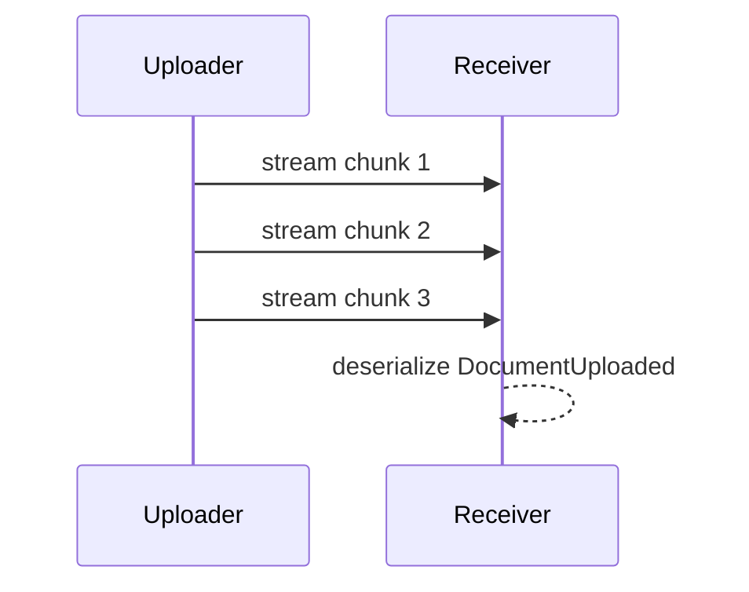

# Streaming

## Overview

The uploader opens a write stream to the receiver endpoint, sends one serialized `DocumentUploaded` message in three chunks, and the receiver reassembles the payload before invoking its stream handler.

## Participants

- `ServiceConnect.Examples.Streaming.Uploader`
- `ServiceConnect.Examples.Streaming.Receiver`

## Message Flow



## Prerequisites

`docker compose -f ../docker-compose.yml up -d`

## Run This Example

`bash run.sh`

The scripted runners use a unique receiver queue on each run so repeated smoke tests stay isolated.

## Run Manually

Run the receiver first, then the uploader with the same receiver queue name.

```bash
SC_EXAMPLES_QUEUE_NAME=streaming-receiver-manual \
dotnet run --project src/ServiceConnect.Examples.Streaming.Receiver/ServiceConnect.Examples.Streaming.Receiver.csproj

SC_EXAMPLES_ENDPOINT_NAME=streaming-receiver-manual \
dotnet run --project src/ServiceConnect.Examples.Streaming.Uploader/ServiceConnect.Examples.Streaming.Uploader.csproj
```

## Expected Output

`READY:streaming-receiver`

`SUCCESS:streaming-uploader:sent 3 chunks for demo-document.txt`

`SUCCESS:streaming-receiver:received demo-document.txt with 103 bytes`

## What To Notice

The receiver handler gets the fully reassembled payload after the final close packet arrives. Even though the uploader writes three chunks, the handler runs once with the original `DocumentUploaded` message restored from the streamed bytes. The reported byte count is the serialized message payload size for that streamed contract.

## v8 Stream Lifecycle

**Admission cap.** Admission is gated on an atomic counter (no speculative dictionary insert); the cap is `MaxActiveStreams = 1000`. Attempts to open a stream beyond the cap return `ProcessResult.NotHandled` immediately rather than queuing. **Dispose contract.** The dispatcher rejects late-arriving packets after `DisposeAsync` has been called and drains any in-flight stream state before completing disposal.
