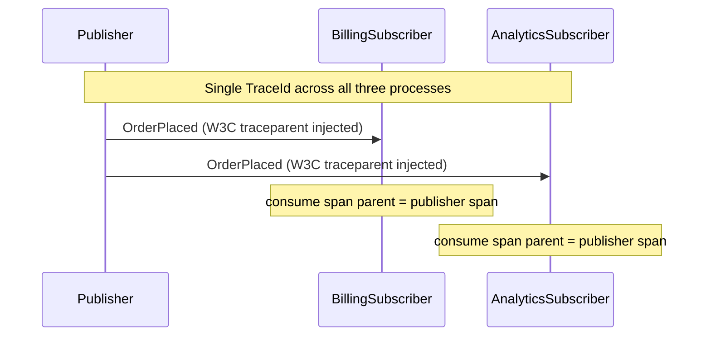

# Telemetry

## Overview

Publish one event from a publisher to multiple subscribers and observe W3C trace-context propagation across the broker. Each subscriber's consume span is a child of the publisher's publish span — all three processes share a single TraceId even though they run as separate OS processes communicating via RabbitMQ.

The sample uses a plain `ActivityListener` (no OpenTelemetry SDK required). Swapping the listener for a real exporter is a one-line change; see the comment in `Publisher/Program.cs` and the [Observability — Tracing](/ServiceConnect-CSharp/learn/operations/observability/#tracing-opentelemetry) reference for the full picture.

## Participants

- `ServiceConnect.Examples.Telemetry.Publisher` — publishes one `OrderPlaced` event
- `ServiceConnect.Examples.Telemetry.BillingSubscriber` — consumes `OrderPlaced`, prints `BILLING:received:<orderId>`
- `ServiceConnect.Examples.Telemetry.AnalyticsSubscriber` — consumes `OrderPlaced`, prints `ANALYTICS:received:<orderId>`
- `ServiceConnect.Examples.Telemetry.Contracts` — shared message types

## Message Flow

## Prerequisites

`docker compose -f ../docker-compose.yml up -d`

## Run This Example

`bash run.sh`

The script starts both subscribers, waits for them to signal `READY:`, then runs the publisher. After all three processes have emitted their `TRACE:` lines, the script asserts that the TraceId matches across all three and that each subscriber's `ParentSpanId` equals the publisher's `SpanId`, then prints `OK: trace-id correlated across publisher and both subscribers`.

## Run Manually

Run both subscribers first, then the publisher.

`dotnet run --project src/ServiceConnect.Examples.Telemetry.BillingSubscriber/ServiceConnect.Examples.Telemetry.BillingSubscriber.csproj`

`dotnet run --project src/ServiceConnect.Examples.Telemetry.AnalyticsSubscriber/ServiceConnect.Examples.Telemetry.AnalyticsSubscriber.csproj`

`dotnet run --project src/ServiceConnect.Examples.Telemetry.Publisher/ServiceConnect.Examples.Telemetry.Publisher.csproj`

## Expected Output

`READY:billing-subscriber`

`READY:analytics-subscriber`

`READY:telemetry-publisher`

`SUCCESS:telemetry-publisher:published order`

`BILLING:received:<orderId>`

`ANALYTICS:received:<orderId>`

`TRACE:telemetry-publisher:<operation>:<traceId>:<spanId>:`

`TRACE:billing-subscriber:<operation>:<traceId>:<spanId>:<publisherSpanId>`

`TRACE:analytics-subscriber:<operation>:<traceId>:<spanId>:<publisherSpanId>`

`OK: trace-id correlated across publisher and both subscribers`

Note: The `BILLING:received:` and `ANALYTICS:received:` lines, and the three `TRACE:` lines, may interleave in the output because the subscriber processes run concurrently. The exact order of those lines may vary between runs.

## What To Notice

All three `TRACE:` lines carry the **same TraceId** — the W3C `traceparent` header written by the publisher's publish span is extracted by each subscriber and used as the parent context for the consume span. This means a single distributed trace spans two RabbitMQ hops and three OS processes without any shared state.

Each subscriber's `ParentSpanId` field equals the publisher's `SpanId`, confirming the parent–child relationship. In a real exporter (Jaeger, Zipkin, OTLP collector) these spans appear in one connected waterfall.

For the conceptual story behind this, see [Observability — Tracing](/ServiceConnect-CSharp/learn/operations/observability/#tracing-opentelemetry).
